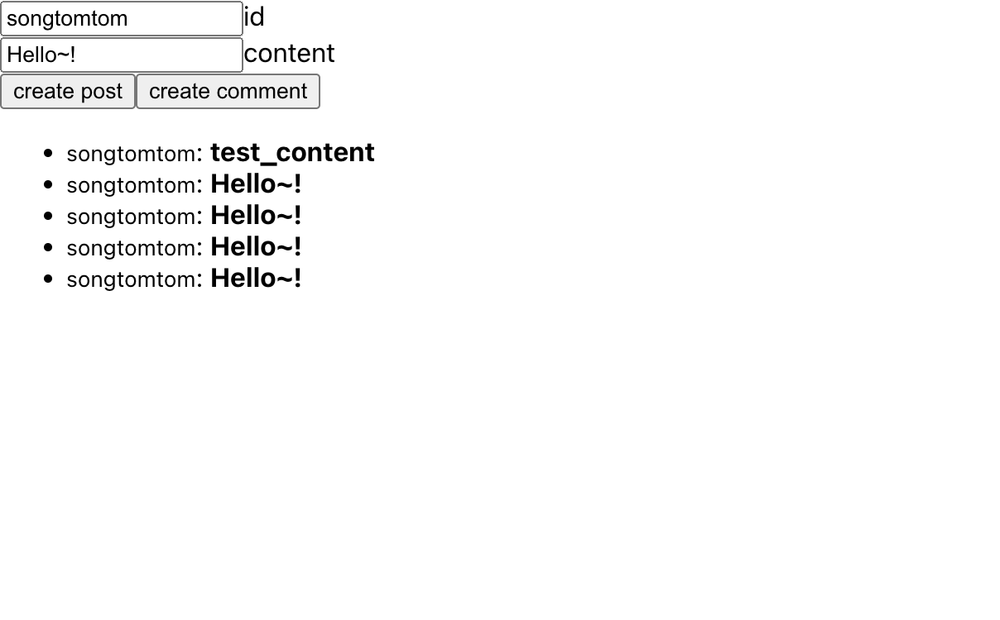

3편에서 게시물과 댓글을 저장하는 리졸버를 만들었습니다. 이번 편은 그 리졸버를 부르는 React 화면입니다. 화면 자체는 단순합니다. 게시물 id와 댓글 내용을 입력하는 칸 두 개, 버튼 두 개, 댓글 목록 하나입니다. 대신 Apollo Client의 캐시가 뮤테이션과 쿼리 사이에서 어떻게 움직이는지를 이해하는 데 집중합니다. 그래야 5편에서 구독 결과를 목록에 합치는 코드가 이해됩니다.

## GraphQL 문서 정의

`client/src/App.tsx`

```tsx
const CREATE_POST = gql`
  mutation CreatePost($input: CreatePostInput!) {
    createPost(input: $input) {
      id
    }
  }
`;

const CREATE_COMMENT = gql`
  mutation CreateComment($input: CreateCommentInput!) {
    createComment(input: $input) {
      id
      postId
      content
    }
  }
`;

const LIST_COMMENTS = gql`
  query ListComments($where: CommentsWhere!) {
    comments(where: $where) {
      id
      postId
      content
    }
  }
`;
```

문서는 컴포넌트 밖 모듈 스코프에 둡니다. 컴포넌트 안에 두면 렌더링마다 `gql`이 다시 파싱합니다. `gql`은 파싱 결과를 캐시하긴 하지만, 문서를 밖에 두는 것이 코드 읽기에도 낫습니다.

## 게시물 id를 직접 입력받는 이유

3편의 스키마에서 `createPost`는 id를 입력으로 받습니다. 서버가 UUID를 만들어 주는 편이 일반적인데 굳이 입력받게 한 이유는 화면 때문입니다. 이 예제는 브라우저 탭 두 개를 열고 같은 게시물에 댓글을 달아 실시간 전달을 확인하는 것이 목적입니다. 탭마다 같은 id를 타이핑할 수 있어야 하므로 id를 사용자가 정하게 했습니다. 실제 서비스라면 서버가 생성해야 합니다.

## 상태와 훅

```tsx
function App() {
  const [id, setId] = useState<string>('songtomtom');
  const [content, setContent] = useState<string>('Hello~!');

  const [createPost] = useMutation(CREATE_POST, {
    variables: { input: { id } },
  });
  const [createComment] = useMutation(CREATE_COMMENT, {
    variables: { input: { postId: id, content } },
  });
  const { data, loading, subscribeToMore } = useQuery(LIST_COMMENTS, {
    variables: { where: { postId: id } },
  });
  // ...
}
```

`useMutation`은 실행 함수를 돌려주고, 실제 요청은 그 함수를 부를 때 나갑니다. `useQuery`는 렌더링과 동시에 요청을 보내고, 변수가 바뀌면 다시 보냅니다. `id` 상태가 바뀌면 `LIST_COMMENTS`의 변수가 바뀌므로 다른 게시물의 댓글 목록이 자동으로 조회됩니다.

`subscribeToMore`는 여기서 미리 꺼내 두기만 하고 5편에서 씁니다.

## 이벤트 핸들러와 JSX

```tsx
const onClickCreatePost = async () => {
  await createPost();
};

const onClickCreateComment = async () => {
  await createComment();
};

const onChangeId = (e: ChangeEvent<HTMLInputElement>) => setId(e.target.value);
const onChangeContent = (e: ChangeEvent<HTMLInputElement>) => setContent(e.target.value);

return (
  <div>
    <div>
      <input type="text" onChange={onChangeId} value={id} /> id
      <br />
      <input type="text" onChange={onChangeContent} value={content} /> content
    </div>

    <button onClick={onClickCreatePost}>create post</button>
    <button onClick={onClickCreateComment}>create comment</button>
    <ul>
      {!loading &&
        data.comments.map((item: any, index: number) => (
          <li key={index}>
            <small>{item.postId}</small>: <strong>{item.content}</strong>
          </li>
        ))}
    </ul>
  </div>
);
```

## 댓글을 만들었는데 목록이 안 바뀌는 이유

이 상태로 실행하면 댓글 생성 버튼을 눌러도 목록이 그대로입니다. 서버에는 저장됐는데 화면이 안 바뀝니다. 새로고침하면 보입니다.

Apollo Client의 캐시는 정규화된 저장소입니다. `LIST_COMMENTS`의 결과는 `ROOT_QUERY.comments({"where":{"postId":"songtomtom"}})`라는 키 아래에 댓글 참조 배열로 저장됩니다. `createComment` 뮤테이션의 결과는 새 `Comment` 객체로 캐시에 들어가지만, 그 객체를 어느 목록에 넣어야 하는지 Apollo는 알 수 없습니다. 목록은 서버가 정의한 쿼리 결과이고, 클라이언트는 그 목록의 규칙(어떤 postId가 포함되는지, 정렬은 무엇인지)을 모르기 때문입니다.

해결 방법은 세 가지가 있습니다.

1. 뮤테이션 옵션에 `refetchQueries: [LIST_COMMENTS]`를 주어 목록을 다시 조회합니다. 가장 쉽지만 요청이 한 번 더 나가고, 다른 사람이 단 댓글은 여전히 안 보입니다.
2. 뮤테이션의 `update` 콜백에서 캐시의 목록에 새 댓글을 직접 넣습니다. 내 댓글은 즉시 보이지만 다른 사람의 댓글은 역시 안 보입니다.
3. 목록을 구독과 연결합니다. 누가 달았든 서버가 알려 주는 대로 목록에 넣습니다.

이 시리즈의 목적이 3번입니다. 내가 단 댓글도 서버가 발행한 이벤트로 돌아와서 목록에 들어가므로, 뮤테이션 쪽에서는 아무것도 하지 않아도 됩니다. 뮤테이션 응답을 받아 화면을 직접 고치는 코드가 하나도 없는 것은 이 때문입니다.

## 실행

서버와 클라이언트를 띄우고, 게시물을 만든 뒤 댓글을 달아 봅니다. 아직 목록은 새로고침해야 갱신되지만, 저장과 조회가 화면에서 되는 것을 확인합니다.



다음 편에서 서버에 Observer를 만들고 클라이언트를 `subscribeToMore`로 연결해, 새로고침 없이 목록이 바뀌게 만듭니다.

## Reference

- [Apollo Client — Mutations](https://www.apollographql.com/docs/react/data/mutations)
- [Apollo Client — Caching overview](https://www.apollographql.com/docs/react/caching/overview)
