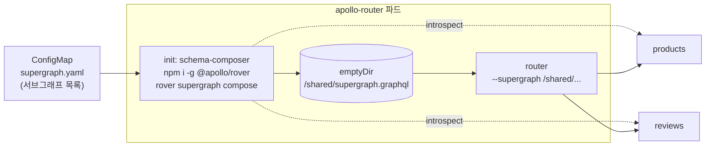

GraphQL 서브그래프 여러 개를 Apollo Router 하나로 묶어 서빙하고 있습니다. Federation에서는 라우터가 각 서브그래프 스키마를 합친 **슈퍼그래프**를 갖고 있어야 쿼리를 어느 서브그래프로 보낼지 계획할 수 있습니다. 이 슈퍼그래프를 누가 언제 만드느냐가 문제입니다.

Apollo가 권하는 방식은 GraphOS입니다. 서브그래프 CI가 스키마를 publish하면 GraphOS가 합치고, 라우터는 Uplink라는 엔드포인트를 폴링해 최신 슈퍼그래프를 받습니다. 저는 처음에 그 길로 가지 않았습니다. 서브그래프 CI를 전부 손봐야 했고, 라우터 런타임이 외부 서비스에 매달리는 것도 내키지 않았습니다. 대신 라우터 파드가 뜰 때 클러스터 안에 실제로 떠 있는 서브그래프를 그 자리에서 합치게 했습니다. 이 글은 그 구조와, 1년 뒤 그것이 어디서 깨졌는지를 작은 예제로 다시 만든 기록입니다. 코드는 [songtomtom/apollo-router-supergraph-on-kubernetes](https://github.com/songtomtom/apollo-router-supergraph-on-kubernetes)에 있고, 이 편은 `overlays/init-compose`입니다.

## 구조



라우터 Deployment에 init container가 하나 있습니다. 파드가 뜰 때마다 이 컨테이너가 먼저 돌고, 끝나야 라우터 컨테이너가 시작됩니다.

`k8s/base/router/deployment.yaml`

```yaml
      initContainers:
      - name: schema-composer
        image: node:18
        securityContext:
          runAsNonRoot: false   # npm 전역 설치 때문에 root가 필요하다
          runAsUser: 0
        command:
        - sh
        - -c
        - |
          set -e
          echo "Installing Rover CLI..."
          export NPM_CONFIG_CACHE=/tmp/.npm NPM_CONFIG_PREFIX=/tmp/.npm-global
          export PATH="/tmp/.npm-global/bin:$PATH"
          npm install -g @apollo/rover

          sed "s/\${POD_NAMESPACE}/${POD_NAMESPACE}/g" /etc/subgraphs/supergraph.yaml > /shared/supergraph.yaml

          # 목록에서 name과 routing_url을 뽑아 순회한다
          awk '/^  [a-z0-9-]+:$/ { name=$1; sub(/:$/, "", name) } /^    routing_url:/ { print name, $2 }' \
            /shared/supergraph.yaml > /tmp/subgraphs.list

          if [ -n "${APOLLO_KEY}" ]; then
            echo "Publishing subgraphs to GraphOS..."
            while read -r name url; do
              rover subgraph introspect "${url}" < /dev/null | \
                rover subgraph publish "${APOLLO_GRAPH_REF}" --name "${name}" --routing-url "${url}" \
                  --schema - --convert || echo "Warning: Failed to publish ${name}"
            done < /tmp/subgraphs.list
          fi

          echo "Composing supergraph..."
          rover supergraph compose --config /shared/supergraph.yaml > /shared/supergraph.graphql
          ls -la /shared/
```

하는 일은 넷입니다. rover를 npm으로 설치하고, 서브그래프 목록의 네임스페이스 자리를 채우고, (키가 있으면) 각 서브그래프를 GraphOS에 publish하고, `rover supergraph compose`로 슈퍼그래프를 만들어 emptyDir에 씁니다. 라우터 컨테이너는 그 파일을 `--supergraph`로 받습니다.

```yaml
      containers:
      - name: router
        image: ghcr.io/apollographql/router:v2.8.1
        args: ["--config", "/etc/apollo/router.yaml", "--supergraph", "/shared/supergraph.graphql"]
```

서브그래프 목록은 ConfigMap 하나에 있습니다. `rover supergraph compose`가 읽는 `supergraph.yaml` 형식 그대로입니다.

`k8s/base/router/subgraphs-configmap.yaml`

```yaml
data:
  supergraph.yaml: |
    federation_version: =2.15.1
    subgraphs:
      products:
        routing_url: http://products.${POD_NAMESPACE}.svc.cluster.local/
        schema:
          subgraph_url: http://products.${POD_NAMESPACE}.svc.cluster.local/
      reviews:
        routing_url: http://reviews.${POD_NAMESPACE}.svc.cluster.local/
        schema:
          subgraph_url: http://reviews.${POD_NAMESPACE}.svc.cluster.local/
```

`schema.subgraph_url`은 compose가 introspect할 주소, `routing_url`은 라우터가 쿼리를 보낼 주소입니다. 여기서는 같지만 다를 수 있습니다. `${POD_NAMESPACE}`는 downward API로 받은 네임스페이스로 치환되므로 dev와 prod가 같은 ConfigMap을 씁니다.

실제 운영에서는 처음에 이 목록이 init 스크립트 안에 서브그래프마다 publish 블록 7줄, compose용 heredoc에 또 한 번, 그렇게 두 군데에 손으로 적혀 있었습니다. 두 목록이 어긋나서 publish는 되는데 compose에서 빠진 서브그래프가 8개나 됐던 날이 있었고, 그 뒤에 ConfigMap 하나로 모았습니다. 예제는 모은 뒤의 모양입니다.

### 왜 이렇게 했나

이 구조의 장점은 분명합니다.

- **클러스터 안에서 완결됩니다.** 서브그래프 CI를 건드리지 않고, 외부 레지스트리도 없고, GitOps 저장소 하나에 라우터와 서브그래프 목록이 다 있습니다.
- **떠 있는 것이 곧 진실입니다.** 라우터가 뜨는 순간 실제로 응답하는 서브그래프의 스키마를 합치므로, publish를 깜빡한 서브그래프나 배포 전 스키마가 슈퍼그래프에 들어갈 일이 없습니다.
- **되돌리기 쉽습니다.** 서브그래프를 롤백하고 라우터를 재시작하면 슈퍼그래프도 같이 돌아갑니다.

서브그래프가 서너 개이고 배포가 잦지 않을 때 이것은 좋은 선택이었습니다. 문제는 그 조건이 오래가지 않았다는 것입니다.

## 예제 띄우기

서브그래프는 둘입니다. products가 `Product` 엔티티를 갖고, reviews가 그 엔티티를 확장해 `reviews`와 `averageRating`을 붙입니다.

`subgraphs/reviews/schema.graphql`

```graphql
extend schema @link(url: "https://specs.apollo.dev/federation/v2.7", import: ["@key"])

type Review {
  id: ID!
  body: String!
  rating: Int!
}

# products 서브그래프의 엔티티를 확장한다. 라우터가 두 서브그래프를 한 타입으로 합친다.
type Product @key(fields: "id") {
  id: ID!
  reviews: [Review!]!
  averageRating: Float
}

type Query {
  reviews: [Review!]!
}
```

Minikube에 올리고 두 서브그래프를 가로지르는 쿼리를 보냅니다.

```bash
./scripts/minikube-up.sh
kubectl --context supergraph apply -k k8s/overlays/init-compose
./scripts/query.sh
```

```json
{"data":{"products":[
  {"name":"키보드","price":89000,"averageRating":4,"reviews":[{"body":"키감이 좋다","rating":5},{"body":"소음이 있다","rating":3}]},
  {"name":"마우스","price":45000,"averageRating":4,"reviews":[{"body":"가볍다","rating":4}]},
  {"name":"모니터 암","price":120000,"averageRating":null,"reviews":[]}
]}}
```

`name`과 `price`는 products에서, `reviews`와 `averageRating`은 reviews에서 왔습니다. init container 로그는 이렇습니다.

```
Installing Rover CLI...
added 42 packages in 4s
Composing supergraph...
There is a newer version of Rover available: v0.41.0 (currently running v0.37.0)
merging supergraph schema files
downloading the 'supergraph' plugin from https://rover.apollo.dev/tar/supergraph/aarch64-unknown-linux-gnu/v2.15.1
```

두 줄이 눈에 걸립니다. npm이 설치한 rover는 최신이 아니고(npm 패키지가 바이너리 릴리스보다 늦습니다), compose 플러그인은 매 기동마다 인터넷에서 새로 받습니다. 파드가 뜰 때마다 npm 레지스트리와 Apollo CDN 두 곳에 의존하는 셈입니다. 이 예제에서는 init이 3~6초에 끝나지만, 서브그래프 15개를 introspect하고 publish까지 하는 실제 운영 환경에서는 40~60초가 걸렸고 파드가 Ready가 되기까지 1분 남짓이었습니다. HPA가 파드를 늘리는 순간은 대개 트래픽이 몰리는 순간인데, 그때 1분은 깁니다.

## 어디서 깨지나

기동 시간은 불편이지만 장애는 아닙니다. 아래 두 실험이 이 구조의 진짜 문제입니다.

### 실험 1: 서브그래프 하나가 죽어 있으면 라우터가 못 뜬다

reviews를 0개로 줄인 뒤 라우터 파드를 다시 만들었습니다.

```bash
kubectl -n supergraph scale deploy/reviews --replicas=0
kubectl -n supergraph delete pod -l app=apollo-router
```

```
NAME                             READY   STATUS                  RESTARTS      AGE
apollo-router-559c9fbd64-2c9vv   0/1     Init:CrashLoopBackOff   3 (16s ago)   75s
apollo-router-559c9fbd64-bt5t6   0/1     Init:CrashLoopBackOff   3 (22s ago)   75s
```

```
error: Error resolving subgraphs:
reviews: Failed to introspect the subgraph "reviews": Upstream service error: ... ConnectionRefused
```

compose는 목록의 서브그래프를 전부 introspect해야 성공합니다. 하나라도 응답하지 않으면 `set -e` 때문에 init이 실패하고 라우터는 시작조차 못 합니다. products는 멀쩡한데 products 쿼리도 못 받습니다.

이미 떠 있는 파드는 영향이 없습니다. 슈퍼그래프를 기동 시점에 한 번 만들어 갖고 있으니 reviews가 죽어도 products 쿼리는 계속 답합니다. 문제는 **새 파드**입니다. 노드 교체, HPA 스케일아웃, 롤링 업데이트, 어느 것이든 파드를 새로 만드는 순간 서브그래프 하나의 상태가 라우터 전체의 증설을 막습니다. 실제 운영에서 prod 라우터의 `minReplicas`를 3으로 둔 것은 이것을 알고 한 완충이었습니다.

### 실험 2: 파드마다 다른 스키마를 서빙한다

reviews 스키마에 `author` 필드를 추가한 v2 이미지를 배포한 뒤, 라우터 파드 **하나만** 지웠습니다. 남은 파드와 새 파드에 각각 introspection을 보냈습니다.

```
apollo-router-...-2c9vv  Review 필드: ['id', 'body', 'rating']
apollo-router-...-wd5cn  Review 필드: ['id', 'body', 'rating', 'author']
```

같은 Service 뒤에 스키마가 다른 파드 두 개가 있습니다. 클라이언트가 `author`를 요청하면 어느 파드에 닿느냐에 따라 성공하거나 `Cannot query field "author"`를 받습니다.

반대 방향도 해 봤습니다. reviews를 v1으로 되돌리고 라우터 파드 하나만 교체하면, 옛 파드는 v2 슈퍼그래프(author 있음)를, 새 파드는 v1 슈퍼그래프를 갖습니다. 이번엔 옛 파드 쪽이 깨집니다.

```
옛 파드: {"data":null,"errors":[{"message":"HTTP fetch failed from 'reviews': 400: Bad Request", ... "code":"SUBREQUEST_HTTP_ERROR"
새 파드: {"errors":[{"message":"Cannot query field \"author\" on type \"Review\".", ... "code":"GRAPHQL_VALIDATION_FAILED"
```

옛 파드는 `author`가 있다고 믿고 reviews에 물었다가 400을 받고, 새 파드는 애초에 검증에서 거부합니다. 같은 요청에 파드마다 다른 에러입니다.

이 구조에는 **슈퍼그래프를 갱신하는 경로가 없습니다.** init container는 한 번만 돌고, 라우터의 `APOLLO_ROUTER_HOT_RELOAD`는 파일이 바뀌어야 뭔가를 하는데 파일을 바꾸는 주체가 없습니다. 서브그래프를 배포하면 라우터를 재시작해야 반영되고, 재시작은 롤링이라 그 사이에 새 스키마와 옛 스키마가 공존합니다. 서브그래프 배포가 잦아질수록 이 창은 자주 열립니다.

## 정리

| | |
|---|---|
| 슈퍼그래프를 만드는 곳 | 라우터 파드의 init container |
| 서브그래프 목록 | ConfigMap `supergraph.yaml` 하나 (처음엔 두 군데) |
| 외부 의존 | 없음 (단, 기동 때마다 npm 레지스트리와 rover 플러그인 CDN) |
| 깨지는 곳 | 서브그래프 하나라도 죽으면 새 라우터 파드 기동 불가 |
| | 파드마다 다른 슈퍼그래프, 갱신 경로 없음 |
| 기동 시간 | 예제 3~6초, 실제 운영 40~60초 |

실험 1과 2의 공통 원인은 "슈퍼그래프가 파드 기동에 묶여 있다"는 것입니다. 만드는 시점도, 갱신하는 시점도 파드 생명주기와 같습니다. 이 결합을 풀려면 슈퍼그래프를 파드 밖에서 만들고, 라우터는 그것을 받기만 해야 합니다. 어디에 두느냐가 다음 질문입니다. 처음엔 클러스터 안에 두려 했고, 그 계획이 왜 틀어졌는지가 [2편](/blog/apollo-router-uplink-publish-cronjob)입니다.

## Reference

- [Apollo Router: Supergraph configuration (--supergraph)](https://www.apollographql.com/docs/graphos/routing/configuration/cli)
- [Rover: supergraph compose](https://www.apollographql.com/docs/rover/commands/supergraphs)
- [Apollo Federation: Entities](https://www.apollographql.com/docs/graphos/schema-design/federated-schemas/entities)
- [Kubernetes: Init Containers](https://kubernetes.io/docs/concepts/workloads/pods/init-containers/)
