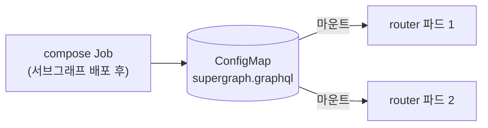
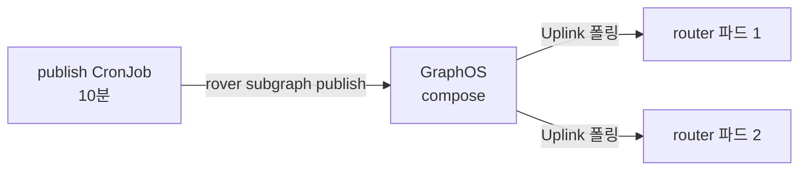

[2편](/blog/apollo-router-subgraph-list-publish-cronjob)까지 하고 나면 서브그래프 목록은 한 곳이고 publish는 CronJob이 합니다. 남은 것은 라우터입니다. 아직 파드가 뜰 때마다 init container가 슈퍼그래프를 합치고, 그래서 [1편](/blog/apollo-router-init-container-compose)의 두 문제(서브그래프 하나가 죽으면 새 파드가 못 뜨고, 파드마다 다른 스키마를 서빙하는 것)가 그대로입니다.

풀어내는 방향은 하나입니다. 슈퍼그래프를 파드 밖에서 만들고 라우터는 받기만 한다. 어디에 두느냐가 문제였고, 처음 계획은 틀어졌습니다.

## 방안 A: 클러스터 안에 두자

이슈를 만들 때 제가 권한 안입니다.



compose를 Job으로 떼어내 결과를 ConfigMap에 쓰고, 라우터는 그 ConfigMap을 마운트해 `--supergraph`로 읽습니다. 라우터에 이미 `APOLLO_ROUTER_HOT_RELOAD=true`가 켜져 있으니 ConfigMap이 갱신되면 재시작 없이 새 스키마를 읽습니다. compose가 실패하면 ConfigMap을 안 건드리니 라우터는 마지막 성공 스키마로 뜹니다. 모든 파드가 같은 ConfigMap을 보니 스키마도 같습니다. 외부 의존 없이 1편의 문제를 다 풀고, "클러스터 안에서 완결"이라는 처음 장점도 지킵니다.

좋아 보였고, 이슈에도 그렇게 적었습니다. 그리고 다음 날 실행 중인 파드에서 슈퍼그래프 파일 크기를 재 봤습니다.

```
-rw-r--r--. 1 10001 10001 3458205 Sep 29 04:04 supergraph.graphql
```

3.5MB입니다. 서브그래프 14개, 타입 1,172개. ConfigMap의 한도는 1MiB입니다. 슈퍼그래프 SDL에는 각 필드가 어느 서브그래프에서 오는지를 나타내는 `@join__` 지시어가 필드마다 붙어서, 서브그래프 스키마 합보다 훨씬 큽니다. 이 예제의 두 서브그래프도 원본 스키마 합은 600바이트 남짓인데 슈퍼그래프는 2.3KB입니다.

압축하면 들어갑니다. S3 같은 곳에 두고 init container가 내려받게 해도 됩니다. 하지만 그러면 다시 init container가 생기고, 갱신 경로를 또 만들어야 하고, 저장소가 하나 더 늘어납니다. 이 방안이 좋았던 이유가 하나씩 깎였습니다.

## 방안 B: 이미 publish하고 있잖아

2편에서 publish를 CronJob으로 뺐습니다. 즉 GraphOS에는 10분 안에 최신 서브그래프 스키마가 올라가 있고, GraphOS는 그것을 합쳐서 갖고 있습니다. 라우터가 그걸 받아오게 하면 됩니다. 이것이 Apollo가 처음부터 권한 방식(managed federation)이고, 라우터는 `--supergraph`를 빼고 `APOLLO_KEY`와 `APOLLO_GRAPH_REF`만 주면 Uplink 엔드포인트를 폴링합니다.



1년 전에 이 길을 피한 이유는 서브그래프 CI를 다 손봐야 한다는 것과 외부 의존이었습니다. 앞의 것은 CronJob이 해결했습니다. CI는 하나도 건드리지 않았습니다. 뒤의 것은, 사실 이미 그랬습니다. 라우터 v2는 `APOLLO_KEY`가 있으면 기동할 때 GraphOS에서 라이선스를 받아옵니다. init 방식일 때도 키가 있었으니 라우터는 이미 매 기동마다 GraphOS에 연결하고 있었습니다. Uplink로 바꾼다고 새로 생기는 의존이 아니었습니다.

### overlay는 지우기만 한다

base는 그대로 두고 overlay에서 init container와 그 볼륨을 지웁니다.

`k8s/overlays/uplink/deployment-patch.yaml`

```yaml
apiVersion: apps/v1
kind: Deployment
metadata:
  name: apollo-router
spec:
  template:
    spec:
      # init container와 그 전용 볼륨을 지운다. base는 그대로라 revert 한 번으로 되돌아간다.
      initContainers:
      - name: schema-composer
        $patch: delete
      volumes:
      - name: shared-data
        $patch: delete
      - name: subgraphs
        $patch: delete
      - name: tmp
        $patch: delete
      containers:
      - name: router
        # --supergraph 를 빼면 APOLLO_KEY/APOLLO_GRAPH_REF 로 Uplink에서 받는다
        args: ["--config", "/etc/apollo/router.yaml"]
        volumeMounts:
        - name: shared-data
          mountPath: /shared
          $patch: delete
        env:
        - name: APOLLO_KEY
          valueFrom: {secretKeyRef: {name: apollo-router-studio, key: APOLLO_KEY}}
        - name: APOLLO_GRAPH_REF
          valueFrom: {secretKeyRef: {name: apollo-router-studio, key: APOLLO_GRAPH_REF}}
```

kustomize의 strategic merge patch에서 `$patch: delete`는 이름이 같은 항목을 목록에서 뺍니다. base의 Deployment를 고치지 않고 overlay만으로 init 방식을 걷어낼 수 있어서, 문제가 생기면 이 patch를 revert하는 것으로 즉시 init 방식으로 돌아갑니다. 실제 운영에서 prod overlay의 patch 파일은 267줄(init 스크립트 복제본)에서 52줄이 됐습니다.

렌더링해 보면 라우터 컨테이너에 남는 것은 이것뿐입니다.

```
initContainers: []
volumes: ['router-config']
args: ['--config', '/etc/apollo/router.yaml']
env: [('APOLLO_KEY', 'apollo-router-studio'), ('APOLLO_GRAPH_REF', 'apollo-router-studio'), ('APOLLO_ROUTER_HOT_RELOAD', 'true')]
```

`APOLLO_ROUTER_HOT_RELOAD`는 이제 의미가 없습니다. 라우터 `--help`가 말하듯 이 옵션은 로컬 파일에만 적용되고 Uplink로 받는 스키마는 항상 즉시 반영됩니다. 남겨 둬도 해는 없어서 두었습니다.

## 잘못된 키로 적용하면 어떻게 되나

이 예제에는 제 GraphOS 그래프를 붙이지 않았습니다. 그래서 Uplink에서 실제로 스키마를 받는 것은 예제에서 돌리지 않았고, 아래 "실제 운영에서 달라진 것"의 숫자는 운영 환경의 것입니다. 대신 예제에서는 잘못된 키로 overlay를 적용해 실패 경로를 봤습니다.

```
NAME                             READY   STATUS             RESTARTS      AGE
apollo-router-5f98b4b47f-72zgb   1/1     Running            0             20m
apollo-router-5f98b4b47f-zfhm8   1/1     Running            0             20m
apollo-router-9d9894c4-mkhc9     0/1     CrashLoopBackOff   3 (10s ago)   71s
```

```
ERROR uplink error, the request will not be retried: code=ACCESS_DENIED message=API key service:example:●●●● cannot access Uplink for the 'example-graph' graph.
ERROR no valid schema was supplied
```

새 파드는 Uplink에서 거절당하고 죽지만, 기존 파드 둘은 계속 서빙합니다. `RollingUpdate`의 기본값 maxSurge 25%, maxUnavailable 25%는 replicas 2에서 각각 올림 1, 내림 0이 되어 새 파드를 하나 먼저 띄우고 Ready가 돼야 기존 것을 내립니다. 새 파드가 못 뜨면 롤아웃이 멈추고 기존 파드는 그대로입니다. Uplink 설정이 틀려도 서비스가 내려가지는 않는다는 뜻입니다.

## 실제 운영에서 달라진 것

| | init compose | Uplink |
|---|---|---|
| 파드 생성부터 Ready까지 | 46~68초 | 7~9초 |
| init container | 1개 (npm 설치, introspect 15개, compose) | 없음 |
| 새 파드 기동 조건 | 서브그래프 15개 전부 응답 | Uplink 응답 |
| 스키마 갱신 | 라우터 재시작 | 자동, 파드 전부 동시에 |
| 서브그래프 배포 후 반영 | 재시작 때까지 무기한 | CronJob 주기, 최대 10분 |
| dev HPA 파드 수 | 8 | 5 |

기동이 빨라진 것보다 "새 파드 기동 조건"이 바뀐 것이 큽니다. 서브그래프 하나의 상태가 라우터 증설을 막던 것이 없어졌습니다. 반영 지연 10분은 새로 생긴 비용입니다. 지금까지는 라우터를 재시작해야 반영됐으니 실질적으로는 나아진 것이지만, "배포했는데 왜 안 보이지"라는 질문이 나올 수 있어 팀에 알렸습니다.

## 이 전환이 결제와 무관한 이유

전환하면서 한 번 확인한 것입니다. Uplink(managed federation)는 GraphOS의 모든 요금제에 포함되고 Free 요금제에도 있습니다. 그러니 init compose에서 Uplink로 바꾸는 것 자체는 비용을 바꾸지 않습니다.

비용이 걸리는 곳은 다른 데 있습니다. 라우터에 `APOLLO_KEY`를 주는 순간 라우터는 GraphOS에서 라이선스를 받고, 그 라이선스가 요금제를 따릅니다. Free 요금제의 셀프 호스팅 라우터는 요청 속도 제한이 있습니다. 라우터 설정에 JWT 인증이나 authorization 지시어처럼 GraphOS 연결이 필요한 기능이 있다면, 프로덕션 트래픽에서는 유료 요금제(Developer, 요청량 과금)가 사실상 필요합니다. 이것은 init 방식일 때도 똑같이 그랬습니다. 키를 아예 빼고 로컬 슈퍼그래프 파일로만 라우터를 띄우면 GraphOS 없이 돌지만, 그 기능들도 같이 포기해야 합니다.

정리하면 "슈퍼그래프를 어디서 받느냐"와 "GraphOS 기능에 돈을 내느냐"는 별개의 결정이고, 이 시리즈는 앞의 것만 바꿨습니다.

## 남은 것

- **미검증:** 이미 떠 있는 파드가 Uplink 장애 중에도 계속 서빙하는지. 문서상으로는 받아 둔 라이선스와 스키마로 버티지만 직접 시험하지 않았습니다.
- **미검증:** 서브그래프를 내린 상태에서 새 라우터 파드가 뜨는지. 1편의 실험 1과 대응되는 것인데, 공유 dev 환경의 서비스를 내려야 해서 하지 않았습니다.
- base에는 init 방식이 그대로 남아 있습니다. 롤백 경로로 남겨 둔 것이지만, 한동안 문제가 없으면 base에서도 지우고 overlay를 단순하게 만드는 게 맞습니다.

전환 자체보다 어려웠던 것은 "바꾼 뒤에도 같은 스키마를 서빙한다"를 바꾸기 전에 증명하는 것이었습니다. 그것이 [4편](/blog/apollo-router-prove-same-schema-before-switch)입니다.

## Reference

- [Apollo GraphOS: Pricing](https://www.apollographql.com/pricing)
- [Apollo Router: License](https://www.apollographql.com/docs/graphos/routing/license)
- [Apollo Router: CLI 설정 (APOLLO_KEY, APOLLO_GRAPH_REF)](https://www.apollographql.com/docs/graphos/routing/configuration/cli)
- [Kubernetes: ConfigMap](https://kubernetes.io/docs/concepts/configuration/configmap/)
- [Kubernetes: Strategic merge patch ($patch: delete)](https://github.com/kubernetes/community/blob/master/contributors/devel/sig-api-machinery/strategic-merge-patch.md)
