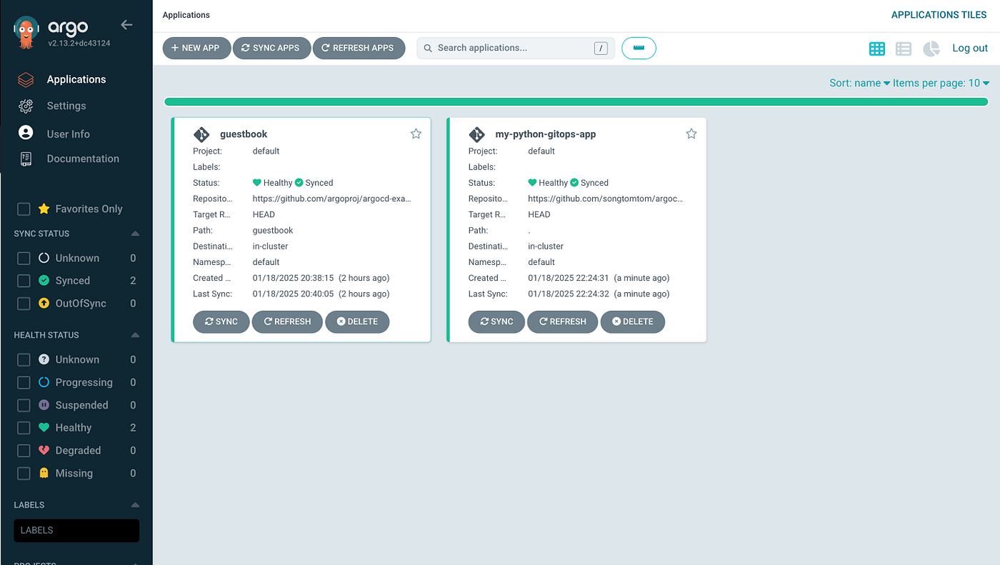
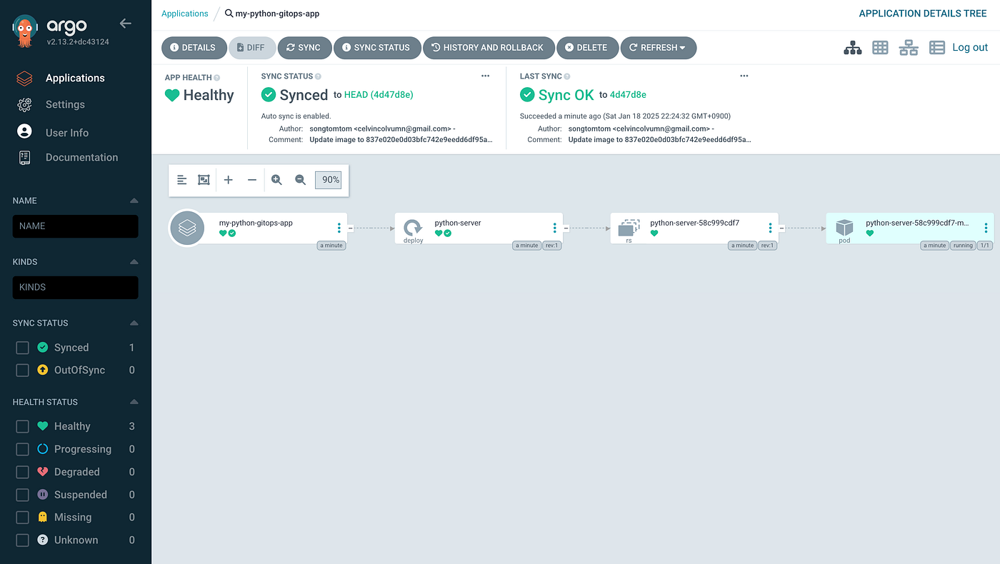
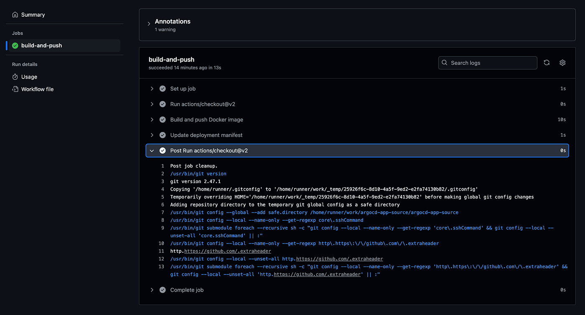

## Github 레파지토리 준비

먼저, 두 개의 레파지토리를 생성합니다.

- argocd-app-source: 애플리케이션 소스 코드를 저장합니다.
- argocd-app-manifests: Kubernetes 매니페스트 파일을 저장합니다.

## Python 애플리케이션 소스 코드 작성

argocd-app-source 레포지토리에 간단한 Flask 서버를 만듭니다.

`app.py`

```python
from flask import Flask

app = Flask(__name__)


@app.route('/')
def hello():
    return "Hello, Argo CD with Python!"


if __name__ == '__main__':
    app.run(port=5001)
```

<a href="https://medium.com/media/9ec244011a0251fa0b43f864e5745c61/href">https://medium.com/media/9ec244011a0251fa0b43f864e5745c61/href</a>

```bash
python app.py

 * Serving Flask app 'app'
 * Debug mode: off
WARNING: This is a development server. Do not use it in a production deployment. Use a production WSGI server instead.
 * Running on http://127.0.0.1:5001
Press CTRL+C to quit
127.0.0.1 - - [18/Jan/2025 21:26:29] "GET / HTTP/1.1" 200 -
127.0.0.1 - - [18/Jan/2025 21:26:29] "GET /favicon.ico HTTP/1.1" 404 -
```

requirements.txt

```text
Flask==3.0.0
```

`Dockerfile`

```dockerfile
FROM python:3.9-slim

WORKDIR /app

COPY requirements.txt .
RUN pip install --no-cache-dir -r requirements.txt

COPY app.py .

CMD ["python", "app.py"]
```

<a href="https://medium.com/media/bb3a553df21e6009d1496bdb5cd90335/href">https://medium.com/media/bb3a553df21e6009d1496bdb5cd90335/href</a>

## Kubernetes 매니페스트 작성

argocd-app-manifests 레파지토리에deployment.yaml 파일을 생성합니다.

`deployment.yaml`

```yaml
apiVersion: apps/v1
kind: Deployment
metadata:
  name: python-server
spec:
  replicas: 1
  selector:
    matchLabels:
      app: python-server
  template:
    metadata:
      labels:
        app: python-server
    spec:
      containers:
        - name: python-server
          image: songtomtom/python-server:latest
          ports:
            - containerPort: 5001
```

<a href="https://medium.com/media/fe3732c759ee98e8920f286c6f3065bb/href">https://medium.com/media/fe3732c759ee98e8920f286c6f3065bb/href</a>

## GitHub 레파지토리 연결

Argo CD에 GitHub **레파지토리**를 연결합니다.

```bash
kubectl create secret generic github-repo-creds \
  --namespace argocd \
  --from-literal=url=https://github.com/songtomtom/argocd-app-manifests.git \
  --from-literal=username=songtomtom \
  --from-literal=password='your_password'

secret/github-repo-creds created
```

## Argo CD 애플리케이션 생성 및 적용

argocd-app-manifests 레포지토리의 루트 디렉토리에 my-gitops-app.yaml 파일을 생성합니다.

`my-gitops-app.yaml`

```yaml
apiVersion: argoproj.io/v1alpha1
kind: Application
metadata:
  name: my-python-gitops-app
  namespace: argocd
spec:
  project: default
  source:
    repoURL: https://github.com/songtomtom/argocd-app-manifests.git
    targetRevision: HEAD
    path: .
  destination:
    server: https://kubernetes.default.svc
    namespace: default
  syncPolicy:
    automated:
      prune: true
      selfHeal: true
```

<a href="https://medium.com/media/7dc9063e6238f345449220c1613f85ee/href">https://medium.com/media/7dc9063e6238f345449220c1613f85ee/href</a>

위 Application 리소스를 Kubernetes 클러스터에 적용합니다.

```bash
kubectl apply -f my-gitops-app.yaml
```

Argo CD가 애플리케이션을 관리하고 자동으로 동기화할 수 있게 됩니다.





## CI/CD 파이프라인 구성

argocd-app-source 레포지토리에 GitHub Actions 워크플로우를 추가합니다.

`build_and_push.yaml`

```yaml
name: CI/CD Pipeline

on:
  push:
    branches: [ master ]

jobs:
  build-and-push:
    runs-on: ubuntu-latest
    steps:
    - uses: actions/checkout@v2
      with:
        token: ${{ secrets.USER_CHECKOUT_TOKEN }}

    - name: Build and push Docker image
      env:
        DOCKER_USERNAME: ${{ secrets.DOCKER_USERNAME }}
        DOCKER_PASSWORD: ${{ secrets.DOCKER_PASSWORD }}
      run: |
        docker login -u $DOCKER_USERNAME -p $DOCKER_PASSWORD
        docker build -t songtomtom/python-server:${{ github.sha }} .
        docker push songtomtom/python-server:${{ github.sha }}

    - name: Update deployment manifest
      run: |
        git config --global user.name 'songtomtom'
        git config --global user.email 'celvincolvumn@gmail.com'
        git clone https://songtomtom:${{ secrets.USER_CHECKOUT_TOKEN }}@github.com/songtomtom/argocd-app-manifests.git
        cd argocd-app-manifests
        sed -i 's|image: .*|image: songtomtom/python-server:${{ github.sha }}|' deployment.yaml
        git add deployment.yaml
        git commit -m "Update image to ${{ github.sha }}"
        git push
```

<a href="https://medium.com/media/924fcdde8b10f7e2583d5827cd03bbc9/href">https://medium.com/media/924fcdde8b10f7e2583d5827cd03bbc9/href</a>

## 변경사항 배포

이제 argocd-app-source에 변경사항을 푸시하면 다음과 같은 과정이 자동으로 진행됩니다.

- GitHub Actions가 새 Docker 이미지를 빌드하고 푸시합니다.
- argocd-app-manifests의 배포 매니페스트가 업데이트됩니다.
- Argo CD가 변경을 감지하고 클러스터에 새 버전의 Python서버를 배포합니다.



## Github

- [songtomtom/argocd-app-source](https://github.com/songtomtom/argocd-app-source)
- [songtomtom/argocd-app-manifests](https://github.com/songtomtom/argocd-app-manifests)
