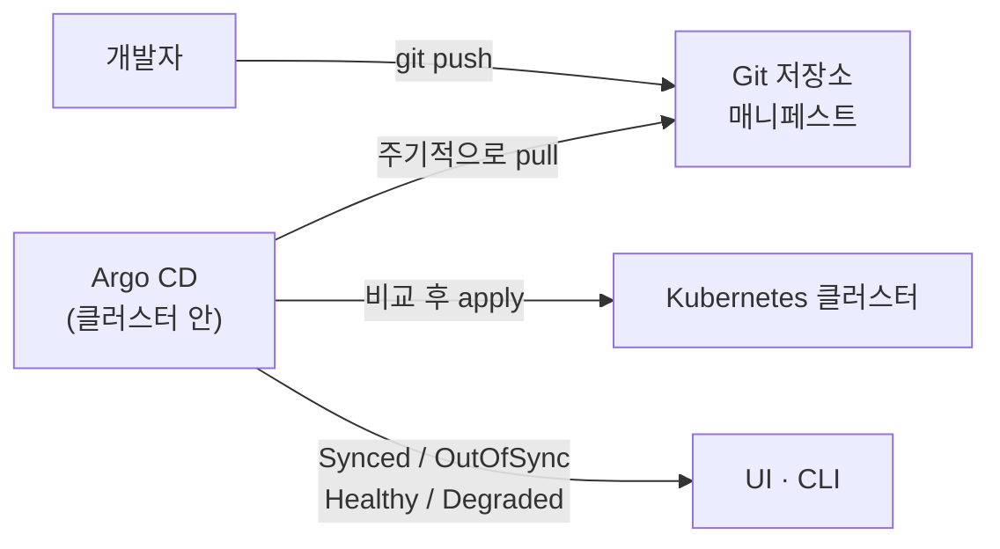

배포를 `kubectl apply`로 하다 보면 두 가지가 불안해집니다. 지금 클러스터에 무엇이 떠 있는지 정확히 아는 사람이 없고, 누가 언제 무엇을 바꿨는지 기록이 없습니다. GitOps는 이 문제를 "클러스터의 원하는 상태를 Git에 두고, 클러스터가 Git을 따라가게 한다"는 원칙으로 풉니다. 배포는 커밋이고, 롤백은 revert이고, 감사 기록은 git log입니다.

Argo CD는 그 원칙을 Kubernetes에서 실행하는 도구입니다. Git 저장소를 감시하다가 매니페스트가 바뀌면 클러스터에 적용하고, 반대로 클러스터가 Git과 달라지면 알려 주거나 되돌립니다. 이 글은 로컬 Minikube에 Argo CD를 올려 예제 애플리케이션을 배포하는 첫 단계입니다. 2편에서 GitHub Actions와 연결해 푸시만으로 배포되는 파이프라인을 만듭니다.

## Argo CD의 동작



전통적인 CI/CD는 CI 서버가 클러스터에 접속해 배포를 밀어 넣습니다(push). Argo CD는 클러스터 안에서 Git을 당겨옵니다(pull). 차이는 권한에 있습니다. CI 서버가 클러스터 자격 증명을 가질 필요가 없고, 클러스터에 접근할 수 있는 것은 클러스터 안의 Argo CD뿐입니다.

## 설치

```bash
minikube start
kubectl create namespace argocd
kubectl apply -n argocd -f https://raw.githubusercontent.com/argoproj/argo-cd/stable/manifests/install.yaml
```

설치 매니페스트 하나가 API 서버, 저장소 서버, 애플리케이션 컨트롤러, Redis 등을 `argocd` 네임스페이스에 올립니다. 컨트롤러가 Git과 클러스터를 비교하는 핵심이고, API 서버는 UI와 CLI가 붙는 곳입니다.

```bash
kubectl get pods -n argocd
```

모든 파드가 Running이 될 때까지 1분 정도 걸립니다.

## CLI와 접속

```bash
brew install argocd
kubectl port-forward svc/argocd-server -n argocd 8080:443
```

API 서버는 기본적으로 외부에 노출되지 않습니다. 실습에서는 포트 포워딩이 가장 간단하고, 실제 환경에서는 Ingress를 붙입니다. 이제 `https://localhost:8080`으로 UI에 들어갈 수 있습니다. 자체 서명 인증서라 브라우저 경고가 뜹니다.

초기 관리자 비밀번호는 설치 시 시크릿에 생성됩니다.

```bash
argocd admin initial-password -n argocd
argocd login localhost:8080
# Username: admin
# Password: (위에서 확인한 값)
argocd account update-password
```

비밀번호를 바꾼 뒤에는 초기 비밀번호 시크릿을 지우는 것이 문서의 권장 사항입니다.

```bash
kubectl -n argocd delete secret argocd-initial-admin-secret
```


## Application 리소스

Argo CD에서 배포 단위는 `Application`이라는 커스텀 리소스입니다. "어느 Git 저장소의 어느 경로를, 어느 클러스터의 어느 네임스페이스에" 넣을지를 선언합니다. CLI로 만들어 봅니다.

```bash
argocd app create guestbook \
  --repo https://github.com/argoproj/argocd-example-apps.git \
  --path guestbook \
  --dest-server https://kubernetes.default.svc \
  --dest-namespace default
```

- `--repo`, `--path`: 매니페스트가 있는 곳. Argo CD 공식 예제 저장소의 guestbook 디렉터리입니다.
- `--dest-server`: 배포 대상 클러스터. `https://kubernetes.default.svc`는 Argo CD 자신이 떠 있는 클러스터를 뜻합니다.
- `--dest-namespace`: 배포 대상 네임스페이스.


만든 직후 상태는 **OutOfSync**입니다. Git에는 매니페스트가 있지만 클러스터에는 아직 없기 때문입니다. Argo CD는 기본적으로 차이를 발견해도 자동으로 적용하지 않고 사람의 승인을 기다립니다. 이 동작을 바꾸는 것이 2편의 자동 동기화입니다.

## 동기화

```bash
argocd app sync guestbook
```

```text
TIMESTAMP                  GROUP        KIND   NAMESPACE                  NAME    STATUS   HEALTH            HOOK  MESSAGE
2025-01-18T20:40:05+09:00            Service     default          guestbook-ui    Synced  Healthy                  service/guestbook-ui created
2025-01-18T20:40:05+09:00   apps  Deployment     default          guestbook-ui    Synced  Progressing              deployment.apps/guestbook-ui created

Name:               argocd/guestbook
Sync Status:        Synced to  (4773b9f)
Health Status:      Progressing
```

출력에서 두 축을 구분해서 봐야 합니다.

- **Sync Status**는 Git과 클러스터가 같은지입니다. `Synced`는 매니페스트가 적용됐다는 뜻이지 앱이 잘 돈다는 뜻이 아닙니다.
- **Health Status**는 리소스가 실제로 동작하는지입니다. Deployment는 파드가 준비될 때까지 `Progressing`이었다가 `Healthy`가 되고, 이미지 풀 실패 같은 문제가 있으면 `Degraded`가 됩니다.

배포가 "성공"했다는 것은 두 상태가 모두 좋아졌을 때입니다. Argo CD는 리소스 종류별로 건강 상태를 판단하는 규칙을 내장하고 있고, 커스텀 리소스는 Lua 스크립트로 규칙을 추가할 수 있습니다.


UI에서는 Application이 만든 리소스 트리를 볼 수 있습니다. Deployment 아래 ReplicaSet, 그 아래 Pod가 연결되어 있어 어느 단계에서 문제가 생겼는지 바로 보입니다.

## 되돌리기

GitOps의 롤백은 Git 이력을 되돌리는 것입니다. UI의 History 탭에서 이전 커밋을 골라 롤백할 수 있고, 근본적으로는 매니페스트 저장소에서 `git revert` 후 푸시하면 됩니다. 클러스터에서 손으로 `kubectl rollout undo`를 하면 Git과 달라져 OutOfSync가 되므로 하지 않습니다.

## 배운 것

- Argo CD의 단위는 컨테이너나 파드가 아니라 **Git 경로**입니다. 저장소 구조를 먼저 설계해야 합니다. 2편에서 소스 코드와 매니페스트를 왜 다른 저장소에 두는지 다룹니다.
- Sync와 Health는 다른 축입니다. 배포 파이프라인이 "Synced"만 보고 성공으로 판단하면 죽은 파드를 놓칩니다.
- 수동 동기화가 기본값인 것은 안전장치입니다. 자동으로 바꾸기 전에 어떤 변경이 어떤 영향을 주는지 UI에서 몇 번 확인해 보는 것이 좋습니다.

## Reference

- [Argo CD — Getting Started](https://argo-cd.readthedocs.io/en/stable/getting_started/)
- [Argo CD — Core Concepts](https://argo-cd.readthedocs.io/en/stable/core_concepts/)
