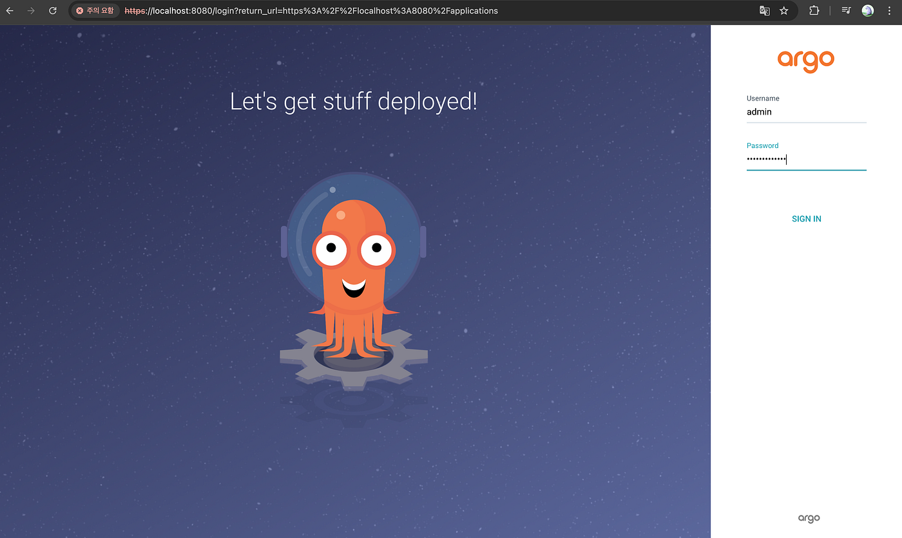
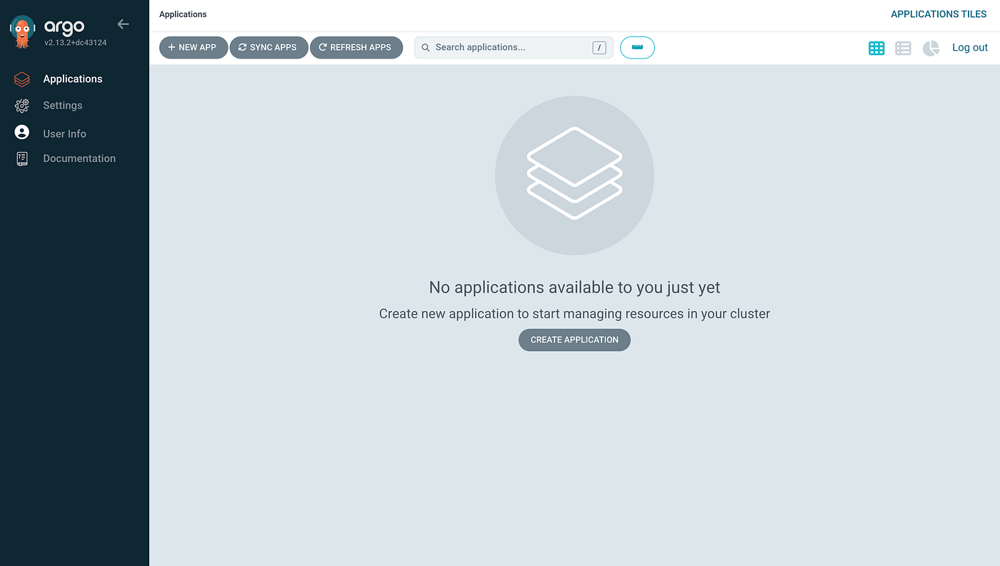
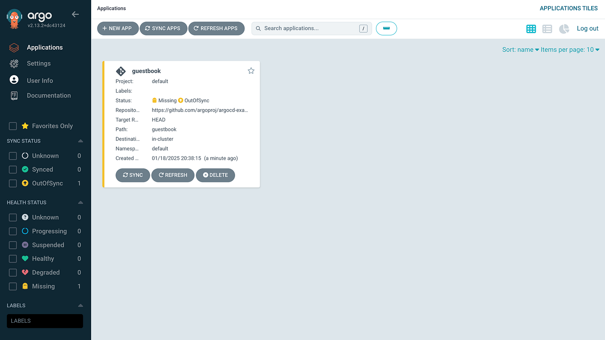
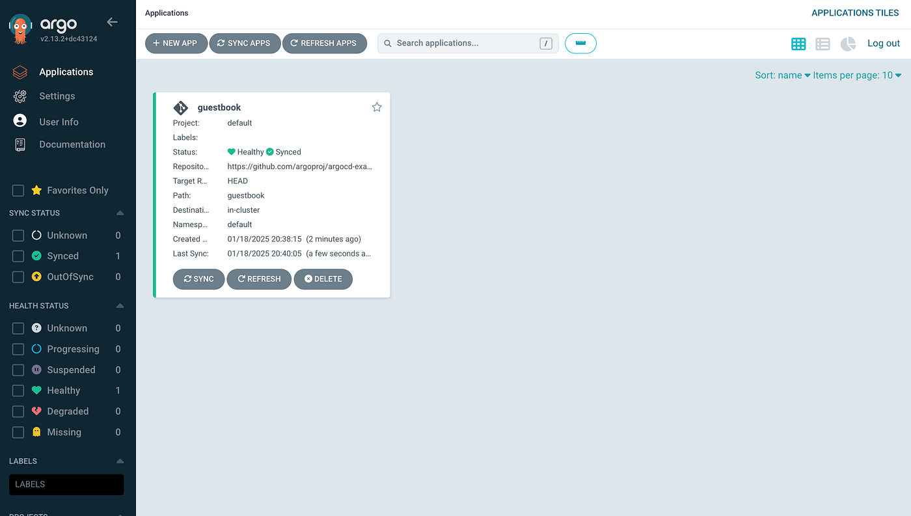
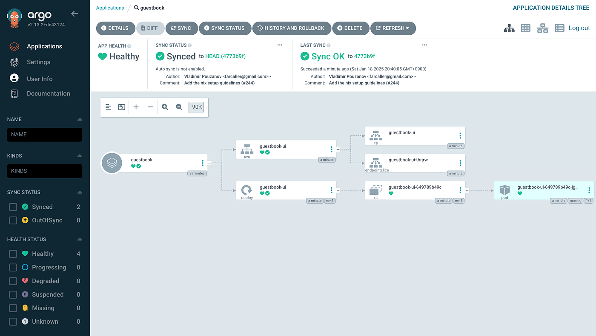

## Argo CD 설치

Minikube 시작

```bash
minikube start
```

Argo CD를 위한 네임스페이스 생성

```bash
kubectl create namespace argocd
```

Argo CD 설치

```bash
kubectl apply -n argocd -f https://raw.githubusercontent.com/argoproj/argo-cd/stable/manifests/install.yaml
```

## Argo CD CLI 설치

Argo CD CLI를 사용하면 명령줄에서 쉽게 Argo CD를 관리할 수 있습니다. 다음 명령으로 설치할 수 있습니다.

```bash
brew install argocd
```

## Argo CD API 서버 접근

기본적으로 Argo CD API 서버는 외부 IP로 노출되지 않습니다. 다음 방법 중 하나를 선택하여 API 서버에 접근할 수 있습니다:

포트 포워딩

```bash
kubectl port-forward svc/argocd-server -n argocd 8080:443
```

이후 [https://localhost:8080](https://localhost:8080/) 으로 접근 가능합니다.

## Argo CD 로그인

초기 관리자 비밀번호 확인

```bash
argocd admin initial-password -n argocd
```

CLI로 로그인

```bash
argocd login localhost:8080
WARNING: server certificate had error: tls: failed to verify certificate: x509: certificate signed by unknown authority. Proceed insecurely (y/n)? y
Username: admin
Password:
'admin:login' logged in successfully
Context 'localhost:8080' updated
```

비밀번호 변경

```bash
argocd account update-password

*** Enter password of currently logged in user (admin):
*** Enter new password for user admin:
*** Confirm new password for user admin:
Password updated
Context 'localhost:8080' updated
```





## Application 배포하기

예제로 guestbook 애플리케이션을 배포해 보겠습니다:

Application 생성

```bash
argocd app create guestbook --repo https://github.com/argoproj/argocd-example-apps.git --path guestbook --dest-server https://kubernetes.default.svc --dest-namespace default
```



Application 동기화(배포)

```bash
argocd app sync guestbook

TIMESTAMP                  GROUP        KIND   NAMESPACE                  NAME    STATUS   HEALTH            HOOK  MESSAGE
2025-01-18T20:40:05+09:00            Service     default          guestbook-ui    Synced  Healthy                  service/guestbook-ui created
2025-01-18T20:40:05+09:00   apps  Deployment     default          guestbook-ui    Synced  Progressing              deployment.apps/guestbook-ui created

Name:               argocd/guestbook
Project:            default
Server:             https://kubernetes.default.svc
Namespace:          default
URL:                https://localhost:8080/applications/guestbook
Source:
- Repo:             https://github.com/argoproj/argocd-example-apps.git
  Target:
  Path:             guestbook
SyncWindow:         Sync Allowed
Sync Policy:        Manual
Sync Status:        Synced to  (4773b9f)
Health Status:      Progressing

Operation:          Sync
Sync Revision:      4773b9f1f8fd425f84174c338012771c4e9a989c
Phase:              Succeeded
Start:              2025-01-18 20:40:05 +0900 KST
Finished:           2025-01-18 20:40:05 +0900 KST
Duration:           0s
Message:            successfully synced (all tasks run)

GROUP  KIND        NAMESPACE  NAME          STATUS  HEALTH       HOOK  MESSAGE
       Service     default    guestbook-ui  Synced  Healthy            service/guestbook-ui created
apps   Deployment  default    guestbook-ui  Synced  Progressing        deployment.apps/guestbook-ui created
```

이제 guestbook 애플리케이션이 Minikube 클러스터에 배포되었습니다.





## Reference

- [Argo CD — Getting Started](https://argo-cd.readthedocs.io/en/stable/getting_started/)
