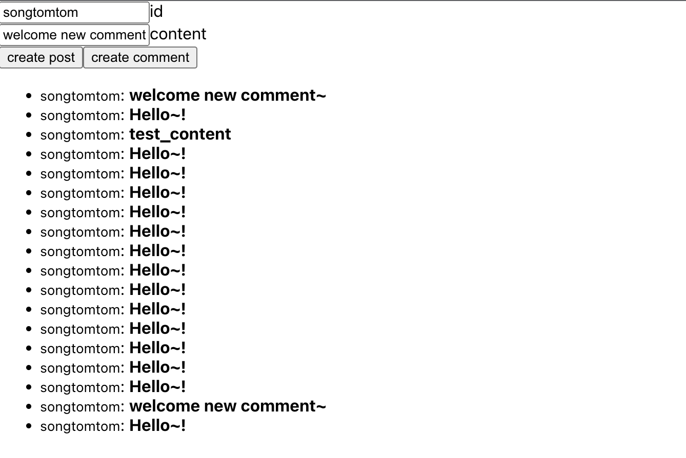

지금까지 구독 통로(1, 2편)와 저장소(3편), 화면(4편)을 만들었습니다. 남은 것은 가운데를 잇는 부분입니다. `createComment` 뮤테이션이 실행됐을 때 그 사실을 `commentAdded` 구독 리졸버가 알아야 합니다. 두 리졸버는 서로 다른 요청, 서로 다른 고루틴에서 실행되므로 둘 사이에 공유되는 무언가가 필요합니다. 이 글에서는 그것을 Observer라고 부르고 Go 채널로 만듭니다.

## 문제를 그림으로

```
createComment (요청 A, 고루틴 A)          commentAdded (요청 B, 고루틴 B)
        │                                         │
        │  DB 저장                                 │  채널을 만들어 gqlgen 에 반환
        │                                         │  gqlgen 은 채널에서 값을 읽어 클라이언트로 보냄
        ▼                                         ▼
     ┌───────────────── Observer ─────────────────┐
     │  postId → { 구독자 채널, 구독자 채널, ... }  │
     └────────────────────────────────────────────┘
        Publish(postId, comment)     Subscribe(postId) → 채널
```

구독 리졸버는 채널을 Observer에 등록하고 그 채널을 gqlgen에 돌려줍니다. 뮤테이션 리졸버는 저장이 끝난 뒤 Observer에 발행합니다. Observer는 같은 postId에 등록된 모든 채널에 댓글을 씁니다.

## 처음 만든 버전과 세 가지 버그

처음에는 이렇게 만들었습니다.

```go
// 처음 버전. 문제가 있다.
type Resolver struct {
	DB       *gorm.DB
	Observer map[string]chan *model.Comment
}

func (r *subscriptionResolver) CommentAdded(ctx context.Context, input model.AddedCommentInput) (<-chan *model.Comment, error) {
	ch := make(chan *model.Comment)
	go func() {
		<-ctx.Done()
		delete(r.Observer, input.PostID)
	}()
	r.Observer[input.PostID] = ch
	return ch, nil
}

func (r *mutationResolver) CreateComment(ctx context.Context, input model.CreateCommentInput) (*model.Comment, error) {
	// ... 저장 ...
	for _, o := range r.Observer {
		o <- &comment
	}
	return &comment, nil
}
```

브라우저 탭 하나로 테스트할 때는 잘 됐습니다. 탭을 두 개 열자 문제가 드러났습니다.

**1. 동시 쓰기.** Go의 map은 동시에 읽고 쓰면 런타임이 `fatal error: concurrent map writes`로 프로세스를 죽입니다. 구독 리졸버와 뮤테이션 리졸버는 각자의 고루틴에서 같은 map을 만지므로, 구독이 시작되는 순간과 댓글이 발행되는 순간이 겹치면 서버가 내려갑니다. 부하 테스트 없이도 탭 두 개로 재현됐습니다.

**2. 구독자 덮어쓰기.** postId 하나에 채널 하나만 저장하므로 같은 게시물을 두 번째 사람이 구독하면 첫 번째 사람의 채널이 map에서 사라집니다. 첫 번째 사람은 더 이상 이벤트를 받지 못하는데, 연결은 살아 있어서 오류도 안 납니다. 게다가 첫 번째 사람이 구독을 끊으면 `delete`가 두 번째 사람의 채널을 지웁니다.

**3. 블로킹 발행.** `o <- &comment`는 버퍼 없는 채널에 쓰는 것이라 구독자 쪽에서 읽어 갈 때까지 멈춥니다. 구독자 하나가 느리거나 네트워크가 막혀 있으면 댓글을 쓰는 사람의 뮤테이션 응답이 같이 멈춥니다. 발행이 모든 구독자에게 가는 것도 문제입니다. postId로 거르지 않아서 다른 게시물의 댓글까지 받습니다.

## 고친 Observer

세 문제를 한 번에 풀기 위해 Observer를 별도 타입으로 분리했습니다.

`graph/observer.go`

```go
type Observer struct {
	mu   sync.RWMutex
	subs map[string]map[chan *model.Comment]struct{}
}

// subscriberBuffer 는 구독자 한 명이 소비하지 못한 채 쌓아 둘 수 있는 이벤트 수다.
const subscriberBuffer = 16

func NewObserver() *Observer {
	return &Observer{subs: map[string]map[chan *model.Comment]struct{}{}}
}

// Subscribe 는 postID 에 대한 수신 채널과 구독 해제 함수를 돌려준다.
func (o *Observer) Subscribe(postID string) (<-chan *model.Comment, func()) {
	ch := make(chan *model.Comment, subscriberBuffer)

	o.mu.Lock()
	if o.subs[postID] == nil {
		o.subs[postID] = map[chan *model.Comment]struct{}{}
	}
	o.subs[postID][ch] = struct{}{}
	o.mu.Unlock()

	var once sync.Once
	unsubscribe := func() {
		once.Do(func() {
			o.mu.Lock()
			defer o.mu.Unlock()
			if set, ok := o.subs[postID]; ok {
				delete(set, ch)
				if len(set) == 0 {
					delete(o.subs, postID)
				}
			}
			close(ch)
		})
	}
	return ch, unsubscribe
}

// Publish 는 postID 를 구독 중인 모든 채널에 comment 를 보낸다.
// 버퍼가 가득 찬 구독자는 건너뛰며, 실제로 전달된 구독자 수를 돌려준다.
func (o *Observer) Publish(postID string, comment *model.Comment) int {
	o.mu.RLock()
	defer o.mu.RUnlock()

	delivered := 0
	for ch := range o.subs[postID] {
		select {
		case ch <- comment:
			delivered++
		default:
			// 구독자가 이벤트를 소비하지 못하고 있다. 뮤테이션을 막지 않기 위해 버린다.
		}
	}
	return delivered
}
```

각 문제가 어디서 풀리는지 짚으면 이렇습니다.

- **동시 쓰기** → `sync.RWMutex`. 등록과 해제는 쓰기 잠금, 발행은 읽기 잠금입니다. 발행이 훨씬 자주 일어나므로 읽기 잠금은 여러 발행이 동시에 진행되게 해 줍니다.
- **덮어쓰기** → `map[postId]map[chan]struct{}`. 값이 채널 하나가 아니라 채널 집합입니다. 구독자가 몇 명이든 각자 자기 채널을 갖고, 해제할 때 자기 것만 지웁니다. `struct{}`는 크기가 0이라 집합을 표현할 때 관용적으로 씁니다.
- **블로킹 발행** → 버퍼 16과 `select`의 `default`. 구독자가 잠깐 늦어도 16개까지는 쌓아 두고, 그래도 가득 차면 그 구독자에 대해서만 이벤트를 버리고 다음으로 넘어갑니다. 뮤테이션은 절대 구독자 때문에 멈추지 않습니다.
- **해제 함수의 `sync.Once`** → 구독 해제가 두 번 호출되어도 채널을 두 번 닫아 panic이 나지 않게 합니다. 5편을 쓰면서 테스트로 잡은 케이스입니다.

## 리졸버 연결

`graph/schema.resolvers.go`

```go
func (r *subscriptionResolver) CommentAdded(ctx context.Context, input model.AddedCommentInput) (<-chan *model.Comment, error) {
	ch, unsubscribe := r.Observer.Subscribe(input.PostID)

	// 구독이 끝나면(클라이언트 종료, 네트워크 단절, 서버 셧다운) 등록을 지우고 채널을 닫는다.
	// 채널이 닫히면 gqlgen 은 클라이언트에 complete 메시지를 보내고 구독을 정리한다.
	go func() {
		<-ctx.Done()
		unsubscribe()
	}()

	return ch, nil
}

func (r *mutationResolver) CreateComment(ctx context.Context, input model.CreateCommentInput) (*model.Comment, error) {
	comment := model.Comment{
		ID:      uuid.UUIDv4(),
		PostID:  input.PostID,
		Content: input.Content,
	}
	if err := r.DB.WithContext(ctx).Create(&comment).Error; err != nil {
		return nil, fmt.Errorf("create comment: %w", err)
	}

	// DB 에 저장이 끝난 뒤에 발행한다. 저장 전에 발행하면 구독자가 아직 없는 댓글을 먼저 보게 된다.
	r.Observer.Publish(input.PostID, &comment)

	return &comment, nil
}
```

구독 리졸버가 간단해졌습니다. 채널 생성, 등록, 해제가 모두 Observer 안에 있고 리졸버는 "구독 종료 시 해제"만 책임집니다. 1편에서 본 것처럼 클라이언트가 `complete`를 보내거나 연결이 끊기면 gqlgen이 `ctx`를 취소하고, 그 순간 `unsubscribe`가 실행됩니다.

Observer는 3편에서 설명한 대로 서버 시작 시 한 번만 만들어 `Resolver`에 넣습니다. 요청마다 만들면 구독자와 발행자가 다른 Observer를 보게 되어 아무 일도 일어나지 않습니다.

## 테스트

Observer는 HTTP나 DB 없이 단위 테스트할 수 있는 순수한 Go 코드가 되었습니다. 세 가지 버그를 각각 재현하는 테스트를 두었습니다.

`graph/observer_test.go`

```go
func TestObserver_PublishReachesAllSubscribersOfSamePost(t *testing.T) {
	o := NewObserver()
	a, unsubA := o.Subscribe("post-1")
	b, unsubB := o.Subscribe("post-1")
	other, unsubOther := o.Subscribe("post-2")
	defer unsubA()
	defer unsubB()
	defer unsubOther()

	c := &model.Comment{ID: "c1", PostID: "post-1", Content: "hi"}
	if got := o.Publish("post-1", c); got != 2 {
		t.Fatalf("delivered = %d, want 2", got)
	}
	if got := <-a; got != c {
		t.Fatalf("subscriber a got %v", got)
	}
	if got := <-b; got != c {
		t.Fatalf("subscriber b got %v", got)
	}
	select {
	case got := <-other:
		t.Fatalf("post-2 subscriber should not receive post-1 comment, got %v", got)
	default:
	}
}
```

동시성 테스트는 `go test -race`로 돌립니다. 처음 버전의 map을 이 테스트에 넣으면 race detector가 바로 잡아냅니다.

```bash
go test -race ./...
# ok  github.com/songtomtom/gqlgen-apollo-subscriptions/graph  1.496s
```

여기에 더해 실제 서버를 띄우고 graphql-transport-ws 프로토콜로 직접 붙는 스모크 테스트도 돌렸습니다. 허용되지 않은 오리진이 거부되는지, 같은 게시물 구독자 둘은 받고 다른 게시물 구독자는 받지 않는지, 한 명이 구독을 끊은 뒤에도 남은 사람은 계속 받는지를 확인했습니다.

## 클라이언트: subscribeToMore

4편에서 남겨 둔 문제, 댓글을 달아도 목록이 안 바뀌는 문제를 풉니다. 구독 결과를 목록에 합치는 데는 `useSubscription`이 아니라 `useQuery`가 돌려주는 `subscribeToMore`를 씁니다.

`client/src/App.tsx`

```tsx
const COMMENTS_SUBSCRIPTION = gql`
  subscription OnCommentAdded($input: AddedCommentInput!) {
    commentAdded(input: $input) {
      id
      postId
      content
    }
  }
`;

const { data, loading, subscribeToMore } = useQuery(LIST_COMMENTS, {
  variables: { where: { postId: id } },
});

const subscribeToNewComment = () => {
  return subscribeToMore({
    document: COMMENTS_SUBSCRIPTION,
    variables: { input: { postId: id } },
    updateQuery: (prev, { subscriptionData }) => {
      if (!subscriptionData.data) {
        return prev;
      }
      const newComment = subscriptionData.data.commentAdded;
      return Object.assign({}, prev, {
        comments: [newComment, ...prev.comments],
      });
    },
  });
};

// id 가 바뀌면 이전 postId 구독을 해제하고 새 postId 로 다시 구독한다.
// subscribeToMore 가 돌려주는 함수가 구독 해제 함수라서 그대로 cleanup 으로 쓴다.
useEffect(() => subscribeToNewComment(), [id]);
```

`useSubscription`은 "마지막으로 받은 이벤트 하나"를 상태로 갖는 훅입니다. 목록에 누적하려면 따로 상태를 만들어 이어 붙여야 하고, 그러면 `useQuery`가 가진 목록과 두 벌이 됩니다. `subscribeToMore`는 쿼리 캐시 자체를 갱신합니다. `updateQuery`가 이전 결과와 구독 이벤트를 받아 새 결과를 돌려주면, Apollo가 캐시를 바꾸고 이 쿼리를 쓰는 모든 컴포넌트가 다시 렌더링됩니다. 4편에서 설명한 "클라이언트는 목록 규칙을 모른다"는 문제를, 규칙을 `updateQuery`에 직접 써 주는 것으로 푸는 셈입니다.

`useEffect`의 의존성이 `[id]`인 것도 중요합니다. 처음에는 `[]`로 두어서 게시물 id를 바꿔도 처음 게시물의 구독이 그대로 남았습니다. 목록은 새 게시물 것인데 이벤트는 옛 게시물 것이 들어오는 상태였습니다. `subscribeToMore`가 돌려주는 해제 함수를 cleanup으로 넘기면 id가 바뀔 때 이전 구독이 정리되고 새 구독이 열립니다.

## 실행

탭 두 개를 열고 같은 게시물 id를 넣은 뒤 한쪽에서 댓글을 달면 다른 쪽 목록에 즉시 나타납니다.



## 한계와 운영에서 달라져야 할 것

이 Observer는 프로세스 안의 메모리입니다. 예제로는 충분하지만 그대로 운영에 올릴 수는 없습니다.

- **서버가 여러 대면 동작하지 않습니다.** 인스턴스 A에 붙은 구독자는 인스턴스 B에서 일어난 뮤테이션을 모릅니다. Redis Pub/Sub, NATS, Kafka 같은 외부 브로커에 발행하고 각 인스턴스가 브로커를 구독해 자기 Observer로 흘려보내는 구조가 필요합니다. Observer의 `Publish`를 브로커 발행으로, 브로커 수신을 Observer 발행으로 바꾸면 됩니다. 이 인터페이스 경계를 지금 만들어 둔 것이 그래서 의미가 있습니다.
- **버퍼가 차면 이벤트가 버려집니다.** 댓글 하나를 놓친 구독자는 새로고침 전까지 모릅니다. 놓치면 안 되는 도메인이라면 버리는 대신 그 구독자를 끊고 클라이언트가 재접속 시 목록을 다시 조회하게 하거나, 이벤트에 순번을 붙여 빠진 구간을 채우는 설계가 필요합니다.
- **인증과 권한이 없습니다.** 누구나 어떤 postId든 구독할 수 있습니다. `connection_init` 단계에서 토큰을 검증하고 `Subscribe` 전에 권한을 확인해야 합니다.
- **구독자 수 제한이 없습니다.** 악의적인 클라이언트가 구독을 무한히 열 수 있으므로 연결당 구독 수와 전체 연결 수에 상한이 필요합니다.

## 시리즈를 마치며

다섯 편을 거치며 가장 크게 배운 것은 "구독은 채널을 돌려주는 리졸버"가 아니라 "수명을 관리해야 하는 자원"이라는 점입니다. 구독이 시작될 때 등록하고, 끝날 때 해제하고, 발행이 구독자 때문에 멈추지 않게 하고, 여러 구독자를 서로 격리하는 것. 이 네 가지가 지켜지면 나머지는 프로토콜과 라이브러리가 해 줍니다. 처음 버전은 네 가지 모두를 놓치고도 탭 하나에서는 잘 돌았습니다. 동시성 문제는 항상 그렇게 옵니다.

## Reference

- [gqlgen — Subscriptions](https://gqlgen.com/recipes/subscription/)
- [Apollo Client — subscribeToMore](https://www.apollographql.com/docs/react/data/subscriptions#subscribing-to-updates-for-a-query)
- [Go — sync.RWMutex](https://pkg.go.dev/sync#RWMutex)
