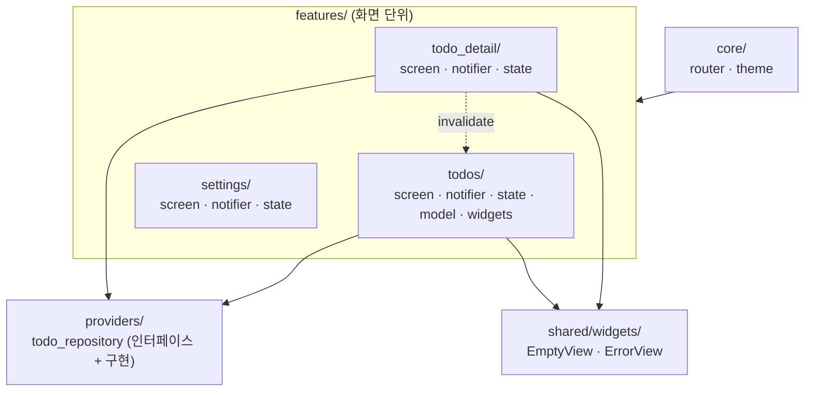

Flutter 프로젝트를 몇 개 만들다 보면 같은 지점에서 불편해집니다. 화면 하나에 필드 하나를 추가하는데 `models/`, `repositories/`, `providers/`, `screens/` 네 폴더를 오가야 하고, 어떤 파일이 어떤 화면에 쓰이는지는 파일을 열어 봐야 압니다. 처음 세 화면일 때는 견딜 만한데 스무 화면쯤 되면 "이 파일 지워도 되나"를 아무도 답하지 못하는 상태가 됩니다.

이 시리즈는 그 문제를 다루는 구조를 작은 할 일 앱으로 만들어 보는 기록입니다. 이번 편은 폴더 구조, 2편은 상태를 타입으로 다루는 방법, 3편은 코드 생성, 4편은 금지 패턴과 그 이유입니다. 전체 코드는 [songtomtom/flutter-feature-architecture](https://github.com/songtomtom/flutter-feature-architecture)에 있고, 이번 편의 코드는 `part-1` 태그 시점입니다.

## 만드는 것

할 일 목록, 상세, 설정 세 화면입니다. 서버는 없고 SharedPreferences에 저장합니다. 화면이 세 개뿐인데도 구조를 이야기하기에 충분한 이유는, 세 화면이 저장소 하나를 공유하고 상세 화면의 변경이 목록에 반영되어야 하기 때문입니다. 기능 사이의 경계를 어디에 둘지가 바로 드러납니다.



스택은 Riverpod(riverpod_generator), go_router(go_router_builder), freezed입니다. Flutter 3.35, Dart 3.9 기준입니다.

## 레이어 폴더를 만들지 않는 이유

Clean Architecture를 Flutter에 적용한 예제는 대개 이런 모양입니다.

```text
lib/
├── data/repositories/todo_repository_impl.dart
├── domain/entities/todo.dart
├── domain/repositories/todo_repository.dart
├── domain/usecases/get_todos.dart
└── presentation/screens/todos_screen.dart
```

레이어로 나누면 "어떤 종류의 코드인가"는 바로 보입니다. 대신 "어떤 화면의 코드인가"가 사라집니다. 할 일 상세 화면을 지우려면 다섯 폴더에서 관련 파일을 찾아야 하고, 놓친 파일은 그대로 남습니다. 팀에서 실제로 반복되는 작업은 "레이어 하나를 통째로 바꾸기"가 아니라 "화면 하나를 고치기"입니다. 폴더 구조는 자주 하는 작업이 쉬워지는 쪽으로 잡아야 합니다.

그래서 이 프로젝트는 반대로 갑니다. 화면 하나에 필요한 파일은 그 화면의 폴더에 같이 둡니다.

## 구조

`app/lib/`

```text
lib/
├── main.dart                      ProviderScope 로 앱을 감싼다
├── app.dart                       MaterialApp.router, 테마
├── core/
│   ├── router/app_router.dart     타입 라우트 (go_router_builder)
│   └── theme/app_theme.dart
├── features/
│   ├── todos/
│   │   ├── todos_screen.dart      UI
│   │   ├── todos_notifier.dart    비즈니스 로직 (@riverpod Notifier)
│   │   ├── todos_state.dart       상태 (freezed sealed class)
│   │   ├── todo.dart              모델 (freezed + json)
│   │   └── widgets/todo_tile.dart
│   ├── todo_detail/
│   │   ├── todo_detail_screen.dart
│   │   ├── todo_detail_notifier.dart
│   │   └── todo_detail_state.dart
│   └── settings/
│       ├── settings_screen.dart
│       ├── settings_notifier.dart
│       └── settings_state.dart
├── providers/
│   └── todo_repository.dart       여러 feature 가 공유하는 저장소
└── shared/
    └── widgets/                   여러 feature 가 공유하는 위젯
```

네 디렉터리의 역할은 이렇습니다.

| 디렉터리 | 들어가는 것 | 들어가면 안 되는 것 |
|---|---|---|
| `features/<기능>/` | 그 화면의 UI, Notifier, State, 모델, 전용 위젯 | 다른 feature 에서 import 하는 파일 |
| `providers/` | 두 개 이상의 feature 가 공유하는 상태·저장소 | 특정 화면에만 쓰이는 것 |
| `core/` | 앱 전역 인프라. 라우터, 테마, (있다면) 네트워크 클라이언트 | 도메인 로직 |
| `shared/widgets/` | 여러 feature 가 쓰는 순수 위젯 | Provider, Notifier, Repository 의 import |

기준은 "누가 쓰는가"입니다. 한 화면만 쓰면 그 화면 폴더에, 둘 이상이 쓰면 `providers/`나 `shared/`에, 화면과 무관한 인프라면 `core/`에 둡니다. 처음부터 `providers/`에 넣지 않습니다. 두 번째 사용처가 생길 때 옮깁니다.

## feature 폴더 안

`todos` 폴더의 세 파일이 화면 하나를 이룹니다.

`app/lib/features/todos/todos_state.dart`

```dart
@freezed
sealed class TodosState with _$TodosState {
  const factory TodosState.loading() = TodosLoading;
  const factory TodosState.loaded(List<Todo> todos) = TodosLoaded;
  const factory TodosState.error(String message) = TodosError;
}
```

`app/lib/features/todos/todos_notifier.dart`

```dart
@riverpod
class TodosNotifier extends _$TodosNotifier {
  @override
  TodosState build() {
    _load();
    return const TodosState.loading();
  }

  Future<void> _load() async {
    try {
      final todos = await ref.read(todoRepositoryProvider).findAll();
      state = TodosState.loaded(todos);
    } catch (e) {
      state = TodosState.error(e.toString());
    }
  }

  Future<void> add(String title) async {
    final trimmed = title.trim();
    if (trimmed.isEmpty) return;
    await ref.read(todoRepositoryProvider).create(trimmed);
    await _load();
  }

  Future<void> toggle(String id) async {
    await ref.read(todoRepositoryProvider).toggle(id);
    await _load();
  }

  Future<void> remove(String id) async {
    await ref.read(todoRepositoryProvider).delete(id);
    await _load();
  }
}
```

`app/lib/features/todos/todos_screen.dart`

```dart
class TodosScreen extends ConsumerWidget {
  const TodosScreen({super.key});

  @override
  Widget build(BuildContext context, WidgetRef ref) {
    final state = ref.watch(todosProvider);
    return Scaffold(
      appBar: AppBar(
        title: const Text('할 일'),
        actions: [
          IconButton(
            icon: const Icon(Icons.settings),
            onPressed: () => const SettingsRoute().push<void>(context),
          ),
        ],
      ),
      body: switch (state) {
        TodosLoading() => const Center(child: CircularProgressIndicator()),
        TodosLoaded(:final todos) when todos.isEmpty =>
          const EmptyView(message: '할 일이 없습니다. 아래 + 버튼으로 추가하세요.'),
        TodosLoaded(:final todos) => ListView.builder(
            itemCount: todos.length,
            itemBuilder: (context, index) {
              final todo = todos[index];
              return TodoTile(
                todo: todo,
                onToggle: () =>
                    ref.read(todosProvider.notifier).toggle(todo.id),
                onTap: () => TodoDetailRoute(id: todo.id).push<void>(context),
              );
            },
          ),
        TodosError(:final message) => ErrorView(message: message),
      },
      // ...
    );
  }
}
```

State는 화면이 가질 수 있는 상태의 목록이고, Notifier는 그 상태를 바꾸는 유일한 곳이며, Screen은 상태를 그리기만 합니다. 세 파일이 나란히 있어서 화면을 이해하는 데 다른 폴더를 열 필요가 없습니다. `switch` 표현식으로 분기하는 부분은 2편에서 자세히 다룹니다.

## 공유의 경계

`todo_detail`에서 완료 상태를 바꾸면 목록도 바뀌어야 합니다. 두 화면이 같은 저장소를 보므로 데이터는 이미 같지만, 목록 화면의 상태는 자기가 마지막으로 읽은 값입니다. 이 프로젝트에서는 상세 Notifier가 목록 provider를 무효화하는 방식을 택했습니다.

`app/lib/features/todo_detail/todo_detail_notifier.dart`

```dart
  Future<void> toggle() async {
    final todo = await ref.read(todoRepositoryProvider).toggle(id);
    state = TodoDetailState.loaded(todo);
    // 목록 화면이 같은 저장소를 보므로 목록도 다시 읽게 한다.
    ref.invalidate(todosProvider);
  }
```

이건 feature 간 경계를 넘는 import입니다. `todo_detail`이 `todos`의 provider를 알게 됩니다. 허용한 이유는 방향이 한쪽(상세 → 목록)이고 호출이 `invalidate` 하나뿐이기 때문입니다. 서로를 import 하거나 상대의 상태를 직접 읽기 시작하면 두 feature는 사실상 하나이고, 그때는 합치거나 공유 부분을 `providers/`로 올려야 합니다. 이 판단 기준을 코드 리뷰에서 반복해서 묻습니다.

## 저장소는 인터페이스로

`providers/todo_repository.dart`는 두 feature가 공유합니다. 처음에는 SharedPreferences를 직접 쓰는 구체 클래스 하나였습니다.

```dart
// 처음 버전
class TodoRepository {
  TodoRepository(this._prefs);
  final SharedPreferencesAsync _prefs;
  // ...
}
```

테스트에서 이 클래스를 상속해 메모리 버전을 만들었더니 생성자가 `SharedPreferencesAsync()`를 요구했고, 테스트 환경에는 플랫폼 구현이 없어서 `The SharedPreferencesAsyncPlatform instance must be set`으로 실패했습니다. 가짜 저장소가 진짜 저장소의 생성자에 묶여 있었던 것입니다. 인터페이스와 구현으로 나누니 해결됐습니다.

`app/lib/providers/todo_repository.dart`

```dart
// 화면과 Notifier 는 이 인터페이스만 본다. 테스트는 메모리 구현을, 앱은 SharedPreferences 구현을 끼운다.
abstract interface class TodoRepository {
  Future<List<Todo>> findAll();
  Future<Todo?> findById(String id);
  Future<Todo> create(String title);
  Future<Todo> toggle(String id);
  Future<void> delete(String id);
}

// 예제라서 SharedPreferences 에 JSON 으로 통째로 저장한다. 저장 방식이 바뀌어도 이 클래스 밖은 모른다.
class SharedPreferencesTodoRepository implements TodoRepository {
  SharedPreferencesTodoRepository(this._prefs);
  // ...
}

@Riverpod(keepAlive: true)
TodoRepository todoRepository(Ref ref) =>
    SharedPreferencesTodoRepository(SharedPreferencesAsync());
```

`app/test/providers/fake_todo_repository.dart`

```dart
// 저장소 대신 메모리에 두는 가짜. 인터페이스만 구현하므로 SharedPreferences 가 필요 없다.
class FakeTodoRepository implements TodoRepository {
  FakeTodoRepository([List<Todo>? seed]) : _todos = [...?seed];
  // ...
}
```

테스트는 provider를 오버라이드해 가짜를 끼웁니다.

```dart
container = ProviderContainer(
  overrides: [
    todoRepositoryProvider.overrideWithValue(FakeTodoRepository()),
  ],
);
```

`abstract interface class`는 Dart 3의 클래스 수정자입니다. 상속은 막고 구현만 허용해서, 누군가 구현 클래스를 상속해 일부만 덮어쓰는 일을 컴파일 시점에 막습니다.

## 공유 위젯은 Provider를 모른다

`shared/widgets/`의 위젯은 데이터를 생성자로만 받습니다.

`app/lib/shared/widgets/error_view.dart`

```dart
class ErrorView extends StatelessWidget {
  const ErrorView({super.key, required this.message});

  final String message;

  @override
  Widget build(BuildContext context) {
    return Center(
      child: Padding(
        padding: const EdgeInsets.all(24),
        child: Text(
          message,
          textAlign: TextAlign.center,
          style: TextStyle(color: Theme.of(context).colorScheme.error),
        ),
      ),
    );
  }
}
```

공유 위젯이 `ref.watch`를 하는 순간 그 위젯은 특정 provider에 묶이고, 다른 화면에서 다른 데이터로 쓸 수 없게 됩니다. 위젯북이나 골든 테스트에서 단독으로 그리기도 어려워집니다. 데이터는 밖에서 넣고 위젯은 그리기만 한다는 규칙을 `shared/`에는 예외 없이 적용합니다.

## import 규칙

두 가지를 금지합니다.

**상대경로 import.** `import '../todos/todo.dart'` 대신 `import 'package:flow_todo/features/todos/todo.dart'`를 씁니다. 파일을 옮기면 상대경로는 깨지고, 같은 파일이 두 경로로 import 되면 Dart가 서로 다른 라이브러리로 취급해 타입이 안 맞는 문제가 생깁니다. 절대경로는 어디서 봐도 파일 위치가 보입니다.

**Barrel file.** `features/todos/todos.dart`에 `export`를 모아 두는 파일을 만들지 않습니다. 편해 보이지만 무엇이 무엇을 쓰는지 흐려지고, 파일 하나를 import 했는데 폴더 전체가 딸려 와 순환 참조가 생기기 쉽습니다. 각 파일을 직접 import 합니다.

## 라우터

`core/router/app_router.dart`가 화면들을 연결합니다. 라우터는 모든 feature를 알아야 하므로 `core/`에 있고, feature는 라우터가 만든 타입 라우트 클래스만 봅니다.

`app/lib/core/router/app_router.dart`

```dart
final appRouter = GoRouter(routes: $appRoutes);

@TypedGoRoute<TodosRoute>(
  path: '/',
  routes: [
    TypedGoRoute<TodoDetailRoute>(path: 'todo/:id'),
    TypedGoRoute<SettingsRoute>(path: 'settings'),
  ],
)
class TodosRoute extends GoRouteData with _$TodosRoute {
  const TodosRoute();

  @override
  Widget build(BuildContext context, GoRouterState state) =>
      const TodosScreen();
}

class TodoDetailRoute extends GoRouteData with _$TodoDetailRoute {
  const TodoDetailRoute({required this.id});

  final String id;

  @override
  Widget build(BuildContext context, GoRouterState state) =>
      TodoDetailScreen(id: id);
}
```

화면에서는 `TodoDetailRoute(id: todo.id).push(context)`처럼 부릅니다. 경로 문자열을 직접 쓰지 않으므로 파라미터가 빠지면 컴파일 오류입니다. 코드 생성 부분은 3편에서 다룹니다.

## 처음 만들 때 놓쳤던 것

- 저장소를 구체 클래스로 두었다가 테스트에서 막혔습니다. 위에 쓴 대로 인터페이스로 나누고 나서야 가짜를 끼울 수 있었습니다. "테스트에서 바꿔 끼울 수 있는가"를 설계할 때 먼저 물었어야 했습니다.
- Riverpod 3의 생성기는 `TodosNotifier` 클래스에서 `todosProvider`를 만듭니다. `Notifier` 접미사를 떼는데, 2.x처럼 `todosNotifierProvider`를 기대하고 썼다가 전부 고쳤습니다.
- go_router_builder 3.x는 라우트 클래스에 `with _$TodosRoute` 믹스인을 요구합니다. 없으면 `Missing mixin clause` 오류로 생성이 멈춥니다.
- Riverpod 3의 autoDispose provider는 듣는 곳이 없으면 바로 정리됩니다. Notifier 테스트에서 `container.read`만 하고 상태 전이를 기다렸더니 이미 초기화된 뒤였습니다. `container.listen`으로 붙들어 두고 지나간 상태를 기록해 검증하는 방식으로 바꿨습니다.

## 검증

```bash
cd app
flutter analyze --no-fatal-infos
# No issues found!
flutter test
# 00:01 +5: All tests passed!
```

Notifier 테스트 3개(초기 로딩 후 loaded 전이, 빈 제목 무시, toggle)와 위젯 테스트 2개(빈 목록 안내, 항목 렌더링)입니다. 웹으로 빌드해 브라우저에서 추가, 완료, 상세 이동까지 눌러 봤습니다.

## 한계와 다음 편

- 기능 간 공유가 늘면 `providers/`가 다시 "중앙 폴더"가 됩니다. 그때는 `providers/` 안을 도메인별 하위 폴더로 나누거나, 공유가 많은 feature 묶음을 하나의 feature로 합치는 편이 낫습니다.
- feature 간 import를 "한 방향, invalidate 하나"로 허용한 것은 판단이지 규칙이 아닙니다. 팀에서는 린트로 막고 싶어질 텐데, `import_lint` 같은 도구로 `features/a`가 `features/b`를 import 하지 못하게 할 수 있습니다.
- 화면이 세 개라 `core/`가 얇습니다. 네트워크 클라이언트, 인증, 로컬 DB가 붙으면 `core/`가 어디까지인지 다시 정해야 합니다.

다음 편은 `TodosState`가 왜 sealed class인지, `switch` 표현식이 `state.when()`과 무엇이 다른지입니다.

## Reference

- [Flutter — Architecture recommendations](https://docs.flutter.dev/app-architecture/recommendations)
- [Dart — Class modifiers](https://dart.dev/language/class-modifiers)
- [Riverpod — Code generation](https://riverpod.dev/docs/concepts/about_code_generation)
- [go_router_builder](https://pub.dev/packages/go_router_builder)
