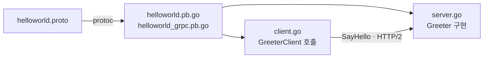

서비스 사이의 내부 통신에 REST 대신 gRPC를 쓰는 이유는 크게 세 가지입니다. 요청과 응답의 형식을 proto 파일로 강제해서 양쪽 코드가 컴파일 시점에 맞춰지고, 바이너리 직렬화라 JSON보다 작고 빠르며, HTTP/2 위에서 스트리밍이 됩니다. 반면 브라우저에서 직접 부르기 어렵고 사람이 읽을 수 없어 디버깅 도구가 따로 필요합니다. 그래서 외부 API는 REST나 GraphQL, 내부 서비스끼리는 gRPC로 나누는 구성이 흔합니다.

이 글은 gRPC 공식 helloworld 예제를 따라 Go로 서버와 클라이언트를 만드는 최소 구성입니다. 전체 코드는 [songtomtom/go-grpc](https://github.com/songtomtom/go-grpc)에 있습니다.

## 흐름



proto 파일이 유일한 원본입니다. 서버는 생성된 인터페이스를 구현하고, 클라이언트는 생성된 스텁을 호출합니다. 양쪽 다 proto에 없는 것은 할 수 없습니다.

## 도구 설치

```bash
brew install protobuf
go install google.golang.org/protobuf/cmd/protoc-gen-go@latest
go install google.golang.org/grpc/cmd/protoc-gen-go-grpc@latest
export PATH="$PATH:$(go env GOPATH)/bin"
```

`protoc`는 proto 파일을 파싱하는 컴파일러이고, 언어별 코드는 플러그인이 만듭니다. Go는 플러그인이 두 개입니다. `protoc-gen-go`는 메시지 타입을, `protoc-gen-go-grpc`는 서비스 인터페이스와 클라이언트 스텁을 생성합니다. `protoc`가 플러그인을 `PATH`에서 찾으므로 마지막 줄이 빠지면 `protoc-gen-go: program not found` 오류가 납니다.

## proto 정의

`proto/v1/helloworld.proto`

```protobuf
syntax = "proto3";

option go_package = "github.com/songtomtom/go-grpc/proto/v1";

package v1;

service Greeter {
  rpc SayHello (HelloRequest) returns (HelloReply) {}
}

message HelloRequest {
  string name = 1;
}

message HelloReply {
  string message = 1;
}
```

- `go_package`는 생성될 Go 패키지의 임포트 경로입니다. 모듈 경로와 맞춰야 서버와 클라이언트가 같은 패키지를 임포트할 수 있습니다.
- `package v1;`은 서비스의 정식 이름을 정합니다. 요청 경로가 `/v1.Greeter/SayHello`가 됩니다. 나중에 호환되지 않는 변경을 하면 `v2` 패키지를 새로 만들어 두 버전을 나란히 서비스할 수 있습니다.
- 필드 뒤의 `= 1`은 필드 번호입니다. 직렬화에는 이름이 아니라 이 번호가 쓰이므로, 한 번 배포한 필드의 번호는 바꾸면 안 되고 삭제한 번호는 재사용하면 안 됩니다.

## 코드 생성

```bash
mkdir -p proto/v1
protoc --go_out=. --go_opt=paths=source_relative \
       --go-grpc_out=. --go-grpc_opt=paths=source_relative \
       proto/v1/helloworld.proto
```

`paths=source_relative`는 생성 파일을 proto 파일과 같은 디렉터리에 두라는 옵션입니다. 없으면 `go_package` 경로 전체를 디렉터리로 만들어 버립니다. 저장소에서는 이 명령을 `make proto`로 묶어 두었습니다.

생성된 두 파일에서 실제로 쓰는 것은 이것들입니다.

| 파일 | 내용 |
|---|---|
| `helloworld.pb.go` | `HelloRequest`, `HelloReply` 구조체와 `GetName()` 같은 게터 |
| `helloworld_grpc.pb.go` | `GreeterServer` 인터페이스, `UnimplementedGreeterServer`, `RegisterGreeterServer`, `GreeterClient`와 `NewGreeterClient` |

## 서버

`server/server.go`

```go
type server struct {
	v1.UnimplementedGreeterServer
}

func (s *server) SayHello(ctx context.Context, in *v1.HelloRequest) (*v1.HelloReply, error) {
	log.Printf("Received: %v", in.GetName())
	return &v1.HelloReply{Message: "Hello " + in.GetName()}, nil
}

func main() {
	lis, err := net.Listen("tcp", ":50051")
	if err != nil {
		log.Fatalf("failed to listen: %v", err)
	}

	s := grpc.NewServer()
	v1.RegisterGreeterServer(s, &server{})
	log.Printf("server listening at %v", lis.Addr())
	if err = s.Serve(lis); err != nil {
		log.Fatalf("failed to serve: %v", err)
	}
}
```

`UnimplementedGreeterServer`를 임베드하는 것이 중요합니다. 이 구조체는 모든 RPC에 대해 `codes.Unimplemented`를 돌려주는 기본 구현입니다. 나중에 proto에 RPC를 추가하고 코드를 재생성해도 서버가 컴파일 오류 없이 돌아가고, 구현 안 한 RPC를 부르면 명확한 오류가 납니다. 이걸 빼면 인터페이스가 바뀔 때마다 컴파일이 깨집니다.

`SayHello`의 첫 인자 `ctx`에는 호출 측의 타임아웃과 취소가 전파됩니다. DB 조회 같은 작업에 이 ctx를 넘겨야 클라이언트가 포기한 요청을 서버도 중단합니다.

## 클라이언트

`client/client.go`

```go
func main() {
	conn, err := grpc.Dial("localhost:50051", grpc.WithTransportCredentials(insecure.NewCredentials()))
	if err != nil {
		log.Fatalf("did not connect: %v", err)
	}
	defer conn.Close()
	c := v1.NewGreeterClient(conn)

	ctx, cancel := context.WithTimeout(context.Background(), time.Second)
	defer cancel()
	r, err := c.SayHello(ctx, &v1.HelloRequest{Name: "world"})
	if err != nil {
		log.Fatalf("could not greet: %v", err)
	}
	log.Printf("Greeting: %s", r.GetMessage())
}
```

- `grpc.Dial`은 연결을 바로 맺지 않고 게으르게 맺습니다. 첫 RPC 때 연결됩니다. 연결 객체는 무겁고 재사용해야 하므로 요청마다 만들지 않고 프로세스에 하나를 둡니다.
- `insecure.NewCredentials()`는 TLS 없이 평문으로 통신하겠다는 뜻입니다. 로컬 실습용이고, 실제로는 TLS 자격 증명을 넣거나 서비스 메시(Istio 등)가 mTLS를 대신 처리하게 합니다.
- `context.WithTimeout`으로 1초를 넘기면 호출이 `DeadlineExceeded`로 실패합니다. 이 데드라인은 서버의 `ctx`로도 전파됩니다.

## 실행

```bash
go run server/server.go
# server listening at [::]:50051
```

```bash
go run client/client.go
# Greeting: Hello world
```

디버깅에는 `grpcurl`이 편합니다. 다만 이 서버는 리플렉션을 켜지 않았으므로 proto 파일을 직접 넘겨야 합니다.

```bash
grpcurl -plaintext -import-path proto/v1 -proto helloworld.proto \
  -d '{"name": "tom"}' localhost:50051 v1.Greeter/SayHello
```

## 실무로 가려면

이 구성에서 빠진 것들입니다.

- **TLS**: 평문 통신은 내부망이라도 권장되지 않습니다.
- **리플렉션**: `reflection.Register(s)` 한 줄이면 `grpcurl`이 proto 없이 서비스를 탐색할 수 있습니다. 개발 환경에서는 켜 두는 편이 편합니다.
- **인터셉터**: 로깅, 인증, 메트릭, 복구(panic recovery)는 미들웨어 격인 인터셉터로 넣습니다.
- **헬스 체크**: Kubernetes에서 gRPC 서비스를 돌리려면 표준 헬스 체크 서비스를 구현해야 합니다.
- **생성 코드 관리**: proto가 바뀌면 반드시 재생성해야 합니다. [Mesh Gateway 3편](/blog/mesh-gateway-grpc-graphql)에서 생성 코드가 proto와 어긋나 서비스를 못 찾는 문제를 실제로 겪었습니다. CI에서 재생성 후 diff가 없는지 검사하는 것이 안전합니다.

## Reference

- [gRPC — Quick start (Go)](https://grpc.io/docs/languages/go/quickstart)
- [Protocol Buffers — Go tutorial](https://protobuf.dev/getting-started/gotutorial/)
- [grpc/grpc-go helloworld](https://github.com/grpc/grpc-go/tree/master/examples/helloworld)
