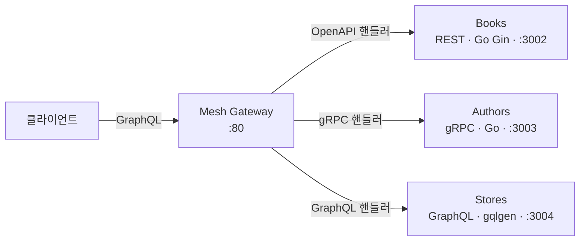

마이크로서비스를 운영하다 보면 프론트엔드가 화면 하나를 그리기 위해 REST 서비스 두 개와 gRPC 서비스 하나를 따로 부르는 상황이 생깁니다. 각 서비스의 인증, 에러 형식, 페이지네이션 방식이 다르고, 프론트엔드는 그 차이를 전부 알아야 합니다. 이 문제를 푸는 흔한 답이 API 게이트웨이이고, 그중 GraphQL Mesh는 "이미 있는 서비스의 스키마를 읽어 GraphQL로 자동 변환"하는 접근입니다. 게이트웨이용 리졸버를 손으로 쓰지 않아도 됩니다.

이 시리즈는 GraphQL Mesh 공식 튜토리얼의 구성을 Go로 다시 만들어 보는 기록입니다. 3편에 걸쳐 REST, gRPC, GraphQL 서비스 하나씩을 만들고 게이트웨이에 붙입니다. 전체 코드는 [songtomtom/graphql-mesh-gateway](https://github.com/songtomtom/graphql-mesh-gateway)에 있습니다.

## 목표 구조



| 서비스 | 프로토콜 | 제공하는 것 |
|---|---|---|
| Books | REST (OpenAPI 3) | `GET /books`, `GET /books/:id`, `GET /categories` |
| Authors | gRPC | `GetAuthor`, `ListAuthors` |
| Stores | GraphQL | `stores`, `bookSells(storeId)` |

세 서비스는 서로 id를 공유합니다. 책의 `authorId`는 저자의 `id`이고, 판매 기록의 `bookId`는 책의 `id`입니다. 게이트웨이가 이 관계를 하나의 그래프로 노출하는 것이 최종 목표입니다.

## Mesh는 어떻게 동작하는가

Mesh의 핵심 개념은 **핸들러**와 **통합 스키마**입니다.

- 핸들러는 소스 하나를 GraphQL 스키마로 바꾸는 어댑터입니다. OpenAPI 핸들러는 OpenAPI 정의 파일의 경로와 컴포넌트를 읽어 쿼리 필드와 타입을 만들고, gRPC 핸들러는 proto 파일의 서비스와 메시지를 읽습니다. GraphQL 핸들러는 원격 서버에 introspection을 보내 스키마를 가져옵니다.
- 이렇게 얻은 스키마 여러 개를 하나로 합친 것이 통합 스키마입니다. 클라이언트는 이 스키마만 봅니다. 게이트웨이가 요청을 받으면 필드가 어느 소스에서 왔는지 알고 있으므로, 해당 소스의 프로토콜로 바꿔 호출하고 결과를 GraphQL 응답으로 돌려줍니다.

즉 게이트웨이 코드를 쓰는 것이 아니라, 소스가 어디에 있고 스키마를 어디서 읽을지 선언하는 것이 작업의 전부입니다.

## 프로젝트 생성

```bash
mkdir mesh_gateway && cd mesh_gateway
yarn init -y
yarn add @graphql-mesh/cli graphql
```

CLI는 핸들러를 포함하지 않습니다. 소스 종류마다 핸들러 패키지를 따로 설치하는데, 2편과 3편에서 서비스를 붙일 때마다 하나씩 추가합니다.

## 구성 파일

`mesh_gateway/.meshrc.yaml`

```yaml
sources:
  - name: Books
    handler:
      openapi:
        endpoint: http://localhost:3002/
        source: ../rest_api/openapi3-definition.json
  - name: Authors
    handler:
      grpc:
        endpoint: localhost:3003
        source: ../grpc/proto/v1/authors_service.proto
  - name: Stores
    handler:
      graphql:
        endpoint: http://localhost:3004/query
serve:
  hostname: 0.0.0.0
  port: 80
  endpoint: /
  browser: false
  playground: true
```

소스마다 두 가지를 적습니다. `endpoint`는 실행 시 요청을 보낼 주소, `source`는 빌드 시 스키마를 읽을 정의 파일입니다. GraphQL 소스는 정의 파일이 없고 introspection으로 스키마를 얻으므로 `endpoint`만 있습니다. 그래서 GraphQL 소스는 **빌드 시점에 서버가 떠 있어야** 합니다. 이 점을 몰라서 3편에서 한 번 막혔습니다.

gRPC의 `endpoint`는 `http://`를 붙이지 않습니다. 처음에는 다른 소스처럼 URL로 적었는데, gRPC 클라이언트가 `http://localhost:3003/`를 호스트 이름으로 해석하려다 DNS 조회에 실패했습니다. 오류 메시지가 `Name resolution failed for target dns:http://localhost:3003/`라서 원인을 찾는 데 시간이 걸렸습니다. gRPC 핸들러에는 호스트와 포트만 적습니다.

## 빌드와 실행

`mesh_gateway/package.json`

```json
{
  "scripts": {
    "build": "mesh build",
    "start": "mesh start"
  }
}
```

```bash
yarn build
yarn start
# 💡 🕸️  Mesh - Server Serving GraphQL Mesh: http://0.0.0.0:80
```

`mesh build`는 소스들의 스키마를 읽어 통합 스키마와 실행 코드를 `.mesh/` 디렉터리에 생성합니다. `mesh start`는 그 산출물로 서버를 띄웁니다. 빌드 없이 `start`를 실행하면 "artifacts를 먼저 빌드하라"는 오류가 납니다. 개발 중에는 `mesh dev`가 두 단계를 합쳐 주지만, 배포 시에는 빌드 산출물을 이미지에 포함하고 `start`만 실행하는 편이 시작 시간이 짧습니다.

`.mesh/`는 생성물이므로 `.gitignore`에 넣습니다.

## 버전에 대해

이 예제는 GraphQL Mesh 0.82 기준입니다. 2023년 초 버전이라 Node 20 이상에서는 요청을 처리하다 `duplex option is required`라는 오류로 죽습니다. 라이브러리가 내장한 fetch 폴리필과 Node의 내장 fetch가 충돌하는 문제입니다. 저장소를 그대로 실행하려면 Node 18을 쓰고, 새로 시작한다면 최신 버전의 Mesh를 쓰는 편이 맞습니다. 구성 파일의 형식은 크게 다르지 않습니다.

## 다음

2편에서 첫 번째 소스인 Books REST 서비스를 OpenAPI 정의에서 생성하고 게이트웨이에 연결합니다.

## Reference

- [GraphQL Mesh — Your first Gateway with Mesh](https://the-guild.dev/graphql/mesh/docs/getting-started/your-first-mesh-gateway)
- [charlypoly/graphql-mesh-docs-first-gateway](https://github.com/charlypoly/graphql-mesh-docs-first-gateway)
