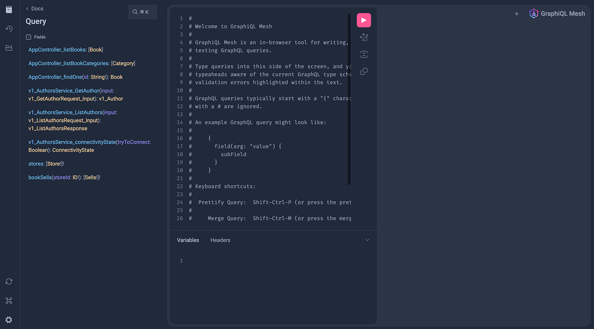

2편에서 REST 소스를 붙였습니다. 이번 편은 나머지 두 소스인 gRPC와 GraphQL입니다. 두 서비스를 만들고 게이트웨이에 연결한 뒤, 마지막에 세 소스를 한 쿼리로 부르는 것까지 확인합니다. gRPC 서버 자체를 처음 만든다면 [gRPC 서버, 클라이언트 만들기](/blog/go-grpc-server-client)를 먼저 보는 것이 좋습니다.

## Authors gRPC 서비스

### proto 정의

`grpc/proto/v1/authors_service.proto`

```protobuf
syntax = "proto3";

option go_package = "github.com/songtomtom/graphql-mesh-gateway/grpc/proto/v1";

package v1;

service AuthorsService {
  rpc GetAuthor(GetAuthorRequest) returns (Author) {}
  rpc ListAuthors(ListAuthorsRequest) returns (ListAuthorsResponse) {}
}

message ListAuthorsRequest {}

message GetAuthorRequest {
  string id = 1;
}

message ListAuthorsResponse {
  repeated Author items = 1;
}

message Author {
  string id = 1;
  string name = 2;
  string editor = 3;
}
```

`package v1;`이 서비스의 정식 이름을 정합니다. gRPC는 요청 경로를 `/v1.AuthorsService/ListAuthors`처럼 패키지 이름을 포함해 만들기 때문에, 이 값이 서버와 클라이언트에서 다르면 서로를 찾지 못합니다. 아래에서 실제로 겪은 문제입니다.

```bash
cd grpc
protoc --go_out=. --go_opt=paths=source_relative \
       --go-grpc_out=. --go-grpc_opt=paths=source_relative \
       proto/v1/authors_service.proto
```

### 서버

`grpc/server.go`

```go
var authors = []*v1.Author{
	{Id: "a1", Name: "Alan A. A. Donovan", Editor: "Addison-Wesley"},
	{Id: "a2", Name: "Samer Buna", Editor: "Manning"},
}

type server struct {
	v1.UnimplementedAuthorsServiceServer
}

func (s *server) GetAuthor(ctx context.Context, in *v1.GetAuthorRequest) (*v1.Author, error) {
	for _, a := range authors {
		if a.Id == in.GetId() {
			return a, nil
		}
	}
	return nil, status.Errorf(codes.NotFound, "author %q not found", in.GetId())
}

func (s *server) ListAuthors(ctx context.Context, in *v1.ListAuthorsRequest) (*v1.ListAuthorsResponse, error) {
	return &v1.ListAuthorsResponse{Items: authors}, nil
}

func main() {
	lis, err := net.Listen("tcp", ":3003")
	if err != nil {
		log.Fatalf("failed to listen: %v", err)
	}
	s := grpc.NewServer()
	v1.RegisterAuthorsServiceServer(s, &server{})
	log.Printf("server listening at %v", lis.Addr())
	log.Fatal(s.Serve(lis))
}
```

없는 id를 요청하면 빈 객체 대신 `codes.NotFound`를 돌려줍니다. gRPC 상태 코드는 게이트웨이를 거쳐 GraphQL 에러 메시지로 그대로 전달되므로, 서비스가 상태 코드를 제대로 쓰면 게이트웨이 사용자도 원인을 알 수 있습니다.

### UNIMPLEMENTED: unknown service

이 글을 다시 정리하면서 저장소를 실행했더니 게이트웨이가 `12 UNIMPLEMENTED: unknown service v1.AuthorsService`를 냈습니다. 서버는 분명 떠 있었습니다. 원인은 커밋되어 있던 생성 코드였습니다. 생성 코드의 서비스 이름이 `authors.v1.AuthorsService`로 되어 있었는데, proto 파일은 `package v1;`이었습니다. 처음 proto를 `package authors.v1;`로 쓰고 코드를 생성한 뒤 proto만 고치고 재생성을 안 한 것입니다.

서버는 생성 코드의 이름으로 서비스를 등록하고, 게이트웨이는 proto 파일의 이름으로 호출하니 서로 다른 서비스가 됩니다. proto를 다시 컴파일해서 해결했습니다. 생성 코드를 저장소에 커밋할 때는 proto가 바뀔 때마다 재생성하는 것을 CI에서 검사하거나, 아예 빌드 단계에서 생성하는 편이 안전합니다.

### 게이트웨이 연결

```bash
cd ../mesh_gateway
yarn add @graphql-mesh/grpc
```

`.meshrc.yaml`의 Authors 소스는 1편에서 선언해 두었습니다. `endpoint: localhost:3003`처럼 `http://` 없이 적어야 한다는 것도 1편에서 다뤘습니다.

Mesh의 gRPC 핸들러는 proto 파일에서 스키마를 만듭니다. 변환 규칙은 이렇습니다.

| proto | GraphQL |
|---|---|
| `rpc ListAuthors` | `Query` 필드 `v1_AuthorsService_ListAuthors(input: ...)` |
| 요청 메시지 | `input` 인자 타입 |
| 응답 메시지 | 반환 타입 |
| `repeated Author items` | `items: [Author]` |

필드 이름에 패키지와 서비스 이름이 접두사로 붙고, 요청 메시지가 비어 있어도 `input: {}`를 넘겨야 합니다. 그리고 `v1_AuthorsService_connectivityState`라는 필드가 하나 더 생기는데, 게이트웨이와 gRPC 서버 사이의 연결 상태를 조회하는 Mesh의 부가 기능입니다.

## Stores GraphQL 서비스

### 스키마와 서버

`graphql/graph/schema.graphqls`

```graphql
type Store {
  id: ID!
  name: String!
  location: String!
}

type Sells {
  bookId: ID!
  sellsCount: Int!
  monthYear: String
  storeId: ID!
}

type Query {
  stores: [Store!]!
  bookSells(storeId: ID!): [Sells!]!
}
```

gqlgen으로 서버 뼈대를 만들고 리졸버에 데이터를 넣습니다. gqlgen 사용법은 [구독 시리즈 1편](/blog/gqlgen-subscriptions-server)과 같습니다.

`graphql/graph/schema.resolvers.go`

```go
var (
	stores = []*model.Store{
		{ID: "s1", Name: "Downtown Books", Location: "Seoul"},
		{ID: "s2", Name: "Riverside Books", Location: "Busan"},
	}
	sells = map[string][]*model.Sells{
		"s1": {
			{BookID: "b1", SellsCount: 12, MonthYear: strPtr("2023-01"), StoreID: "s1"},
			{BookID: "b2", SellsCount: 5, MonthYear: strPtr("2023-01"), StoreID: "s1"},
		},
		"s2": {
			{BookID: "b3", SellsCount: 8, MonthYear: strPtr("2023-01"), StoreID: "s2"},
		},
	}
)

func (r *queryResolver) Stores(ctx context.Context) ([]*model.Store, error) {
	return stores, nil
}

func (r *queryResolver) BookSells(ctx context.Context, storeID string) ([]*model.Sells, error) {
	return sells[storeID], nil
}
```

```bash
cd graphql && go run server.go
# connect to http://localhost:3004/ for GraphQL playground
```

### 게이트웨이 연결

```bash
cd ../mesh_gateway
yarn add @graphql-mesh/graphql
```

GraphQL 핸들러는 정의 파일이 없습니다. `mesh build`가 `endpoint`에 introspection 쿼리를 보내 스키마를 가져옵니다. 그래서 **빌드할 때 Stores 서버가 실행 중이어야** 합니다. 서버를 안 띄우고 빌드하면 연결 오류로 실패하는데, 처음에는 이 순서를 몰라서 REST와 gRPC는 되는데 GraphQL만 안 되는 이유를 한참 찾았습니다. 원격 스키마를 파일로 내려받아 `source`로 지정하면 빌드 시 서버가 없어도 되고 스키마 변경을 코드 리뷰로 확인할 수도 있습니다.

## 세 소스를 한 쿼리로

서비스 세 개와 게이트웨이를 모두 띄웁니다.

```bash
(cd rest_api && go run main.go)
(cd grpc && go run server.go)
(cd graphql && go run server.go)
(cd mesh_gateway && yarn build && yarn start)
```

```graphql
{
  AppController_listBooks {
    id
    title
    authorId
  }
  v1_AuthorsService_ListAuthors(input: {}) {
    items {
      id
      name
      editor
    }
  }
  stores {
    id
    name
  }
  bookSells(storeId: "s1") {
    bookId
    sellsCount
  }
}
```

```json
{
  "data": {
    "AppController_listBooks": [
      { "id": "b1", "title": "The Go Programming Language", "authorId": "a1" },
      { "id": "b2", "title": "GraphQL in Action", "authorId": "a2" },
      { "id": "b3", "title": "Designing Data-Intensive Applications", "authorId": "a1" }
    ],
    "v1_AuthorsService_ListAuthors": {
      "items": [
        { "id": "a1", "name": "Alan A. A. Donovan", "editor": "Addison-Wesley" },
        { "id": "a2", "name": "Samer Buna", "editor": "Manning" }
      ]
    },
    "stores": [
      { "id": "s1", "name": "Downtown Books" },
      { "id": "s2", "name": "Riverside Books" }
    ],
    "bookSells": [
      { "bookId": "b1", "sellsCount": 12 },
      { "bookId": "b2", "sellsCount": 5 }
    ]
  }
}
```



REST, gRPC, GraphQL 응답이 하나의 JSON에 들어왔습니다. 클라이언트는 세 서비스가 서로 다른 프로토콜이라는 것을 모릅니다.

## 여기까지의 한계

세 소스가 한 스키마에 있지만 아직 **연결되지는 않았습니다**. 책의 `authorId`로 저자를 가져오려면 클라이언트가 두 번 쿼리해야 합니다. Mesh는 이 문제를 `additionalTypeDefs`와 `additionalResolvers`로 풉니다. `Book` 타입에 `author: Author` 필드를 추가하고, 그 필드를 `authorId`로 Authors 소스를 호출하도록 선언하는 방식입니다. 이 단계까지 가야 "게이트웨이"가 아니라 "그래프"가 됩니다. 이 시리즈에서는 다루지 않았지만 다음에 해 볼 부분입니다.

그 밖에 실제로 쓰려면 고려할 것들입니다.

- 게이트웨이가 단일 장애점이 됩니다. 인스턴스를 여러 개 두고 앞에 로드밸런서를 놓아야 합니다.
- 필드 하나마다 백엔드 호출이 나가므로 목록 안의 관계 필드는 N+1 문제가 생깁니다. Mesh의 batching 옵션이나 DataLoader 패턴이 필요합니다.
- 소스 서비스의 인증 헤더를 게이트웨이가 전달하도록 설정해야 합니다. 이 예제의 서비스들은 인증이 없습니다.
- 자동 생성된 필드 이름(`AppController_listBooks`, `v1_AuthorsService_ListAuthors`)은 그대로 공개 API로 쓰기에 부적절합니다. `rename` 변환으로 정리해야 합니다.

## Reference

- [GraphQL Mesh — Combine multiple Sources](https://the-guild.dev/graphql/mesh/docs/getting-started/combine-multiple-sources)
- [GraphQL Mesh — gRPC handler](https://the-guild.dev/graphql/mesh/docs/handlers/grpc)
- [gqlgen](https://gqlgen.com/)
