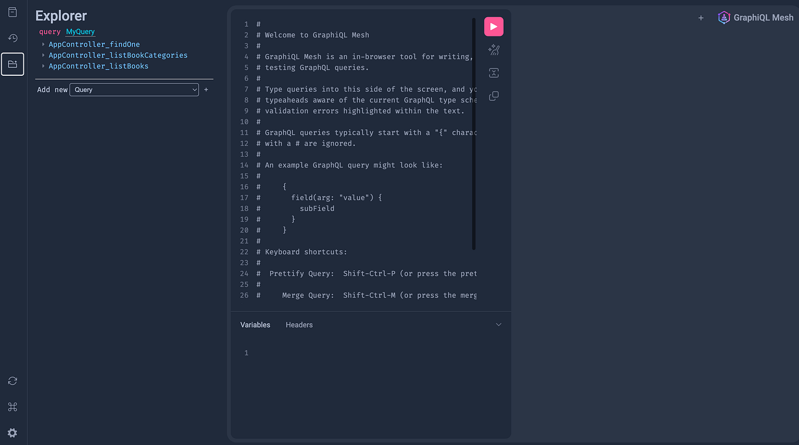

1편에서 게이트웨이 구성을 선언했습니다. 이번 편은 첫 번째 소스인 Books REST 서비스입니다. 핵심은 **OpenAPI 정의 파일 하나를 두 곳에서 쓴다**는 점입니다. 서버 코드를 생성하는 데 한 번, 게이트웨이가 GraphQL 스키마를 만드는 데 한 번. 정의 파일이 계약이 되고 양쪽이 그 계약을 따르므로 서버와 게이트웨이의 스키마가 어긋날 일이 없습니다.

## OpenAPI 정의

GraphQL Mesh 예제 저장소의 `openapi3-definition.json`을 가져옵니다. 경로 세 개와 스키마 두 개(`Book`, `Category`)를 정의한 작은 문서입니다.

```json
{
  "openapi": "3.0.0",
  "paths": {
    "/books": {
      "get": {
        "operationId": "AppController_listBooks",
        "responses": {
          "200": {
            "content": {
              "application/json": {
                "schema": { "type": "array", "items": { "$ref": "#/components/schemas/Book" } }
              }
            }
          }
        }
      }
    },
    "/categories": { "get": { "operationId": "AppController_listBookCategories", "..." : "..." } },
    "/books/{id}": { "get": { "operationId": "AppController_findOne", "..." : "..." } }
  },
  "components": {
    "schemas": {
      "Book": {
        "type": "object",
        "properties": {
          "id": { "type": "string" },
          "authorId": { "type": "string" },
          "categorieId": { "type": "string" },
          "title": { "type": "string" }
        }
      },
      "Category": { "..." : "..." }
    }
  }
}
```

`operationId`를 눈여겨봐 두세요. 서버 코드 생성기는 이 값으로 핸들러 함수 이름을 짓고, Mesh는 이 값으로 GraphQL 필드 이름을 짓습니다.

## 서버 코드 생성

```bash
brew install openapi-generator
mkdir rest_api && cd rest_api
openapi-generator generate -i openapi3-definition.json -g go-gin-server
```

생성 결과입니다.

```text
.
├── api/openapi.yaml
├── go/
│   ├── api_books.go        핸들러 (비어 있음)
│   ├── model_book.go
│   ├── model_category.go
│   └── routers.go          경로와 핸들러 연결
├── go.mod
└── main.go
```

생성기는 라우팅과 모델까지만 만들고 핸들러 본문은 빈 JSON을 돌려주게 둡니다. 비즈니스 로직은 사람이 채우라는 뜻입니다.

## 생성된 코드에서 고친 것

**모듈 경로.** 생성된 `main.go`는 핸들러 패키지를 `sw "./go"`처럼 상대 경로로 임포트하는데, Go 모듈에서는 허용되지 않습니다. `go.mod`의 모듈 이름에 맞춰 고칩니다.

```go
// go.mod
module github.com/songtomtom/graphql-mesh-gateway/rest_api
```

```go
// main.go
import openapi "github.com/songtomtom/graphql-mesh-gateway/rest_api/go"

func main() {
	log.Printf("Server started")
	router := openapi.NewRouter()
	log.Fatal(router.Run(":3002"))
}
```

포트는 1편의 `.meshrc.yaml`에 적은 3002로 맞춥니다.

**핸들러에 데이터 넣기.** 원래 글을 쓸 때는 빈 핸들러 그대로 두고 게이트웨이 연결만 확인했습니다. 그러면 게이트웨이 쿼리 결과가 전부 `{}`라서 정말 동작하는지 알기 어렵습니다. 이번에 인메모리 데이터를 채웠습니다.

`rest_api/go/api_books.go`

```go
var (
	categories = []Category{
		{Id: "c1", Name: "Novel"},
		{Id: "c2", Name: "Essay"},
	}
	books = []Book{
		{Id: "b1", AuthorId: "a1", CategorieId: "c1", Title: "The Go Programming Language"},
		{Id: "b2", AuthorId: "a2", CategorieId: "c1", Title: "GraphQL in Action"},
		{Id: "b3", AuthorId: "a1", CategorieId: "c2", Title: "Designing Data-Intensive Applications"},
	}
)

// AppControllerFindOne - GET /books/:id
func AppControllerFindOne(c *gin.Context) {
	id := c.Param("id")
	for _, b := range books {
		if b.Id == id {
			c.JSON(http.StatusOK, b)
			return
		}
	}
	c.JSON(http.StatusNotFound, gin.H{"message": "book not found"})
}

// AppControllerListBookCategories - GET /categories
func AppControllerListBookCategories(c *gin.Context) {
	c.JSON(http.StatusOK, categories)
}

// AppControllerListBooks - GET /books
func AppControllerListBooks(c *gin.Context) {
	c.JSON(http.StatusOK, books)
}
```

`authorId`를 `a1`, `a2`로 둔 것은 3편의 gRPC 저자 서비스와 맞추기 위해서입니다.

```bash
go run main.go
curl -s localhost:3002/books
# [{"id":"b1","authorId":"a1","categorieId":"c1","title":"The Go Programming Language"}, ...]
```

## 게이트웨이에 연결

OpenAPI 핸들러를 설치합니다. 1편의 `.meshrc.yaml`에는 이미 Books 소스가 선언되어 있으므로 설치와 빌드만 하면 됩니다.

```bash
cd ../mesh_gateway
yarn add @graphql-mesh/openapi
yarn build && yarn start
```

## 변환 규칙

빌드가 끝나면 playground에서 스키마를 볼 수 있습니다. Mesh가 OpenAPI를 GraphQL로 바꾼 규칙은 이렇습니다.

| OpenAPI | GraphQL |
|---|---|
| `GET` 오퍼레이션 | `Query` 필드 |
| `POST`, `PUT`, `DELETE` 오퍼레이션 | `Mutation` 필드 |
| `operationId` | 필드 이름 (`AppController_listBooks`) |
| 경로 파라미터 `{id}` | 필드 인자 (`AppController_findOne(id: String!)`) |
| `components.schemas.Book` | 타입 `Book` |
| `application/json` 응답 스키마 | 필드 반환 타입 |

```graphql
{
  AppController_listBooks {
    id
    title
    authorId
  }
  AppController_findOne(id: "b2") {
    title
  }
}
```

```json
{
  "data": {
    "AppController_listBooks": [
      { "id": "b1", "title": "The Go Programming Language", "authorId": "a1" },
      { "id": "b2", "title": "GraphQL in Action", "authorId": "a2" },
      { "id": "b3", "title": "Designing Data-Intensive Applications", "authorId": "a1" }
    ],
    "AppController_findOne": { "title": "GraphQL in Action" }
  }
}
```

playground에서 Books REST API가 GraphQL 스키마로 바뀐 것을 볼 수 있습니다.



`AppController_listBooks` 같은 이름은 NestJS 컨트롤러에서 자동 생성된 `operationId`가 그대로 드러난 것입니다. 실제로 쓸 때는 정의 파일의 `operationId`를 `listBooks`처럼 다듬거나, Mesh의 `rename` 변환으로 필드 이름을 바꿉니다. 게이트웨이의 스키마는 클라이언트가 보는 공개 API이므로 이름을 방치하면 안 됩니다.

## 배운 것

- OpenAPI 정의는 문서가 아니라 계약입니다. 서버와 게이트웨이가 같은 파일에서 생성되므로 한쪽만 바뀌는 일이 없습니다. 반대로 정의 파일 없이 만든 REST 서비스는 Mesh에 붙이기 전에 정의부터 써야 하고, 그 과정에서 서비스의 응답 형식이 얼마나 일관성이 없는지 드러나곤 합니다.
- 코드 생성기의 출력은 시작점이지 완성품이 아닙니다. 모듈 경로처럼 프로젝트마다 다른 부분은 손으로 맞춰야 하고, 재생성하면 덮어써지므로 `.openapi-generator-ignore`에 수정한 파일을 등록해 둡니다.

다음 편에서 gRPC와 GraphQL 소스를 붙여 세 서비스를 한 쿼리로 부릅니다.

## Reference

- [GraphQL Mesh — OpenAPI handler](https://the-guild.dev/graphql/mesh/docs/handlers/openapi)
- [OpenAPI Generator — go-gin-server](https://openapi-generator.tech/docs/generators/go-gin-server)
