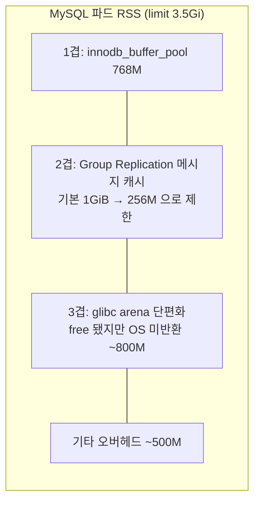

EKS 위에 서비스들을 올리면서 데이터베이스도 클러스터 안에 두기로 했습니다. RDS 대신 Oracle의 MySQL Operator로 InnoDBCluster를 만들었고, GitOps 저장소에서 ArgoCD로 관리했습니다. 1년 뒤 그 클러스터는 제거됐고 자리는 CloudNativePG가 차지했습니다. 이 글은 GitOps 저장소의 커밋 이력을 다시 읽으면서 무엇이 힘들었고 왜 바꿨는지를 정리한 것입니다. 1편이 앱 쪽 이야기였다면 이번 편은 인프라 쪽입니다. 매니페스트는 [저장소](https://github.com/songtomtom/mysql-to-postgres-on-kubernetes)의 `k8s/`에 이름과 계정을 지우고 올려 두었습니다.

## 시간순

| 시기 | 일어난 일 |
|---|---|
| 1년 전 | InnoDBCluster 구축. gp3 스토리지, mycnf "최적화" |
| 10개월 전 | MySQL Router에 HPA. 대회를 앞두고 인스턴스 3 → 5 확장, 끝나고 2로 축소 |
| 8개월 전 | 운영 환경 구축. **하루 커밋 16개**로 buffer_pool을 2G → 1.5G → 768M으로 줄이고 인스턴스를 1과 2 사이에서 오감. "39회 재시작" |
| 7개월 전 | Group Replication 메시지 캐시 기본값 1GiB가 OOM 원인으로 확인. limit 3Gi |
| 6개월 전 | 벡터 검색이 필요한 서비스 하나가 PostgreSQL로(1편) |
| 4개월 전 | 운영 PostgreSQL 클러스터 준비. 같은 달 운영 MySQL 3개 파드가 18~20시간 주기로 전부 OOM. 원인은 ConfigMap 드리프트와 glibc 아레나 |
| 3개월 전 | PostgreSQL에 S3 WAL 백업. 서비스들이 하나씩 PostgreSQL로 |
| 1개월 전 | 개발 MySQL 클러스터 두 인스턴스 모두 다운. 복구 대신 제거 |
| 지금 | 운영 MySQL 제거. PVC는 Retain |

MySQL을 손댄 커밋은 12월부터 5월까지 여섯 달 동안 45건입니다. 같은 기간 PostgreSQL은 values 파일 하나에 몇 건입니다.

## 메모리는 세 겹이다

InnoDBCluster 운영의 대부분은 OOM Kill(exit code 137)과의 싸움이었습니다. 처음에는 `innodb_buffer_pool_size`만 보면 되는 줄 알았습니다. 파드 limit에서 buffer_pool을 빼면 나머지가 여유라고 생각한 것입니다. 실제로는 세 겹이었습니다.



**1겹, buffer_pool.** 데이터 캐시입니다. 2G로 시작해 OOM이 날 때마다 줄였습니다. 줄이면 OOM 빈도가 낮아지지만 캐시 적중률도 떨어집니다.

**2겹, Group Replication 메시지 캐시.** 세 인스턴스가 서로 트랜잭션을 전달하는 xcom 계층의 캐시인데 기본값이 1GiB입니다. 문서를 읽기 전에는 존재조차 몰랐습니다. buffer_pool 512M에 limit 2Gi를 줬는데 계속 죽길래 파드 안에서 메모리를 뜯어보고서야 찾았습니다. 256M으로 제한했고, 이 변수는 플러그인 변수라 `loose_` 접두사가 없으면 기동 시 "알 수 없는 변수"로 실패합니다.

`k8s/mysql-operator/innodbcluster.yaml`

```yaml
  mycnf: |
    [mysqld]
    innodb_buffer_pool_size = 768M
    # 메모리 2겹: Group Replication 메시지 캐시. 기본값 1GiB 가 buffer_pool 과 합쳐 limit 을 넘겼다.
    # loose_ 접두사가 없으면 플러그인 로드 전에 알 수 없는 변수라며 기동에 실패한다.
    loose_group_replication_message_cache_size = 256M
```

**3겹, glibc 아레나 단편화.** 캐시 두 개를 다 잡고도 21시간쯤 지나면 RSS가 limit에 붙었습니다. 계측된 MySQL 내부 메모리는 1.5G에서 안정인데 RSS는 2.3G였습니다. 차이 800M은 glibc가 free된 메모리를 OS에 돌려주지 않고 아레나에 쥐고 있는 단편화였습니다. `MALLOC_ARENA_MAX=2`로 아레나 수를 묶고 limit을 3.5Gi로 올려서 잡았습니다.

```yaml
      - name: mysql
        env:
          - name: MALLOC_ARENA_MAX
            value: "2"
        resources:
          limits:
            memory: 3.5Gi
```

정리하면 768M짜리 데이터 캐시를 안정적으로 굴리는 데 3.5Gi가 필요했습니다. 4.5배입니다. 같은 노드에서 PostgreSQL은 `shared_buffers` 256MB에 limit 2Gi로 문제가 없었습니다. PostgreSQL이 메모리를 덜 쓴다기보다, 복제 계층이 프로세스 안에 캐시를 따로 두지 않고 WAL 스트리밍으로 동작하기 때문에 예측이 쉽다는 쪽이 정확합니다.

## Router는 계층 하나를 더한다

InnoDBCluster에서 앱은 MySQL 파드에 직접 붙지 않습니다. MySQL Router가 앞에 서서 primary와 secondary로 나눠 줍니다. 이 계층이 따로 문제를 만들었습니다.

- 처음에 리소스를 지정하지 않아 **BestEffort QoS**로 배포됐고, 노드가 조금만 빡빡해지면 가장 먼저 OOM Kill 됐습니다. DB는 멀쩡한데 앱이 연결을 못 하는 장애입니다.
- 트래픽에 따라 늘려야 해서 HPA를 붙였는데, HPA는 리소스 request가 있어야 동작합니다. 위 문제와 같은 원인입니다.
- 노드그룹을 나눈 뒤 Router에 `nodeSelector`를 빠뜨려 운영 Router가 개발 노드로 새어 나가는 일이 두 번 있었습니다.

CloudNativePG는 이 계층이 차트 안에 있습니다. `pg-cluster-rw`, `pg-cluster-ro` Service가 primary와 replica를 가리키고, PgBouncer pooler가 같은 values에서 정의됩니다. 따로 운영할 Deployment가 없습니다.

`k8s/cnpg/values.yaml`

```yaml
poolers:
  - name: rw
    type: rw
    poolMode: session
    instances: 2
    parameters:
      max_client_conn: "500"
      default_pool_size: "50"
  - name: ro
    type: ro
    poolMode: session
    instances: 2
```

## GitOps와 오퍼레이터가 어긋나는 순간

5월의 장애는 원인이 두 겹이었습니다. 하나는 위의 GR 캐시였고, 다른 하나는 **드리프트**였습니다. 트래픽 폭주에 대비해 `kubectl patch`로 ConfigMap의 buffer_pool과 max_connections를 급히 올렸는데, git에는 다른 값이 있었습니다. 오퍼레이터는 `spec.mycnf`가 바뀔 때만 ConfigMap을 다시 렌더하므로, ArgoCD가 sync 해도 수동 값이 그대로 남았습니다. 그 상태로 GR 캐시가 기본값 1GiB까지 자라 세 파드가 18~20시간마다 죽었습니다.

교훈은 "오퍼레이터가 만든 리소스는 오퍼레이터의 입력을 바꿔서 고친다"입니다. ConfigMap을 직접 patch하면 GitOps 바깥에 상태가 생기고, 오퍼레이터는 그것을 자기 것으로 인식하지 못합니다. 수정은 반드시 `spec.mycnf`를 git에서 바꿔서 했어야 했고, 그렇게 하자 오퍼레이터가 ConfigMap을 재렌더해 드리프트가 함께 사라졌습니다.

## 쿼럼과 비용

Group Replication은 인스턴스 3개가 정석입니다. 2개면 하나가 죽는 순간 쿼럼을 잃습니다. 그런데 3개 × 3.5Gi에 Router까지 올리면 노드가 통째로 필요해서, 비용 때문에 1, 2, 3, 5 사이를 계속 오갔습니다. 개발 환경은 2개로 두었고, 어느 날 두 인스턴스가 모두 내려간 채로 발견됐습니다. 복구하려면 클러스터를 다시 부트스트랩해야 했는데, 그 시점에는 이미 개발 서비스 대부분이 PostgreSQL로 옮겨 간 뒤라 복구 대신 제거를 택했습니다.

비용을 대략 계산하면 이렇습니다. 서울 리전 온디맨드 가격 기준이고 실제 청구서가 아니라 공개 가격표로 추정한 것입니다.

| 구성 | 월 비용(추정) |
|---|---|
| 자체 운영: t3.large 2대 점유(MySQL 3 파드 + Router) | 약 $140 |
| RDS MySQL db.t3.medium Multi-AZ | 약 $130 |

숫자만 보면 비슷한데, 자체 운영 쪽에는 여섯 달 45건의 커밋에 든 시간이 빠져 있습니다. "오퍼레이터로 정상 운영하려면 RDS만큼 든다"가 이 프로젝트의 결론이었고, 그렇다면 어느 쪽이 덜 손이 가느냐가 기준이 됩니다.

## CloudNativePG로

옮기기로 하고 세운 원칙이 몇 가지 있습니다.

**백업 없이는 운영 트래픽을 붙이지 않는다.** values 파일 맨 위에 주석으로 박아 두었습니다. MySQL 때는 백업이 덤프 스크립트에 의존했고, 그것이 제거를 망설이게 한 이유 중 하나였습니다. CloudNativePG는 S3에 WAL을 연속 아카이브하고 일 단위 베이스 백업을 예약합니다. IRSA로 IAM 역할을 ServiceAccount에 붙여서 시크릿에 액세스 키를 두지 않습니다.

```yaml
backups:
  enabled: true
  provider: s3
  s3:
    inheritFromIAMRole: true   # IRSA. 시크릿에 액세스 키를 두지 않는다
  retentionPolicy: "30d"
  scheduledBackups:
    - name: daily
      schedule: "0 0 17 * * *"  # UTC 17:00 = KST 02:00
```

**슈퍼유저를 끈다.** `enableSuperuserAccess: false`. 앱 계정은 자기 DB의 소유자일 뿐입니다. 1편에서 확장 생성 권한 이야기가 나온 배경입니다.

**연결은 PgBouncer를 거친다.** PostgreSQL의 `max_connections`는 80으로 낮게 두고, pooler가 500개 클라이언트 연결을 받습니다. MySQL 때 `max_connections`를 300까지 올려 가며 버텼던 것과 대비됩니다.

**DB는 온디맨드 노드에 격리한다.** 개발 환경에서 스팟 노드 재고 부족으로 DB 파드가 스케줄되지 않는 일이 반복돼서, DB 전용 온디맨드 노드그룹을 만들고 `nodeSelector`와 `required` anti-affinity로 묶었습니다. 이건 MySQL이든 PostgreSQL이든 같은 교훈입니다.

## 서비스별 이관

한 번에 옮기지 않았습니다. 개발 환경에서 서비스 하나씩, 여섯 달에 걸쳐서였습니다.

1. 앱에 드라이버 전환 필드를 넣습니다(1편). 기본값은 MySQL이라 나머지 서비스는 그대로입니다.
2. 개발 환경의 해당 서비스 시크릿에서 DB 호스트를 `mysql-cluster`에서 `pg-cluster-rw`와 `pg-cluster-ro`로 바꿉니다. 읽기와 쓰기 엔드포인트가 나뉘어 있어서 앱의 읽기 복제본 설정이 그대로 맞습니다.
3. 데이터를 옮기고 개발에서 한동안 굴립니다.
4. 운영 PostgreSQL이 준비되고 백업이 켜진 뒤에야 운영 서비스를 옮깁니다. 각 전환 커밋에는 `pg_dump` 백업과 `helm rollback` 복구 경로를 적어 두었습니다.
5. 마지막 서비스가 넘어간 뒤 MySQL Application을 제거합니다. 실제 연결 0건, 설정 참조 0건을 확인하고, PVC는 `Retain`으로 남깁니다.

PHP 서비스 하나는 `DB_DRIVER` 환경변수와 접속 시크릿 교체로 넘어갔습니다. 드라이버 추상화를 앱마다 갖춰 두면 인프라 전환이 시크릿 교체로 끝납니다.

## 달라진 것

- 여섯 달 45건이던 DB 관련 커밋이 전환 뒤에는 노드 격리 한 건 정도입니다.
- 메모리 limit이 3.5Gi에서 2Gi로 줄었고 OOM Kill이 없습니다.
- Router라는 별도 계층이 사라졌고, 읽기·쓰기 엔드포인트와 커넥션 풀이 차트 하나에 있습니다.
- 백업과 복구가 오퍼레이터 기능입니다. 덤프 스크립트가 아닙니다.
- 앱 쪽에서는 1편의 확장들이 따라왔습니다.

## MySQL Operator를 다시 쓴다면

이 글은 MySQL Operator를 쓰지 말라는 글은 아닙니다. 다시 쓴다면 처음부터 이렇게 했을 것입니다.

- 인스턴스 3개, 파드당 최소 4Gi, GR 메시지 캐시 제한, `MALLOC_ARENA_MAX`를 첫날 넣습니다. 이 네 가지가 1년 커밋의 대부분입니다.
- Router에 리소스와 HPA와 nodeSelector를 처음부터 줍니다.
- ConfigMap을 절대 직접 patch하지 않습니다.
- 그리고 이 조건을 다 맞춘 비용을 RDS와 처음에 비교합니다.

그래도 다시 고른다면 PostgreSQL입니다. 운영이 편해서만이 아니라, 1편에서 본 것처럼 앱이 쓸 수 있는 것이 더 많기 때문입니다.

## Reference

- [MySQL Operator for Kubernetes](https://dev.mysql.com/doc/mysql-operator/en/)
- [MySQL — group_replication_message_cache_size](https://dev.mysql.com/doc/refman/8.4/en/group-replication-system-variables.html#sysvar_group_replication_message_cache_size)
- [CloudNativePG](https://cloudnative-pg.io/documentation/current/)
- [CloudNativePG — Backup on object stores](https://cloudnative-pg.io/documentation/current/backup_barmanobjectstore/)
- [glibc — Memory allocation tunables (MALLOC_ARENA_MAX)](https://www.gnu.org/software/libc/manual/html_node/Memory-Allocation-Tunables.html)
