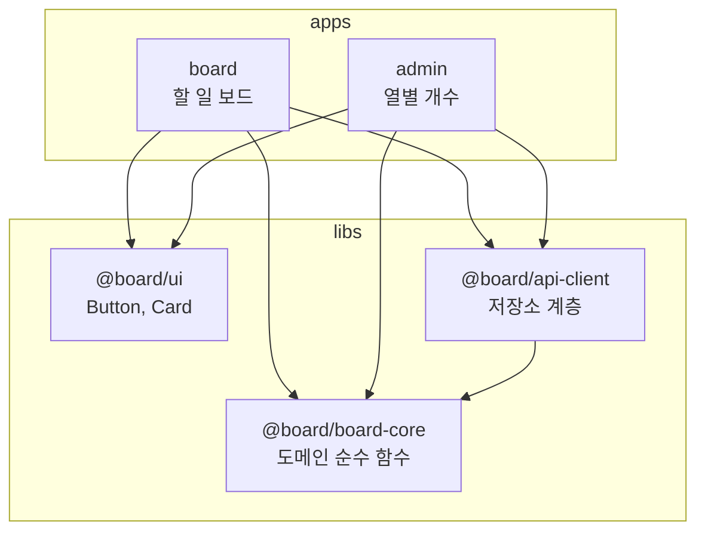

React 앱 하나를 Vite로 만들어 쓰고 있었습니다. `src/` 아래 `components/`, `domain/`, `api/`, `features/`로 폴더는 나뉘어 있었지만 경계는 폴더 이름뿐이었습니다. 그러다 같은 데이터를 다른 화면으로 보여 주는 두 번째 앱이 필요해졌습니다. 도메인 로직과 UI 컴포넌트를 복사하면 당장은 되지만 두 벌을 같이 고쳐야 합니다. 앱을 쪼개고 공유할 것을 라이브러리로 빼기로 했습니다.

이 글은 그 전환을 작은 앱으로 다시 만든 기록입니다. 코드는 [songtomtom/nx-vite-pnpm-monorepo](https://github.com/songtomtom/nx-vite-pnpm-monorepo)에 있고, `single-app` 태그가 전환 전, `main`이 전환 후입니다.

## 쪼개기 전

할 일 보드 앱입니다. 작업을 추가하고 `todo`, `doing`, `done` 열 사이로 옮깁니다. 파일은 이렇습니다.

```
src/
  main.tsx, App.tsx
  components/  Button.tsx, Card.tsx        도메인을 모르는 UI
  domain/      board.ts, board.test.ts    순수 함수. React도 fetch도 모른다
  api/         client.ts                  저장소 계층. localStorage를 원격처럼 쓴다
  features/board/BoardView.tsx            위 셋을 조립하는 화면
```

`domain/`은 처음부터 React를 모르게 썼고 `api/`는 나중에 서버로 바뀔 자리라 분리해 뒀습니다. 그래서 어디를 라이브러리로 뺄지는 이미 정해져 있었습니다. 문제는 그것을 강제할 방법이 없었다는 것입니다. `features/`에서 `api/`의 내부 파일을 직접 import해도 아무도 막지 않았습니다.

## 쪼갠 뒤



앱 두 개와 라이브러리 세 개입니다. 방향은 `apps → libs` 하나이고, 라이브러리끼리는 `api-client`가 `board-core`의 타입을 쓰는 것 하나뿐입니다.

파일 이동은 `git mv`였습니다. `components/`가 `libs/ui/src/`로, `domain/`이 `libs/board-core/src/`로, `api/`가 `libs/api-client/src/`로 갔고, 각 라이브러리에 `src/index.ts`를 만들어 공개할 것만 내보냈습니다. 화면 쪽 import는 상대 경로에서 패키지 이름으로 바뀌었습니다.

`apps/board/src/features/board/BoardView.tsx`

```tsx
import {Button, Card} from '@board/ui';
import {COLUMNS, addTask, moveTask, tasksIn, type Board, type Column} from '@board/board-core';
import {loadBoard, saveBoard} from '@board/api-client';
```

`../../components/Button`처럼 폴더 깊이를 세던 경로가 없어졌고, 라이브러리의 내부 파일을 직접 가리킬 방법도 없어졌습니다. `index.ts`가 내보내지 않은 것은 import할 수 없습니다.

### pnpm workspace가 하는 일

`pnpm-workspace.yaml`

```yaml
packages:
  - apps/*
  - libs/*
```

각 앱과 라이브러리에 `package.json`이 하나씩 있습니다. 이름만 있는 두 줄짜리입니다. 의존성은 전부 루트 `package.json`에 한 벌만 둡니다. React가 두 앱에서 다른 버전이면 라이브러리가 어느 쪽에 맞춰야 할지 정할 수 없기 때문입니다. pnpm은 workspace 패키지 목록을 알고, Nx는 그 목록을 프로젝트 목록으로 씁니다.

### 라이브러리는 빌드하지 않는다

라이브러리마다 `vite build`로 `dist/`를 만들고 앱이 그것을 참조하는 방식도 있습니다. 저는 그렇게 하지 않았습니다. 라이브러리를 고칠 때마다 빌드를 다시 돌려야 하고, dev 서버의 HMR이 `dist/`를 보느라 소스 수정이 바로 반영되지 않습니다.

대신 `tsconfig.base.json`의 `paths`로 패키지 이름을 소스 파일에 바로 연결했습니다.

`tsconfig.base.json`

```json
{
  "compilerOptions": {
    "baseUrl": ".",
    "paths": {
      "@board/ui": ["libs/ui/src/index.ts"],
      "@board/board-core": ["libs/board-core/src/index.ts"],
      "@board/api-client": ["libs/api-client/src/index.ts"]
    }
  }
}
```

앱의 `vite.config.ts`에는 이 `paths`를 Vite alias로 바꿔 주는 플러그인 한 줄이 들어갑니다.

`apps/board/vite.config.ts`

```ts
export default defineConfig({
    // tsconfig.base.json 의 paths 를 Vite alias 로. @board/* 가 libs/*/src 로 해석된다.
    plugins: [react(), nxViteTsPaths()],
    build: {outDir: '../../dist/apps/board', emptyOutDir: true},
    test: {
        environment: 'jsdom',
        passWithNoTests: true,
        include: ['src/**/*.test.{ts,tsx}']
    }
});
```

TypeScript는 `paths`를 보고, Vite는 플러그인이 변환한 alias를 보고, 둘 다 같은 `libs/ui/src/index.ts`에 도착합니다. 앱을 빌드하면 라이브러리 소스가 앱 번들에 함께 들어갑니다. 라이브러리 `dist/`는 어디에도 없습니다. 이 방식이 어디까지 통하고 어디서 깨지는지는 2편에서 다룹니다.

## Nx가 하는 일

여기까지는 pnpm workspace와 tsconfig만으로도 됩니다. Nx는 두 가지를 더 줍니다. 프로젝트마다 타깃을 만들어 주는 것과, 프로젝트 사이 의존 그래프를 알고 있는 것입니다.

### project.json 없이 타깃 만들기

`nx.json`

```json
{
  "plugins": [
    {
      "plugin": "@nx/vite/plugin",
      "options": {
        "buildTargetName": "build",
        "serveTargetName": "serve",
        "previewTargetName": "preview",
        "typecheckTargetName": "typecheck"
      }
    },
    {
      "plugin": "@nx/vitest",
      "options": {
        "testTargetName": "test"
      }
    }
  ]
}
```

예전 Nx는 프로젝트마다 `project.json`에 타깃과 executor를 적어야 했습니다. 지금은 추론 플러그인이 `vite.config.ts`가 있는 폴더를 찾아 타깃을 만들어 줍니다. 앱 폴더에 Vite 설정이 있으면 `build`, `serve`, `preview`, `typecheck`가 생기고, 그 설정에 `test` 블록이 있으면 `test`가 생깁니다. 저장소에 `project.json`은 하나도 없습니다.

무엇이 만들어졌는지는 `nx show project board`로 봅니다. `build` 타깃은 이렇게 나옵니다.

```json
{
  "executor": "nx:run-commands",
  "options": {"cwd": "apps/board", "command": "vite build"},
  "inputs": ["production", "^production", {"externalDependencies": ["vite"]}],
  "outputs": ["{workspaceRoot}/dist/apps/board"],
  "cache": true
}
```

executor는 그냥 `vite build`를 그 폴더에서 실행하는 것입니다. 중요한 건 `inputs`와 `outputs`입니다. 이 프로젝트의 소스(`production`)와 의존하는 프로젝트의 소스(`^production`)가 바뀌지 않았으면 캐시된 `dist/apps/board`를 그대로 씁니다. `^`가 의존 그래프를 따라간다는 뜻이라, 그래프가 정확해야 캐시도 정확합니다.

Nx 23에서 한 가지 걸린 게 있었습니다. 예전 문서대로 `@nx/vite/plugin`에 `testTargetName`을 줬는데 `test` 타깃이 생기지 않았습니다. vitest 타깃 추론이 `@nx/vitest`라는 별도 패키지로 분리됐기 때문입니다. 그런데 이 패키지는 `@nx/vitest/plugin` 경로를 export하지 않아서 그렇게 적으면 플러그인 로드에 실패합니다. 패키지 루트가 곧 플러그인이라 `"plugin": "@nx/vitest"`로 적어야 합니다.

### 의존 그래프가 비어 있었다

타깃이 다 생기고 `nx run-many -t build typecheck`가 통과한 뒤 `nx graph`를 열었더니 프로젝트 다섯 개가 선 하나 없이 떠 있었습니다. `board`가 `@board/ui`를 import하는데 Nx가 모르는 상태였습니다. 이러면 `^production` 입력이 비어서 라이브러리를 고쳐도 앱 빌드 캐시가 그대로 쓰이고, 2편에서 쓸 `affected`도 동작하지 않습니다.

Nx 소스를 따라가 봤습니다. TS import를 분석해 프로젝트 의존성을 만드는 코드는 `nx` 패키지 안에 있고 `TargetProjectLocator`가 `tsconfig.base.json`의 `paths`를 읽어 `@board/ui`를 `libs/ui`로 잘 해석했습니다. 직접 호출하면 답이 나왔습니다. 그런데 파일 맵에는 import 정보가 하나도 없었습니다. 분석 자체가 안 돌고 있었습니다.

원인은 `jsPluginConfig`라는 함수였습니다. `nx.json`에 `pluginsConfig["@nx/js"]`가 없으면 루트 `package.json`의 의존성을 보고, `@nx/js`, `@nx/workspace`, `@nx/react`, `@nx/node`, `@nx/next`, `@nx/angular`, `@nx/web` 중 하나라도 있어야 `analyzeSourceFiles`를 켭니다. 저는 `@nx/vite`와 `@nx/vitest`만 설치했고 둘은 목록에 없습니다. 에러도 경고도 없이 소스 분석이 꺼져 있었습니다.

`nx.json`

```json
  "pluginsConfig": {
    "@nx/js": {
      "analyzeSourceFiles": true
    }
  }
```

이 세 줄을 넣자 그래프가 채워졌습니다.

```
@board/api-client -> ['@board/board-core']
admin -> ['@board/ui', '@board/board-core', '@board/api-client']
board -> ['@board/ui', '@board/board-core', '@board/api-client']
```

`create-nx-workspace`로 시작하면 `@nx/js`가 같이 깔려서 이 문제를 겪지 않습니다. 기존 저장소에 Nx를 손으로 얹으면서 필요한 패키지만 골라 넣으면 겪습니다. 설치한 패키지 목록이 기능 스위치 역할을 한다는 걸 알고 나면 이해되지만, 그래프가 비어 있는데 아무 말이 없는 건 찾기 어려웠습니다.

## 검증

다섯 프로젝트에 대해 타깃 세 개를 한 번에 돌립니다.

```
nx run-many -t test build typecheck
```

라이브러리 셋은 `typecheck`와 `test`, 앱 둘은 거기에 `build`까지 해서 12개 타깃이 돌고, 두 번째 실행은 전부 캐시에서 나옵니다. `passWithNoTests`를 켠 이유는 `ui`와 `api-client`에 아직 테스트 파일이 없어서 vitest가 실패로 끝났기 때문입니다.

두 앱은 `nx preview board`, `nx preview admin`으로 각각 띄워 확인했습니다. board에서 작업을 추가하고 옮기는 것, admin이 열 세 개를 그리는 것까지입니다. admin은 board가 넣은 데이터를 보지 못하는데, 포트가 달라 localStorage 원본이 분리되기 때문입니다. `api-client`가 서버를 가리키게 되면 해결되는 문제라 예제에서는 그대로 뒀습니다.

CI는 `pnpm install` 뒤 같은 `run-many` 한 줄입니다. 2편에서 `affected`로 바꿉니다.

## 남은 것

`paths` 하나로 TypeScript와 Vite가 같은 소스를 보게 했지만, 이 방식은 Vite 설정이 있는 곳마다 플러그인을 넣어야 하고 웹 워커 번들처럼 플러그인이 닿지 않는 곳에서 깨집니다. 그리고 `apps → libs` 방향은 아직 관습일 뿐입니다. `libs/ui`에서 `apps/board`를 import해도 지금은 막히지 않습니다. 이 둘과 affected 기반 CI가 2편입니다.

## Reference

- [Nx: Inferred Tasks](https://nx.dev/concepts/inferred-tasks)
- [Nx: @nx/vite plugin](https://nx.dev/nx-api/vite)
- [Nx: Project Graph](https://nx.dev/features/explore-graph)
- [pnpm: Workspace](https://pnpm.io/workspaces)
