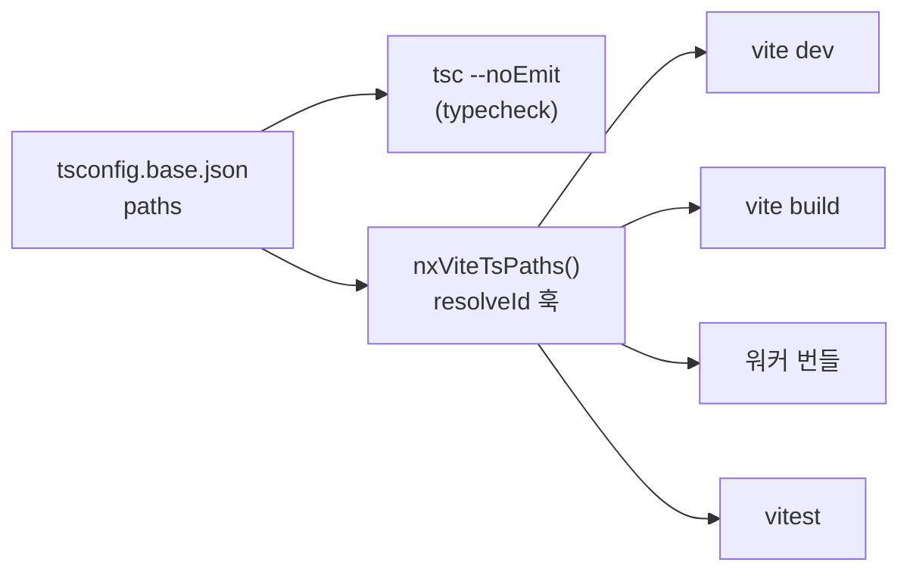

[1편](/blog/nx-monorepo-split-single-app)에서 앱 하나를 앱 2개와 라이브러리 3개로 쪼갰습니다. 라이브러리는 빌드하지 않고 `tsconfig.base.json`의 `paths`로 소스 파일을 직접 가리키게 했고, Vite 쪽은 `nxViteTsPaths` 플러그인 한 줄로 같은 경로를 보게 했습니다. 이번 편은 그 한 줄이 실제로 어디까지 닿는지 확인한 것과, 남겨 둔 두 가지(의존 방향 강제, affected CI)를 붙인 기록입니다. 코드는 [songtomtom/nx-vite-pnpm-monorepo](https://github.com/songtomtom/nx-vite-pnpm-monorepo)입니다.

## paths가 닿는 곳과 닿지 않는 곳

`@board/ui`라는 import를 `libs/ui/src/index.ts`로 바꿔 주는 주체는 상황마다 다릅니다. TypeScript 컴파일러, Vite dev 서버, Vite 프로덕션 빌드(Rolldown), 웹 워커 번들, vitest. 각각 확인했습니다.



**tsc.** 각 프로젝트의 `tsconfig.json`이 `tsconfig.base.json`을 `extends`하므로 `paths`가 그대로 상속됩니다. `typecheck` 타깃은 프로젝트 폴더에서 `tsc --noEmit -p tsconfig.json`을 돌리는 것이라 별도 설정이 없습니다.

**dev 서버.** 앱 폴더에서 dev 서버를 띄우고 변환된 모듈을 직접 받아 봤습니다.

```
import { Button, Card } from "/@fs/Users/.../nx-vite-pnpm-monorepo/libs/ui/src/index.ts"
import { COLUMNS, addTask, moveTask, tasksIn } from "/@fs/.../libs/board-core/src/index.ts"
```

`@board/ui`가 `/@fs/` 접두사가 붙은 절대 경로로 바뀌어 있습니다. dev 서버의 루트(`apps/board`) 밖에 있는 파일을 서빙할 때 Vite가 쓰는 형식입니다. 라이브러리 소스를 고치면 이 경로로 HMR이 옵니다. 빌드된 `dist/`가 아니라 소스를 보고 있다는 뜻입니다.

**웹 워커.** 여기가 제일 궁금했습니다. Vite는 워커를 별도 번들로 만들고, 워커 빌드에는 `worker.plugins`라는 별도 플러그인 목록이 있습니다. 메인 `plugins`에 넣은 별칭 플러그인이 워커 번들에는 적용되지 않을 수 있다고 알고 있었습니다. 확인하려고 라이브러리를 import하는 워커를 하나 넣었습니다.

`apps/board/src/features/board/stats.worker.ts`

```ts
import {COLUMNS, tasksIn, type Board} from '@board/board-core';

self.onmessage = (e: MessageEvent<Board>) => {
    const counts = Object.fromEntries(COLUMNS.map(c => [c, tasksIn(e.data, c).length]));
    self.postMessage(counts);
};
```

빌드하면 `stats.worker-[hash].js`가 따로 나오고 내용은 이렇습니다.

```js
(function(){let e=[`todo`,`doing`,`done`];function t(e,t){return e.tasks.filter(e=>e.column===t)}self.onmessage=n=>{...}})();
```

`COLUMNS`와 `tasksIn`이 인라인돼 있습니다. 별칭이 해석됐습니다. dev 서버에서도 워커 모듈이 같은 `/@fs/` 경로로 바뀌어 왔습니다. 플러그인 소스를 보니 `resolveId` 훅에 `enforce: 'pre'`를 걸어 Vite의 내장 해석기보다 먼저 답하는 구조였고, Vite 8에서는 그 훅이 워커 번들에도 적용됐습니다. 걱정했던 문제가 재현되지 않았으니 글에도 그렇게 씁니다. 다른 Vite 버전이나 `worker.plugins`를 따로 지정한 설정에서는 다를 수 있습니다.

**vitest.** 여기는 깨집니다. vitest는 각 프로젝트의 `vite.config.ts`를 읽으므로 라이브러리 설정에도 플러그인이 있어야 합니다. `libs/api-client`의 설정에서 플러그인을 빼고 테스트를 돌렸습니다.

```
Error: Failed to resolve import "@board/board-core" from "src/client.test.ts". Does the file exist?
```

`api-client`가 `board-core`의 타입만 쓸 때는 tsc만 통과하면 됐지만, 테스트 파일이 `addTask`를 실제로 호출하자 vitest가 `@board/board-core`를 찾지 못했습니다. 라이브러리 다섯 개 설정 파일에 플러그인이 다 들어 있는 이유입니다. 설정 파일이 프로젝트 수만큼 복제되는 것이 이 방식의 비용입니다.

## 관습을 lint 에러로

1편 끝에서 `apps → libs` 방향은 관습일 뿐이라고 썼습니다. `libs/ui`에서 `apps/board`를 상대 경로로 import해도 tsc와 Vite는 아무 말 없이 통과시킵니다. Nx에는 이것을 막는 ESLint 규칙이 있습니다. 프로젝트마다 태그를 붙이고, 태그 사이에 허용되는 의존 방향을 적습니다.

태그는 각 프로젝트의 `package.json`에 둡니다. `project.json`이 없으니 여기가 Nx 설정 자리입니다.

`libs/ui/package.json`

```json
{
  "name": "@board/ui",
  "nx": {
    "tags": ["type:lib", "scope:ui"],
    "projectType": "library"
  }
}
```

`projectType`을 명시한 이유가 있습니다. 처음에 태그만 넣고 lint를 돌렸더니 정상 코드인 `apps/board`에서 `Imports of apps are forbidden`이 세 줄 나왔습니다. `@board/ui`를 import한 것이 앱을 import한 것으로 잡힌 것입니다. `nx show project`로 보니 라이브러리들의 `projectType`이 비어 있었고, 규칙은 비어 있으면 앱으로 취급했습니다. `vite.config.ts`에 `index.html`이 딸린 앱은 플러그인이 `application`으로 추론해 주지만, 라이브러리는 아무도 정해 주지 않았습니다.

규칙은 루트 ESLint 설정에 있습니다.

`eslint.config.mjs`

```js
            '@nx/enforce-module-boundaries': [
                'error',
                {
                    enforceBuildableLibDependency: false,
                    allow: [],
                    depConstraints: [
                        // 앱은 라이브러리만 가져올 수 있다
                        {sourceTag: 'type:app', onlyDependOnLibsWithTags: ['type:lib']},
                        // 라이브러리는 라이브러리만 가져올 수 있다 (앱 금지)
                        {sourceTag: 'type:lib', onlyDependOnLibsWithTags: ['type:lib']},
                        // 도메인은 아무것도 가져오지 않는다
                        {sourceTag: 'scope:core', onlyDependOnLibsWithTags: []}
                    ]
                }
            ]
```

`lint` 타깃은 `@nx/eslint/plugin`이 `eslint.config.mjs`를 보고 추론합니다. 프로젝트 폴더에서 `eslint .`를 실행하는 것이고, 1편의 다른 타깃들처럼 `project.json` 없이 생깁니다.

세 가지 위반을 일부러 만들어 봤습니다.

`libs/ui`에서 `apps/board`의 `App`을 상대 경로로 import:

```
1:1  error  Projects cannot be imported by a relative or absolute path, and must begin with a npm scope
```

`libs/board-core`(scope:core)에서 `@board/ui`를 import:

```
1:1  error  A project tagged with "scope:core" cannot depend on any libs with tags
```

`apps/board`에서 `@board/api-client` 대신 `../../../../../libs/api-client/src/client`로 내부 파일을 직접 import:

```
4:1  error  Projects cannot be imported by a relative or absolute path, and must begin with a npm scope
```

첫 번째와 세 번째는 태그를 보기도 전에 걸립니다. 다른 프로젝트는 반드시 패키지 이름으로만 가져오라는 규칙이라, `index.ts`가 내보내지 않은 내부 파일에 닿을 방법이 없어집니다. 두 번째가 태그 규칙입니다. 도메인 라이브러리가 UI나 저장소를 알게 되는 것을 막습니다. 세 위반 다 tsc와 Vite는 통과시켰을 코드입니다.

한 가지 미리 알아 둘 것이 있습니다. 처음에는 두 번째 실험을 `board-core`에서 `@board/api-client`를 import하는 것으로 했는데, 태그 에러 대신 `Circular dependency between "@board/board-core" and "@board/api-client"`가 나왔습니다. `api-client`가 이미 `board-core`를 쓰고 있어서 순환이 먼저 잡힌 것입니다. 같은 규칙이 순환도 봅니다.

## CI를 affected로

1편의 CI는 `nx run-many -t typecheck test build`였습니다. 프로젝트가 다섯 개면 상관없지만, 늘어날수록 `libs/ui`의 버튼 색을 바꾼 커밋이 `board-core` 테스트까지 돌리는 게 아깝습니다. Nx는 의존 그래프를 알고 있으니 어떤 파일이 바뀌면 어떤 프로젝트가 영향을 받는지 계산할 수 있습니다.

먼저 로컬에서 파일 하나씩 물어봤습니다.

| 바뀐 파일 | affected |
|---|---|
| `libs/ui/src/Button.tsx` | ui, board, admin |
| `libs/board-core/src/board.ts` | board-core, api-client, board, admin |
| `apps/admin/src/App.tsx` | admin |
| `tsconfig.base.json` | 전부 |

`board-core`를 고치면 그것을 쓰는 `api-client`와 두 앱이 잡히고, `ui`를 고치면 `board-core`는 빠집니다. 1편에서 의존 그래프가 비어 있던 상태였다면 이 표는 첫 열만 남고 나머지는 전부 빈칸이었을 것입니다. `tsconfig.base.json`이 전부를 건드리는 건 `nx.json`의 `sharedGlobals`에 넣어 뒀기 때문입니다. `paths`가 바뀌면 모든 프로젝트의 해석이 바뀔 수 있으니 맞는 동작입니다.

CI는 이렇게 바꿨습니다.

`.github/workflows/ci.yml`

```yaml
      - uses: actions/checkout@v4
        with:
          # affected 계산에 base 커밋이 필요하므로 얕은 클론을 쓰지 않는다
          fetch-depth: 0
      # ...
      # PR이면 base 브랜치, main 푸시면 마지막으로 성공한 워크플로 커밋을 NX_BASE 로 잡아 준다
      - uses: nrwl/nx-set-shas@v4
      - run: pnpm exec nx affected -t lint typecheck test build
```

`affected`는 "무엇과 비교해서 바뀌었나"의 기준 커밋이 필요합니다. PR이면 base 브랜치가 자연스럽지만 `main`에 직접 푸시할 때는 애매합니다. 직전 커밋과 비교하면 CI가 실패한 커밋 다음에 온 커밋은 실패한 부분을 다시 검사하지 않습니다. `nx-set-shas`는 GitHub API로 이 워크플로가 마지막으로 성공한 커밋을 찾아 `NX_BASE`로 넣어 줍니다.

실제로 그렇게 동작했습니다. 워커를 추가한 커밋에서 jsdom에 `Worker`가 없어 테스트가 깨졌고, 다음 커밋에서 고쳤습니다. 고친 커밋의 CI 로그입니다.

```
NX_BASE: 8525a27c...
NX   No explicit --base argument provided, but found environment variable NX_BASE so using its value as the affected base
NX   Running targets lint, typecheck, test, build for 5 projects:
```

base가 직전 커밋이 아니라 세 커밋 전, 마지막으로 초록이었던 커밋입니다. 그 사이에 `nx.json`을 건드린 커밋이 있어서 다섯 프로젝트가 전부 잡혔습니다. 실패를 고친 커밋이 실패한 범위를 빠짐없이 다시 검사한 셈입니다.

## 정리

| | 1편 끝 | 2편 끝 |
|---|---|---|
| 별칭 해석 | 플러그인 한 줄, 어디까지 되는지 모름 | tsc·dev·build·워커 확인, vitest는 프로젝트마다 플러그인 필요 |
| 의존 방향 | 관습 | 태그 + lint 에러. 내부 파일 직접 import도 차단 |
| CI | `run-many` 전부 | `affected`, base는 마지막 성공 커밋 |

라이브러리를 빌드하지 않는 방식은 설정 파일이 프로젝트 수만큼 늘어나는 대가가 있습니다. 대신 라이브러리를 고치는 즉시 앱에 반영되고 `dist/`가 어디에도 없습니다. 이 저장소 크기에서는 그 교환이 맞다고 봤습니다.

## Reference

- [Nx: Enforce Module Boundaries](https://nx.dev/features/enforce-module-boundaries)
- [Nx: Run Only Tasks Affected by a PR](https://nx.dev/ci/features/affected)
- [nrwl/nx-set-shas](https://github.com/nrwl/nx-set-shas)
- [Vite: Web Workers](https://vite.dev/guide/features.html#web-workers)
