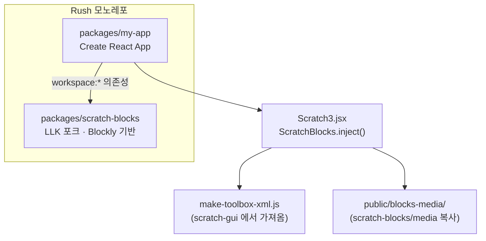
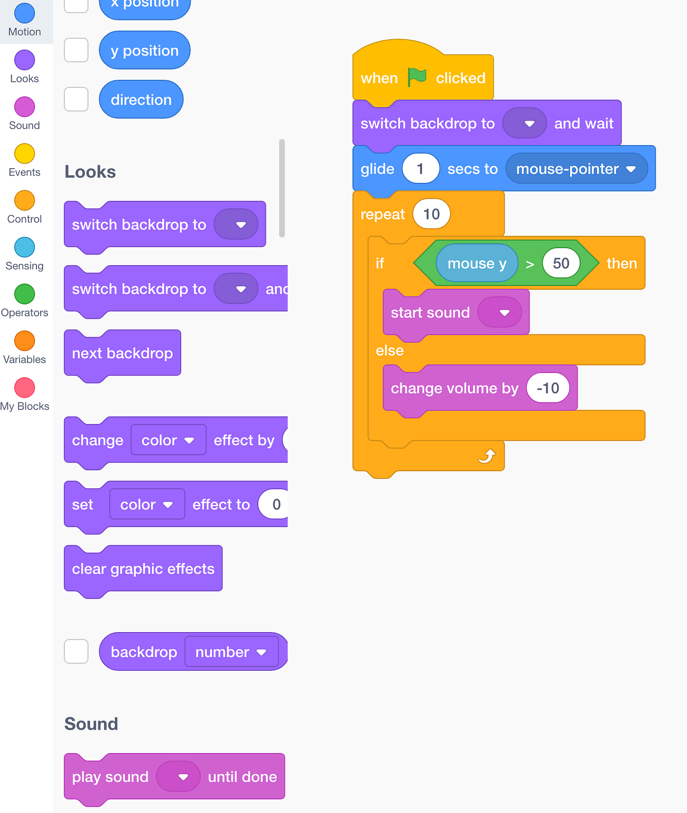

스크래치는 MIT 미디어랩이 만든 블록 코딩 환경이고, 스크래치 3는 웹으로 다시 만들어지면서 여러 패키지로 쪼개졌습니다. 그중 [scratch-blocks](https://github.com/scratchfoundation/scratch-blocks)는 블록을 그리고 끌어다 놓는 렌더링 엔진입니다. Google Blockly를 포크해 스크래치 스타일로 바꾼 것입니다.

교육용 코딩 플랫폼을 만들 때 스크래치 전체(scratch-gui)를 가져오면 무대, 스프라이트, 사운드 편집기까지 딸려 옵니다. 필요한 것이 "블록 에디터"뿐이라면 scratch-blocks만 떼어내서 내 React 앱에 붙이는 편이 훨씬 가볍습니다. 이 글은 그 실험입니다. 코드는 [songtomtom/scratch-blocks](https://github.com/songtomtom/scratch-blocks)에 있습니다.

## 구조



## 왜 모노레포인가

scratch-blocks를 npm에서 받아 쓰면 되지 않나 싶지만, 실제로는 포크가 필요합니다. 블록 모양, 색, 카테고리를 제품에 맞게 바꾸려면 소스를 고쳐야 하고, 고친 소스를 앱에서 바로 써 보려면 두 패키지가 한 저장소에서 링크되어 있어야 합니다. npm에 올렸다 받는 방식은 수정 한 번에 배포 한 번이라 반복이 너무 느립니다.

여러 패키지를 한 저장소에서 관리하는 도구로 [Rush](https://rushjs.io)를 골랐습니다. pnpm 워크스페이스 위에 잠금 파일 하나, 일관된 설치, 변경된 패키지만 빌드하는 기능을 얹은 것입니다. 이미 익숙한 도구라서 택했습니다. 지금 새로 시작한다면 pnpm 워크스페이스에 Turborepo를 얹는 구성이 더 흔합니다.

```bash
npm install -g @microsoft/rush
mkdir my-monorepo && cd my-monorepo
rush init
```

```text
.
├── common/config/rush/   Rush 설정 (버전 정책, pnpm 설정 등)
├── common/scripts/       install-run-rush.js 등 부트스트랩 스크립트
└── rush.json             패키지 목록
```

## 패키지 두 개

```bash
mkdir packages && cd packages
git clone git@github.com:LLK/scratch-blocks.git
npx create-react-app my-app
```

`rush.json`에 두 패키지를 등록합니다.

```json
{
  "projects": [
    {
      "packageName": "my-app",
      "projectFolder": "packages/my-app",
      "reviewCategory": "packages"
    },
    {
      "packageName": "scratch-blocks",
      "projectFolder": "packages/scratch-blocks",
      "reviewCategory": "packages"
    }
  ]
}
```

그리고 `my-app`의 의존성에 scratch-blocks를 워크스페이스 링크로 추가합니다.

```json
{
  "dependencies": {
    "scratch-blocks": "workspace:*"
  }
}
```

```bash
rush update --full
rush build
```

`workspace:*`는 npm 레지스트리가 아니라 같은 워크스페이스의 패키지를 심볼릭 링크로 연결하라는 뜻입니다. scratch-blocks를 고치고 다시 빌드하면 my-app이 바로 새 코드를 봅니다. `rush build`는 scratch-blocks의 빌드(Closure Compiler로 수백 개 파일을 하나로 합칩니다)를 먼저 하고 의존 순서대로 진행합니다.

## 블록 렌더링

scratch-blocks의 진입점은 Blockly와 같은 `inject(container, options)`입니다. 컨테이너 요소 안에 SVG 워크스페이스를 만들고, 옵션의 툴박스대로 블록 팔레트를 그립니다.

`packages/my-app/src/Scratch3.jsx`

```jsx
import React, { useEffect } from "react";
import ScratchBlocks from "scratch-blocks";
import makeToolboxXML from "./make-toolbox-xml";

function Scratch3() {
  useEffect(() => {
    const workspaceConfiguration = {
      toolbox: makeToolboxXML(true),
      media: "/blocks-media/",
    };

    ScratchBlocks.inject("scratch", {
      ...workspaceConfiguration,
    });
  }, []);

  return <div id="scratch" className="scratch" />;
}

export default Scratch3;
```

두 옵션이 핵심입니다.

**toolbox.** 어떤 블록을 어떤 카테고리로 보여 줄지 정의한 XML입니다. scratch-blocks에는 블록 정의만 있고 "스크래치 화면에 나오는 그 팔레트"는 scratch-gui 쪽에 있습니다. 그래서 scratch-gui 저장소의 `make-toolbox-xml.js`를 가져왔습니다. 동작, 형태, 소리, 이벤트 같은 카테고리와 각 카테고리의 블록 목록을 XML 문자열로 만드는 함수입니다. 인자 `true`는 무대가 아니라 스프라이트 기준 툴박스를 만들라는 뜻이라, 무대 전용 블록이 빠집니다. 제품에 맞는 블록만 남기려면 이 파일을 편집하면 됩니다.

**media.** 블록에 들어가는 아이콘(회전 화살표, 깃발 등)과 효과음(클릭, 삭제)의 경로입니다. scratch-blocks 저장소의 `media/` 디렉터리를 `public/blocks-media/`로 복사해 두고 그 경로를 넘깁니다. 이걸 빼먹으면 블록은 그려지지만 아이콘 자리가 비고 콘솔에 404가 쌓입니다.

`useEffect`의 의존성이 `[]`인 것은 마운트 시 한 번만 주입하기 위해서입니다. 다만 이 코드는 언마운트 시 정리가 없습니다. 실제 앱에서는 `inject`가 돌려주는 워크스페이스를 저장해 두고 cleanup에서 `workspace.dispose()`를 불러야 합니다. 그렇지 않으면 화면을 오갈 때마다 워크스페이스가 쌓입니다. React 18 StrictMode에서는 개발 중 effect가 두 번 실행되므로 정리 없이는 블록 팔레트가 두 개 겹쳐 보이는 증상으로 바로 드러납니다.

`App.css`에 `#scratch`의 높이를 지정해야 합니다. 컨테이너 높이가 0이면 워크스페이스가 그려지지 않습니다.

## 실행

```bash
cd packages/my-app
rushx start
```



스크래치와 같은 팔레트가 React 앱 안에 그려집니다. 블록을 끌어 조립할 수도 있습니다.

## 여기서부터가 진짜

렌더링은 시작일 뿐입니다. 이 실험에서 손대지 않은 것들이 실제 제품에서는 대부분의 일이었습니다.

- **실행.** scratch-blocks는 그리기만 합니다. 조립한 블록을 실행하려면 워크스페이스를 XML이나 JSON으로 직렬화해 인터프리터(스크래치는 scratch-vm)에 넘겨야 합니다. 하드웨어를 제어하는 제품이라면 그 결과를 펌웨어 코드로 변환하는 단계가 더 붙습니다.
- **커스텀 블록.** 자사 하드웨어의 모터, 센서 블록은 새로 정의해야 합니다. 블록 정의, 툴박스, 다국어 문자열, 렌더러가 얽혀 있어서 이 부분을 독립 모듈로 분리하는 것이 중요합니다.
- **입력 컴포넌트.** 색 선택기, 각도 다이얼, 음표 입력 같은 필드는 Blockly 필드 API로 만들어야 하고, 제품마다 필요한 것이 다릅니다.
- **저장과 복원.** 워크스페이스 상태를 저장하고 다시 불러올 때 버전이 바뀐 블록을 어떻게 처리할지 정해야 합니다.

렌더링 하나로 끝나지 않는 이유가 여기 있습니다. 블록 에디터를 제품에 넣으려면 위 네 가지를 각각 독립된 모듈로 설계해야 하고, 그 출발점이 이 저장소처럼 scratch-blocks를 앱과 분리해 링크하는 구조입니다.

## Reference

- [scratchfoundation/scratch-blocks](https://github.com/scratchfoundation/scratch-blocks)
- [scratchfoundation/scratch-gui](https://github.com/scratchfoundation/scratch-gui)
- [Rush — Getting started](https://rushjs.io/pages/intro/get_started)
