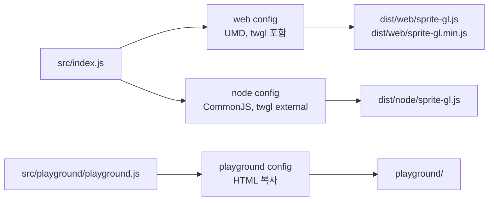

WebGL로 스프라이트를 그리는 라이브러리를 유지보수하고 있었습니다. 브라우저에서는 스크립트 태그로도 쓰이고, 번들러를 거쳐서도 쓰이고, Node에서는 GPU 없이 경계 상자 계산 같은 순수 함수만 씁니다. 그래서 webpack 설정이 세 개였습니다. web용 UMD, node용 CommonJS, 그리고 눈으로 확인하는 playground. 설정 파일 하나에 세 개의 config 객체가 배열로 들어 있었고, 빌드 한 번에 셋 다 돌았습니다.

이 구조를 Vite로 옮겼습니다. 옮긴 이유는 두 가지였습니다. 같은 저장소의 앱 쪽이 이미 Vite였는데 라이브러리만 webpack이라 의존성과 설정 지식이 두 벌이었고, dev 서버가 번들을 다 만들고 나서야 뜨는 게 매번 거슬렸습니다. 이 글은 그 전환을 작은 라이브러리 하나로 다시 만든 기록입니다. 코드는 [songtomtom/webpack-to-vite-library](https://github.com/songtomtom/webpack-to-vite-library)에 있고, `webpack` 태그가 전환 전, `main`이 전환 후입니다.

## 옮기기 전

라이브러리 자체는 작습니다. 캔버스에 색 사각형을 그리는 `SpriteRenderer`, GPU 없이도 도는 `Rectangle`, 색 변환과 스냅샷 직렬화 유틸입니다. 번들러 입장에서 까다로운 지점은 두 곳입니다. 셰이더 소스를 파일에서 문자열로 가져오는 것과, 스냅샷 유틸이 Node 전역인 `Buffer`를 쓰는 것입니다.



전환 전 설정입니다. 공통 부분을 `base`에 두고 세 타깃이 덮어씁니다.

`webpack.config.js` (`webpack` 태그)

```js
const base = {
    module: {
        rules: [
            {
                // 셰이더 파일을 문자열로 가져온다
                test: /\.(vert|frag|glsl)$/,
                use: 'raw-loader'
            }
        ]
    },
    resolve: {
        fallback: {
            // src/util/snapshot.js가 Buffer를 쓴다. webpack 5는 Node 폴리필을 자동으로 넣지 않는다.
            buffer: require.resolve('buffer/')
        }
    },
    optimization: {
        minimizer: [new TerserPlugin({
            terserOptions: {
                compress: {drop_console: true},
                format: {comments: false}
            },
            extractComments: false
        })]
    },
    devtool: 'source-map'
};

const webConfig = {
    ...base,
    name: 'web',
    target: 'browserslist',
    entry: {
        'sprite-gl': path.join(__dirname, 'src/index.js'),
        'sprite-gl.min': path.join(__dirname, 'src/index.js')
    },
    output: {
        path: path.resolve(__dirname, 'dist/web'),
        filename: '[name].js',
        library: {name: 'SpriteGL', type: 'umd'},
        globalObject: 'this'
    },
    // ...
};

const nodeConfig = {
    ...base,
    name: 'node',
    target: 'node',
    entry: {'sprite-gl': path.join(__dirname, 'src/index.js')},
    output: {
        path: path.resolve(__dirname, 'dist/node'),
        filename: '[name].js',
        library: {type: 'commonjs2'}
    },
    externals: {
        'twgl.js': 'commonjs2 twgl.js'
    }
};

const playgroundConfig = {
    ...base,
    name: 'playground',
    target: 'browserslist',
    entry: {playground: path.join(__dirname, 'src/playground/playground.js')},
    output: {
        path: path.resolve(__dirname, 'playground'),
        filename: '[name].js'
    },
    plugins: [
        new CopyWebpackPlugin({patterns: [{context: 'src/playground', from: '*.html'}]})
    ],
    devServer: {
        static: {directory: path.resolve(__dirname, 'playground')},
        port: 8361,
        open: true
    }
};

module.exports = [webConfig, nodeConfig, playgroundConfig];
```

94줄입니다. 설정 자체가 길지는 않은데, 같은 진입점을 세 번 적고, 같은 출력 이름을 타깃마다 다르게 조립하고, minify 규칙을 web에서만 다시 덮어쓰는 식으로 "같은 것을 세 번 말하는" 구조였습니다. 새 포맷을 하나 추가하려면 config 객체를 하나 더 복사해야 했습니다.

## 옮긴 뒤

Vite에는 라이브러리 모드가 있습니다. `build.lib`에 진입점과 포맷 배열을 주면 Rollup(Vite 8부터는 Rolldown)이 포맷별로 번들을 냅니다. 세 config 객체가 하던 일을 `formats` 배열 하나가 대신하고, playground는 `mode`로 분기했습니다.

`vite.config.js`

```js
export default defineConfig(({mode}) => {
    const plugins = [
        // 셰이더 파일을 문자열로. webpack의 raw-loader 자리.
        rawPlugin({fileRegex: /\.(vert|frag|glsl)$/})
    ];

    if (mode === 'playground') {
        return {
            root: resolve(root, 'src/playground'),
            plugins,
            server: {port: 8361, open: true},
            build: {outDir: resolve(root, 'playground'), emptyOutDir: true}
        };
    }

    return {
        plugins,
        build: {
            lib: {
                entry: resolve(root, 'src/index.js'),
                name: 'SpriteGL',
                formats: ['es', 'cjs', 'umd'],
                fileName: format => ({
                    es: 'web/sprite-gl.mjs',
                    cjs: 'node/sprite-gl.cjs',
                    umd: 'umd/sprite-gl.js'
                })[format]
            },
            rollupOptions: {
                // 의존성은 번들에 넣지 않는다. 소비자의 번들러가 해결한다.
                external: ['twgl.js'],
                output: {
                    // UMD는 전역 변수로 의존성을 찾는다
                    globals: {'twgl.js': 'twgl'}
                }
            },
            sourcemap: true
        }
    };
});
```

51줄이고, 진입점은 한 번만 나옵니다. 대응 관계를 표로 두면 이렇습니다.

| webpack | Vite |
|---|---|
| config 객체 세 개를 배열로 export | `formats: ['es', 'cjs', 'umd']` 하나 + playground는 `mode` 분기 |
| `output.library.type: 'umd'` / `'commonjs2'` | `formats`의 `umd` / `cjs` |
| `output.path` + `filename`을 타깃마다 조립 | `fileName(format)` 함수 하나 |
| `externals: {'twgl.js': 'commonjs2 twgl.js'}` | `rollupOptions.external` + UMD용 `output.globals` |
| `module.rules`의 `raw-loader` | `vite-raw-plugin` |
| `CopyWebpackPlugin`으로 HTML 복사 | playground 모드에서 `root`를 HTML이 있는 폴더로 |
| `devServer` | `server` |

### 포맷마다 파일 이름과 확장자를 다르게

`fileName`은 포맷을 받아 경로를 돌려주는 함수입니다. 기본값은 `sprite-gl.js`, `sprite-gl.cjs`, `sprite-gl.umd.js`처럼 한 폴더에 확장자만 다르게 두는 것인데, 저는 예전 폴더 구조(`dist/web`, `dist/node`)를 유지했습니다. 이미 그 경로를 참조하는 곳이 있었기 때문입니다.

확장자는 일부러 `.mjs`와 `.cjs`로 갈랐습니다. `package.json`에 `"type": "module"`을 넣지 않은 상태에서 `.js`는 CommonJS로 해석됩니다. ES 번들을 `.js`로 두면 Node가 파일 내용을 보고 추측해야 하고, 반대로 `"type": "module"`을 넣으면 CommonJS 번들이 `.js`일 때 깨집니다. 확장자를 명시하면 어느 쪽이든 추측이 필요 없습니다.

### external은 포맷 공통이라 UMD에 globals가 필요하다

webpack에서는 node 타깃만 `twgl.js`를 external로 두고 web 타깃은 통째로 번들에 넣었습니다. 스크립트 태그로 쓰는 사람이 twgl을 따로 로드하지 않아도 되게 하려는 배려였습니다.

Vite 라이브러리 모드에서 `rollupOptions.external`은 한 번의 빌드에 속한 모든 포맷에 적용됩니다. 포맷별로 다르게 줄 수 없습니다. 그래서 선택해야 했습니다. 셋 다 external로 두거나, 셋 다 포함하거나. 저는 external을 택했습니다. es와 cjs 소비자는 어차피 번들러나 Node가 `twgl.js`를 해석하고, 같은 twgl을 앱이 이미 쓰고 있다면 중복으로 들어가는 게 더 문제입니다. UMD만 `output.globals`로 전역 `twgl`을 찾게 두었습니다. 스크립트 태그 사용자는 twgl 스크립트를 앞에 하나 더 넣어야 하는데, 그 사용처는 실제로 playground뿐이었고 playground는 ESM으로 바꿨습니다.

### require를 import로

Vite 라이브러리 모드의 진입점은 ESM이어야 합니다. `module.exports`로 쓰여 있던 소스를 전부 `export`로 바꿨습니다. 기계적인 작업이지만 하나 주의할 게 있었습니다.

`src/SpriteRenderer.js`

```js
import * as twgl from 'twgl.js';

import vertexShader from './shaders/sprite.vert';
import fragmentShader from './shaders/sprite.frag';
import Rectangle from './Rectangle';
import {rgbToVec4} from './util/color';
import {encodeSnapshot} from './util/snapshot';
```

`const twgl = require('twgl.js')`를 `import twgl from 'twgl.js'`로 바꾸면 안 됩니다. Vite가 집는 twgl의 ESM 빌드(`module` 필드)는 named export만 있고 default export가 없습니다. 실제로 그렇게 바꿔 빌드하면 이렇게 멈춥니다.

```
[MISSING_EXPORT] "default" is not exported by "node_modules/twgl.js/dist/5.x/twgl-full.module.js".
```

`import * as twgl`이어야 합니다. 헷갈리는 점은 Node에서 `import('twgl.js')`를 해 보면 `default`가 있다는 것입니다. Node는 `main` 필드의 CommonJS 빌드를 집어서 `module.exports` 전체를 default로 감싸 주기 때문입니다. 어느 빌드를 집느냐에 따라 같은 패키지의 export 모양이 달라집니다.

### exports 맵

빌드가 세 파일을 내면 소비자가 어느 파일을 받을지는 `package.json`이 정합니다.

`package.json`

```json
{
  "main": "./dist/node/sprite-gl.cjs",
  "module": "./dist/web/sprite-gl.mjs",
  "unpkg": "./dist/umd/sprite-gl.js",
  "exports": {
    ".": {
      "import": "./dist/web/sprite-gl.mjs",
      "require": "./dist/node/sprite-gl.cjs"
    }
  },
  "files": ["dist"]
}
```

`exports`가 있으면 Node와 번들러는 `main`/`module`보다 이것을 먼저 봅니다. `import`로 들어오면 ES 번들, `require`로 들어오면 CommonJS 번들입니다. `main`과 `module`은 `exports`를 모르는 오래된 도구를 위해 남겼고, `unpkg`는 CDN이 UMD를 집도록 둔 힌트입니다. 전환 전에는 `main`과 `browser` 필드만 있었고, ES 번들 자체가 없었습니다.

## 검증

빌드가 성공하는 것과 번들이 실제로 로드되는 것은 다릅니다. 세 가지를 확인했습니다.

`test/node-smoke.cjs`

```js
const lib = require('../dist/node/sprite-gl.cjs');

assert.deepEqual(lib.rgbToVec4(255, 0, 0), [1, 0, 0, 1]);
assert.equal(lib.vec4ToCss([1, 0.5, 0, 1]), 'rgba(255, 128, 0, 1)');

const r = new lib.Rectangle(0, 10, 0, 10);
assert.ok(r.intersects(new lib.Rectangle(5, 15, 5, 15)));
assert.ok(!r.intersects(new lib.Rectangle(11, 20, 0, 10)));

const pixels = new Uint8Array([1, 2, 3, 255]);
assert.deepEqual(lib.decodeSnapshot(lib.encodeSnapshot(pixels)), pixels);

assert.equal(typeof lib.SpriteRenderer, 'function');
```

`test/node-smoke.mjs`

```js
import * as lib from '../dist/web/sprite-gl.mjs';

assert.deepEqual(lib.rgbToVec4(0, 255, 0), [0, 1, 0, 1]);
assert.ok(new lib.Rectangle(0, 1, 0, 1).intersects(new lib.Rectangle(1, 2, 1, 2)));
assert.equal(typeof lib.SpriteRenderer, 'function');
```

CommonJS 번들을 `require`로, ES 번들을 `import`로 Node에서 로드합니다. GPU가 없어도 `SpriteRenderer` 클래스가 정의되는지, external로 남긴 `twgl.js`가 Node에서 해석되는지가 여기서 확인됩니다. 나머지 하나는 playground를 `vite build --mode playground` 후 `vite preview`로 띄워 사각형 두 개가 그려지는 것을 눈으로 본 것입니다. CI는 빌드 두 번과 스모크 테스트 두 개를 돌립니다.

CI의 첫 실행은 실패했습니다. 로컬에서는 되던 playground 빌드가 `Cannot resolve entry module src/playground/index.html`로 멈췄는데, 원인은 Vite가 아니라 `.gitignore`였습니다. 빌드 결과물을 가리려고 넣은 `playground/` 패턴이 `src/playground/`까지 매칭해서 데모 소스가 아예 커밋되지 않았던 것입니다. 앞에 슬래시를 붙여 `/playground/`로 루트에 한정했습니다.

## 번들 크기가 달라진 이유

같은 소스를 두 번들러로 빌드한 결과입니다.

| 결과물 | webpack | Vite |
|---|---|---|
| 브라우저용 (minify 안 함) | 379 KB (twgl 포함) | 39 KB (twgl external) |
| 브라우저용 minified | 35 KB | 30 KB (UMD) |
| Node용 CommonJS | 3.7 KB | 30 KB |

브라우저용이 줄어든 것은 위에서 말한 대로 twgl을 밖으로 뺐기 때문입니다. 반대로 Node용은 8배 커졌습니다. 이유는 `Buffer`입니다. webpack의 node 타깃은 `Buffer`를 Node 전역으로 남겨 두는데, Vite는 타깃을 구분하지 않고 `import {Buffer} from 'buffer'`를 npm 폴리필로 해석해 세 번들 모두에 넣습니다. Node에서 돌 파일에 브라우저용 Buffer 구현이 들어가 있는 셈입니다. 동작은 하지만 맞는 결과는 아닙니다.

이것과 함께, 빌드 로그에 `vite-raw-plugin`이 소스맵을 만들지 않는다는 경고가 포맷마다 두 줄씩 찍힙니다. 셰이더 import, Buffer, CommonJS 의존성, 소스맵 경고. 옮기고 나서 걸린 이 네 가지가 2편입니다.

## Reference

- [Vite: Library Mode](https://vite.dev/guide/build.html#library-mode)
- [Rollup: output.globals](https://rollupjs.org/configuration-options/#output-globals)
- [Node.js: Package entry points (exports)](https://nodejs.org/api/packages.html#package-entry-points)
- [webpack: Output library types](https://webpack.js.org/configuration/output/#outputlibrarytype)
