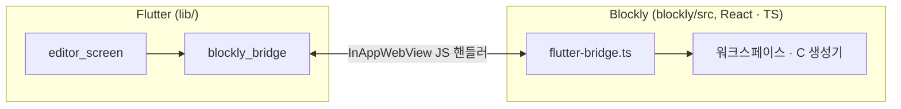
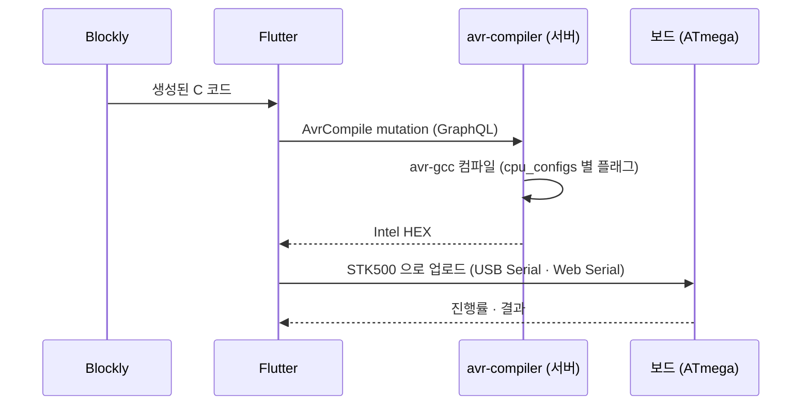
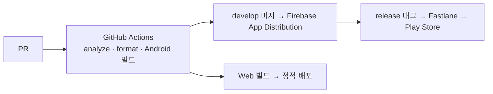

<!-- 캡처 자리: 에디터 화면 (블록 + 내 코드 패널) — 프론트매터 cover 로 -->

## 내 역할

2026년 1월 첫 커밋부터 Flutter ↔ Blockly 연동, 개발·배포 환경, CI/CD를 세웠고, 이후 기능 개발은 팀원 둘이 주도했습니다. 저는 구조와 리뷰, 스토어 배포를 맡았습니다.

| 영역 | 내 커밋 | 전체 | 비율 | 역할 |
|---|---:|---:|---:|---|
| 앱 (Flutter + Blockly) | 181 | 1,528 | 12% | 초기 아키텍처, 브리지, CI/CD, 배포, 리뷰 |
| 서버 flow · avr-compiler | 8 | 53 | 15% | 리뷰 |

## 1. 두 세계를 다리 하나로

Blockly는 웹 라이브러리이고 앱은 Flutter입니다. Blockly를 Flutter로 다시 쓰는 대신 WebView에 얹었고, 둘 사이 통신을 **JS 핸들러 하나**로 고정했습니다. Flutter 쪽 코드는 Blockly 파일을 건드리지 않고, 반대도 마찬가지입니다.

개발 중에는 Vite dev 서버의 Blockly를 WebView가 불러오고, 배포 빌드에는 번들을 에셋으로 넣습니다. 이 전환이 Makefile 한 줄이라 Flutter 핫 리로드와 Blockly HMR을 동시에 씁니다.

## 2. 블록 → C → 보드

컴파일은 서버에서 합니다. 태블릿에 툴체인을 넣을 수 없고, 보드 종류가 늘어도 서버의 CPU 설정 파일만 추가하면 되기 때문입니다. 업로드는 앱이 직접 합니다. 서버가 돌려준 HEX를 STK500 프로토콜로 보드의 부트로더에 씁니다. 모바일에서는 USB Serial, 웹에서는 Web Serial이라 같은 업로더에 전송 계층만 다릅니다.

<!-- 캡처 자리: 컴파일 · 업로드 진행 화면 -->

## 3. 플랫폼 다섯을 한 코드로

Android 태블릿, Windows, macOS, Web(Chromium), iOS. 각 플랫폼에서 못 쓰는 것이 다릅니다. 웹은 로컬 서버를 못 띄우고, Windows는 USB 권한 흐름이 다르고, iOS는 USB Serial이 없습니다.

규칙을 하나로 정했습니다. **삭제·교체 금지, 추가·분기만 허용.** 웹에서 스플래시 애니메이션을 건너뛰려면 스플래시를 지우는 게 아니라 `kIsWeb` 분기로 건너뜁니다. 이 규칙이 없으면 한 플랫폼을 고치다 다른 플랫폼의 기능이 사라지는 회귀가 반복됐습니다. 분기 지점은 `kIsWeb` 63곳, `Platform.is*` 24곳입니다.

## 4. 배포

Android 빌드는 Blockly 번들을 먼저 만들어야 해서 빌드 타깃에 의존성을 걸었고, CI 디스크가 모자라 한때 Android 검증을 껐다가 정리 후 다시 켰습니다. 릴리스는 `.env` 교체부터 버전 코드 증가까지 명령 하나로 묶었습니다.

## 남은 것

- 보드 식별(어느 CPU인지)을 USB에서 읽을 때 경쟁이 있어 재시도와 입력 버퍼 비우기를 넣었는데, 더 안정적인 방법은 부트로더 쪽 응답을 바꾸는 것입니다.
- 코드 생성기가 C 하나뿐이라 다른 보드 계열이 들어오면 생성기 추상화가 필요합니다.
