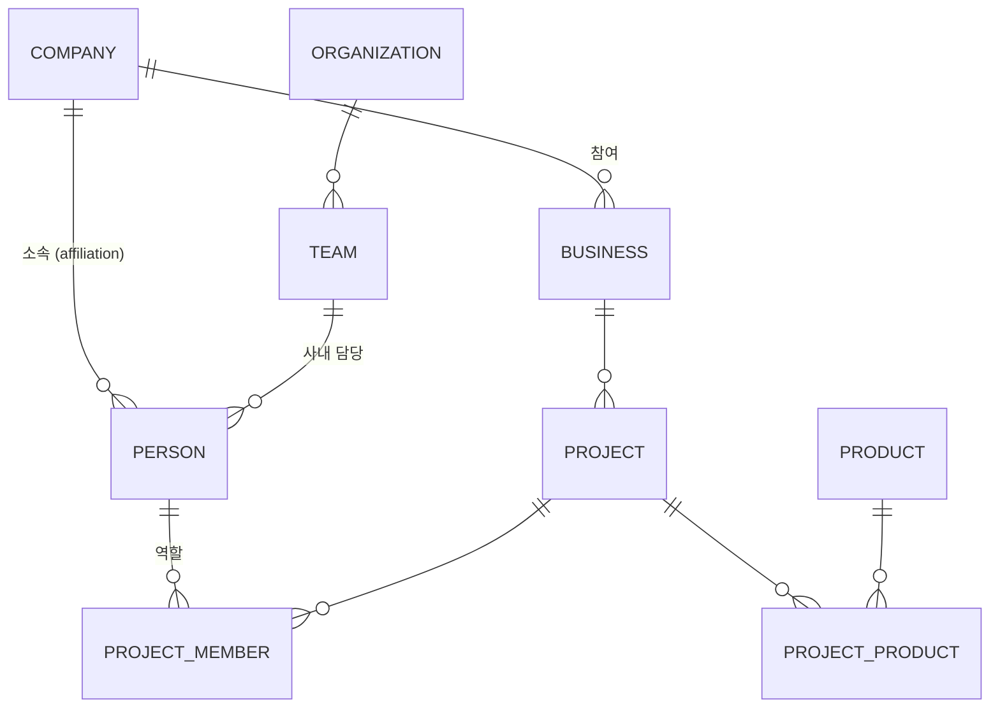
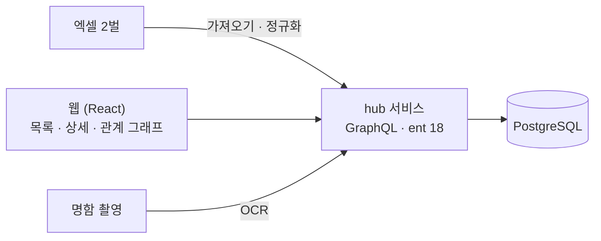

<!-- 캡처 자리: 대시보드 또는 연락처 목록 (개인정보 블러) — 프론트매터 cover 로 -->

## 내 역할

기획서(목적·역할·데이터 모델·로드맵)부터 썼습니다. 프론트 저장소 커밋 449개와 서버 hub 서비스 커밋 114개 중 108개가 제 것입니다. 경영진 검토를 거쳐 5단계 로드맵으로 도입했습니다.

## 문제: 엑셀 두 벌이 서로를 모른다

연락처 명부와 사업 관리 시트가 따로 있었습니다. "이 사업에 관련된 사람이 누구인가"를 보려면 두 파일을 사람 눈으로 맞춰야 했고, 회사명이 "(주)에이", "에이 주식회사", "A Inc."처럼 제각각이라 맞춰지지도 않았습니다.

## 1. 데이터 모델: 회사를 가운데 둔다

핵심 엔티티 8종(사람·회사·사업·프로젝트·제품·조직·팀·사용자)과 연결 테이블 6종입니다. 결정은 **회사를 단일 마스터로 두는 것**이었습니다. 연락처도 사업도 회사에 매달리게 하면, 두 엑셀을 가져올 때 회사명만 맞추면 나머지가 자동으로 연결됩니다. 사람과 회사 사이는 `affiliation`으로 두어 이직하면 이력이 남습니다.

## 2. 가져오기 전에 정리할 것

마이그레이션은 "데이터를 넣는 일"이 아니라 "정합성 문제를 먼저 찾는 일"이었습니다. 미리 식별한 것들입니다.

- 회사명 표기 불일치: 정규화 규칙(법인 접미사 제거, 공백·괄호 통일) 뒤 수동 확인 큐
- 전화번호: 저장은 E.164, 표시는 국내 표기, 검색은 둘 다 매칭
- 사업에 담당자가 비어 있는 행: 백필 대상으로 따로 뽑음
- 중복 등록: 등록 폼에서 즉시 중복을 조회해 기존 레코드로 가는 링크를 보여 줌

<!-- 캡처 자리: 중복 등록 안내 다이얼로그 또는 회사 정규화 화면 -->

## 3. 권한과 이력

Admin·Editor·Viewer 세 역할. 데이터는 전부 공유하고 편집·삭제 권한만 차등입니다. 사용자별 칸막이를 두지 않은 건 "연결"이 핵심이라 보이는 범위를 쪼개면 가치가 사라지기 때문입니다. 대신 모든 등록·수정·삭제를 활동 이력으로 남깁니다.

## 4. 합치면

관계 그래프 화면은 사람·회사·사업을 노드로 그려 "이 사람이 어떤 사업과 엮여 있나"를 한 화면에서 따라갑니다. 명함은 촬영 후 인식 결과를 검수해 등록합니다.

<!-- 캡처 자리: 관계 그래프 화면 (노드 이름 블러) -->

## 남은 것

- 명함 OCR은 외부 API에 의존합니다. 인식률이 낮은 명함(세로형·영문)은 수동 입력으로 떨어집니다.
- 로드맵 5단계 중 사업 쪽 고급 기능(견적·계약)은 아직 착수 전입니다.
