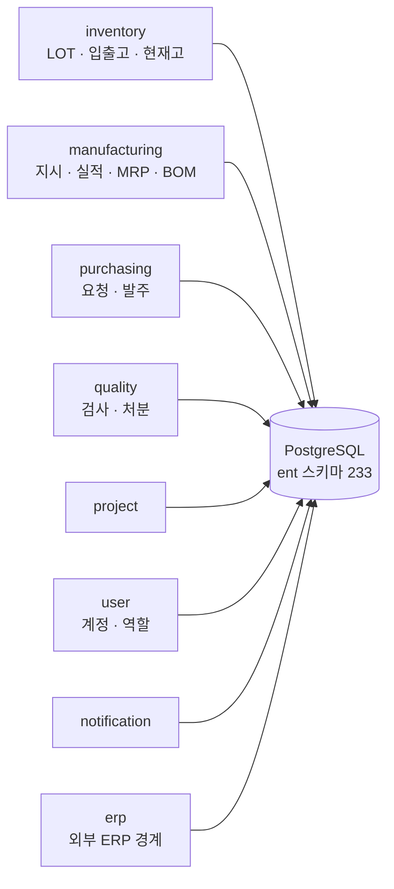
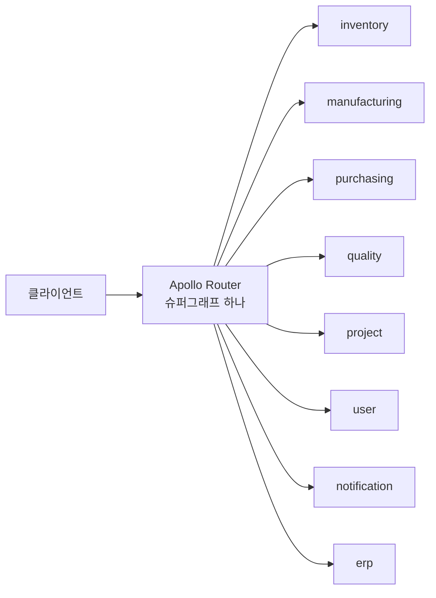
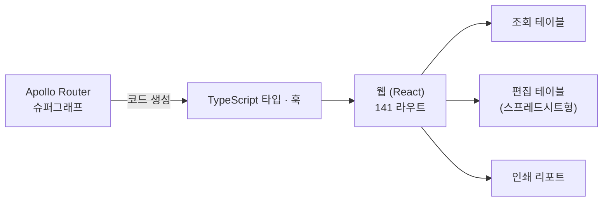
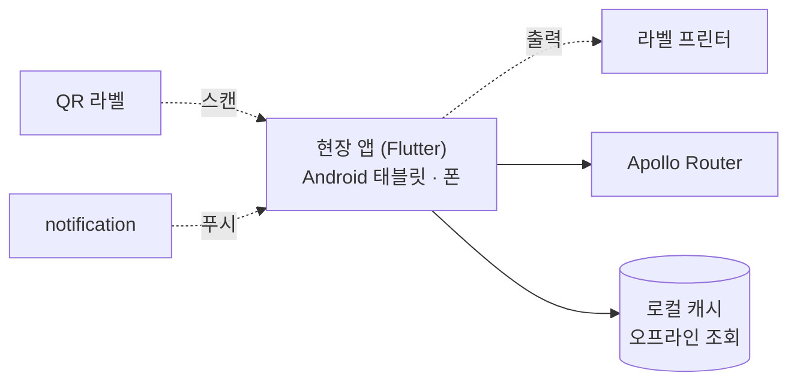
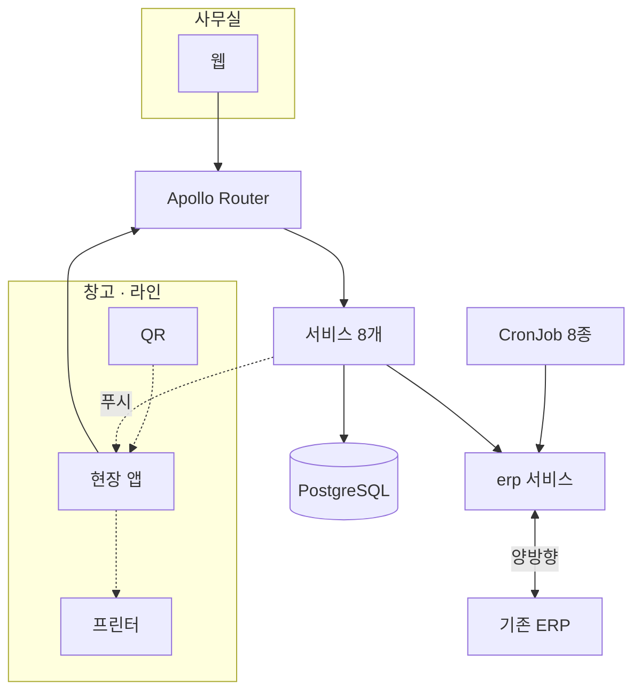
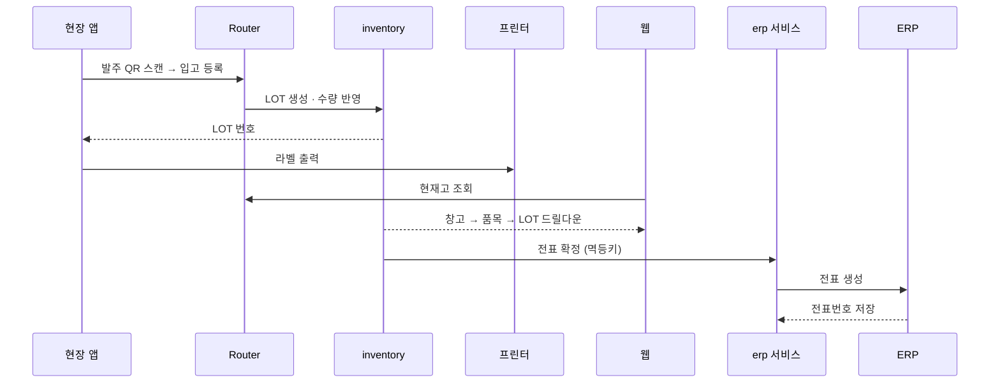
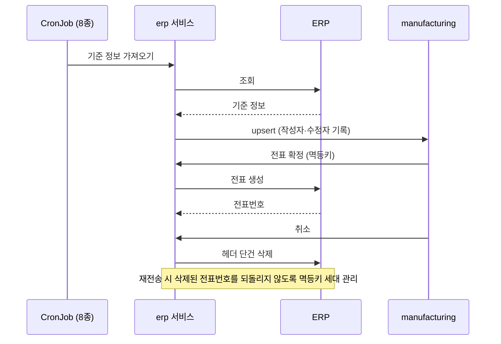

## 내 역할

설계 전체와 백엔드·웹 구현의 대부분을 직접 했고, 현장 앱은 팀원이 주도하고 저는 구조와 리뷰를 맡았습니다. 저장소 기준 기여 비율입니다.

| 영역 | 내 커밋 | 전체 | 비율 | 역할 |
|---|---:|---:|---:|---|
| 백엔드 (Go 서비스 8개) | 2,075 | 2,289 | 90% | 설계·구현 |
| 웹 (React) | 911 | 1,123 | 81% | 설계·구현, PR 393건 중 356건 |
| 현장 앱 (Flutter) | 200 | 680 | 29% | 구조 설계·리뷰, 팀원 주도 |

## 1. 서버: 도메인마다 서비스 하나

생산·재고·구매·품질은 바뀌는 주기도 담당 팀도 다릅니다. 그래서 도메인마다 Go 서비스를 따로 두고, 각 서비스는 자기 테이블만 소유합니다. 이 여덟 개가 시스템의 뼈대입니다.

스키마 233개를 ent로 정의해 Go 타입, DB 마이그레이션, GraphQL 타입이 한 정의에서 나옵니다.

서비스가 여덟 개면 클라이언트가 여덟 군데에 물어야 할 것 같지만 그렇지 않습니다. 각 서비스가 GraphQL 서브그래프를 내고 Apollo Router가 그것을 하나의 슈퍼그래프로 합칩니다. 클라이언트는 라우터 하나만 압니다.

생산지시 화면이 품목(manufacturing)과 현재고(inventory)를 한 쿼리로 받는 식입니다. 조인은 라우터가 합니다.

**왜 하나로 만들지 않았나.** 한 코드베이스였다면 생산 쪽 배포가 재고를 멈추게 했을 것입니다. 나누되 Federation으로 묶어, 운영은 따로 하고 API는 하나로 보이게 했습니다.

## 2. 웹: 사무실에서 보는 화면

웹은 라우터의 슈퍼그래프에서 타입을 생성해 씁니다. 서버 스키마가 바뀌면 웹 빌드가 깨지기 때문에, 141개 화면이 서버와 어긋난 채 배포될 수 없습니다.

141개 화면이 넉 달 안에 나오려면 화면마다 결정을 다시 할 수 없었습니다. 컬럼의 데이터 종류가 표시 방식을 결정하도록 규칙을 문서로 고정했습니다. 날짜는 늘 같은 포맷, 수량은 늘 우측 정렬, 상태는 늘 배지. 예외는 이유와 함께 같은 문서에 남깁니다.

**효과.** 날짜 필드 49곳을 한 커밋으로 바꿀 수 있었습니다. 규칙이 한 곳에 있으니 바꾸는 것도 한 곳입니다.

## 3. 현장 앱: 창고와 라인에서 쓰는 손

창고에는 책상이 없습니다. 스캔, 출력, 확인 세 동작이 한 손으로 끝나야 해서 웹을 반응형으로 늘리는 대신 현장 전용 Flutter 앱을 두었습니다. 앱도 같은 라우터, 같은 생성 타입을 씁니다.

입고 한 건은 앱에서 QR 스캔, LOT 번호 수신, 라벨 출력으로 끝납니다. 부품 적재 위치는 격자로 추적하고 오프라인에서도 조회됩니다.

## 4. 합치면: 입력은 한 번, 나머지는 결과

세 조각을 붙이면 이렇게 됩니다. 어느 입구로 들어오든 같은 서비스가 처리하고 같은 LOT 번호로 추적됩니다. 그리고 기존 ERP가 바깥에 하나 더 있습니다.

현장에서 QR을 한 번 찍으면 어디까지 이어지는지가 이 시스템의 요약입니다.

입력은 현장에서 한 번. 사무실과 ERP는 그 결과를 받기만 합니다. 같은 사실을 두 번 입력하는 지점을 없애는 것이 설계의 기준이었습니다.

## ERP 양방향 동기화

마지막 조각이 가장 어려웠습니다. 기준 정보(품목·BOM 등)는 ERP가 원본이라 가져오고, 현장에서 생기는 전표는 이 시스템이 원본이라 ERP로 보냅니다. 방향이 다른 두 흐름을 각각 설계했습니다.

역동기화는 5단계로 나눠 도입했습니다. 각 단계마다 dev에서 실측 창을 열어 ERP 쪽 결과를 캡처한 뒤 prod로 올렸습니다.

**어려웠던 것.** ERP의 취소·삭제 API가 문서와 다르게 동작해, 실제 호출 결과를 캡처해 맞추는 과정이 필요했습니다. 취소 뒤 재전송이 이미 삭제된 전표번호를 되살리는 결함을 멱등키에 세대를 붙여 막았습니다.

## 도메인 하나씩 출시

넉 달 동안 전부를 한 번에 열지 않고 재고, 구매, 생산·품질, ERP 연동 순으로 열었습니다. 앞 도메인이 뒤 도메인의 입력이 되는 순서라, 매 단계에서 실제 데이터로 다음 단계의 스키마를 검증할 수 있었습니다.

## 남은 것

- ERP 역동기화의 마지막 단계는 아직 운영 데이터로 검증 중입니다.
- Federation 라우터의 슈퍼그래프 구성 방식을 바꾼 과정은 [Apollo Router 시리즈](/series/apollo-router-supergraph-on-kubernetes)에 따로 정리했습니다.
