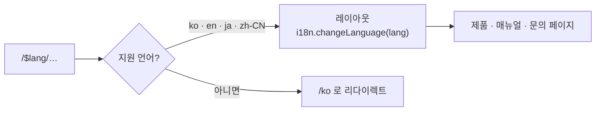
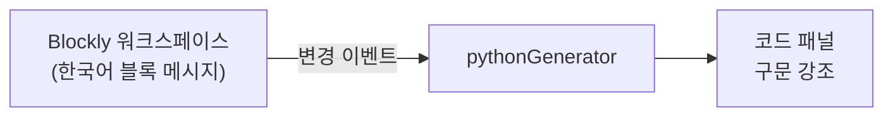

## 내 역할

2025년 12월 시작부터 라우팅·다국어·배포 구조를 세우고 제품 상세와 블록 데모를 만들었습니다. 디자이너 한 명과 프론트 한 명이 함께했고, 커밋 896개 중 452개가 제 것입니다.

## 1. 언어는 URL의 첫 조각

`/ko/products/codetinker`, `/ja/products/codetinker`처럼 언어가 경로의 첫 세그먼트입니다. 쿠키나 브라우저 설정으로 언어를 정하면 같은 주소가 사람마다 다르게 보여서 공유와 검색에 불리합니다. 주소에 넣으면 링크 하나가 한 언어를 가리킵니다.

파일 기반 라우터의 `$lang` 레이아웃이 진입 시 언어 코드를 검증하고, 지원하지 않으면 기본 언어로 보냅니다. 번역 리소스는 언어별 JSON 하나이고, 제품 매뉴얼처럼 긴 문서도 같은 키 체계로 관리합니다.

## 2. 제품 페이지는 제품마다 다르게

제품이 다섯(코드팅커·테크닉·커넥트·코딩드론·비누)이고 각각 소개·기능·가이드·매뉴얼이 있습니다. 매뉴얼은 38개 화면으로 전체 라우트의 3분의 2입니다. 공통 틀(헤더·목차·이전·다음)만 공유하고 본문은 제품마다 따로 둡니다. 공통 템플릿에 억지로 맞추면 핀 가이드 같은 제품 고유 화면이 들어가지 않았습니다.

코딩드론 페이지는 Three.js로 드론 모델을 띄우고 스크롤에 따라 프로펠러가 돌고 궤적이 그려집니다. 모델은 한 번 받아 캐시하고, 3D가 필요 없는 페이지에는 Three.js 번들이 로드되지 않게 경로 단위로 코드를 나눴습니다.

<!-- 캡처 자리: 코딩드론 3D 페이지 또는 제품 매뉴얼 화면 -->

## 3. 설치 없이 블록을 끌어 보게

제품을 사기 전에 "블록코딩이 뭔지" 보여 주는 것이 사이트의 목적 중 하나입니다. 설명 대신 사이트 안에 작은 Blockly 워크스페이스를 넣었습니다. 블록을 끌어 놓으면 옆에 Python 코드가 바로 생깁니다.

본편 플랫폼([블록코딩 플랫폼](/projects/aluxlabs))의 에디터를 그대로 넣기엔 무겁습니다. 데모는 Blockly 기본 블록과 생성기만 쓰고, 플랫폼으로 넘어가는 버튼이 따로 있습니다.

## 4. 배포

정적 사이트라 S3에 올리고 CloudFront로 서빙합니다. develop과 release 두 파이프라인이 있고, 배포 뒤 CloudFront 캐시를 무효화합니다. 서버가 필요한 부분(제휴 문의, 코드팅커 미션 랭킹)만 GraphQL로 플랫폼 서버를 호출합니다.

## 남은 것

- 검색 엔진용 메타 정보가 언어별로 다 채워지지 않았습니다. SPA라 서버 렌더링이 없어서, 언어별 정적 HTML을 미리 생성하는 쪽을 검토 중입니다.
- 매뉴얼 38개 화면이 코드로 되어 있어 내용 수정에 배포가 필요합니다. 콘텐츠를 데이터로 빼는 것이 다음 단계입니다.
