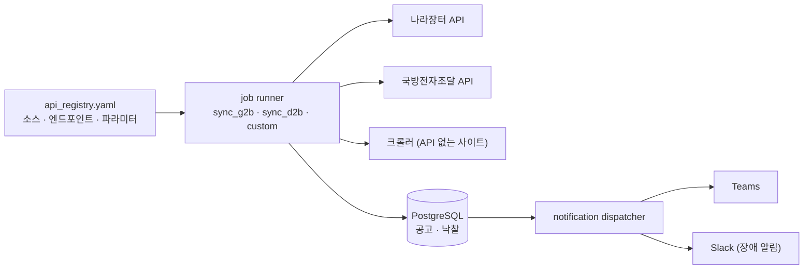
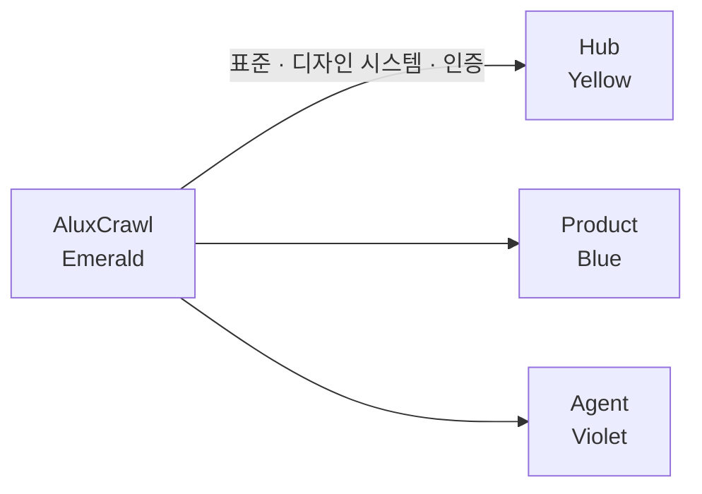

<!-- 캡처 자리: 대시보드 — 프론트매터 cover 로 -->

## 내 역할

웹 저장소 커밋 115개 전부, 서버 crawl 서비스 커밋 119개 중 105개가 제 것입니다. 2026년 1월에 시작해 6월까지 운영 상태로 넘겼습니다.

## 1. 수집: 소스를 설정으로

공공 조달 API는 서비스마다 경로·파라미터·날짜 형식이 다릅니다. 코드에 박는 대신 레지스트리 YAML에 소스를 적고 수집기가 그것을 읽습니다.

API가 없는 사이트는 크롤러를 붙였고, 사용자가 웹에서 URL과 규칙을 넣어 만드는 커스텀 잡도 있습니다. 알림은 담당자 채널(Teams)로 가고, 수집 실패는 운영 채널(Slack)로 따로 갑니다.

<!-- 캡처 자리: 공고 목록 또는 크롤러 관리 화면 -->

## 2. 여기서 정한 표준이 다른 곳으로

이 프로젝트가 사내 `-www` 저장소의 첫 번째였습니다. React 19 + Vite, TanStack Router(파일 기반, `_authenticated` 레이아웃으로 인증 게이팅), shadcn/ui + Tailwind v4, Apollo + graphql-codegen, Valibot. 그리고 서비스마다 테마 색 하나를 정하는 규칙(crawl은 Emerald).

이후 [연락처·사업 관리](/projects/alux-hub)와 [생산·물류 시스템](/projects/alux-product)이 이 저장소를 그대로 복제해 시작했습니다. 두 프로젝트의 CLAUDE.md 첫 줄이 "사내 `-www` 표준 패턴(`aluxcrawl-www`)을 따른다"입니다. 작은 프로젝트에서 표준을 먼저 세운 덕에 뒤의 큰 프로젝트가 화면 규칙을 다시 정하지 않았습니다.

## 남은 것

- 모바일 앱은 로그인·공고 조회·알림 수신까지만 있고 그 뒤로 손대지 않았습니다.
- 공고 본문의 첨부 파일(HWP)은 수집만 하고 내용 추출은 하지 않습니다.
