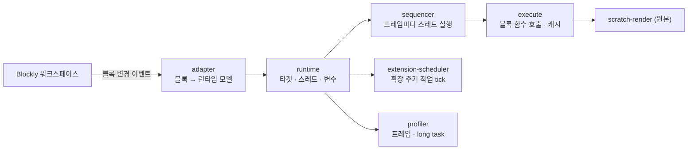
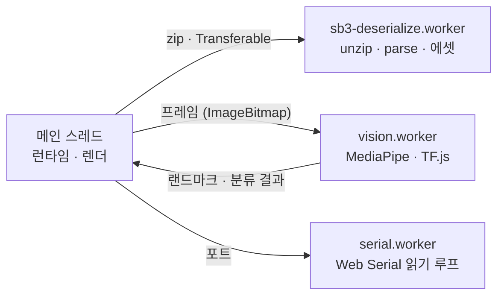
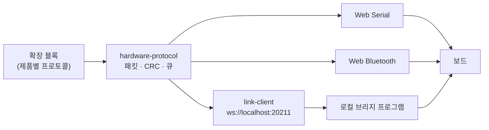
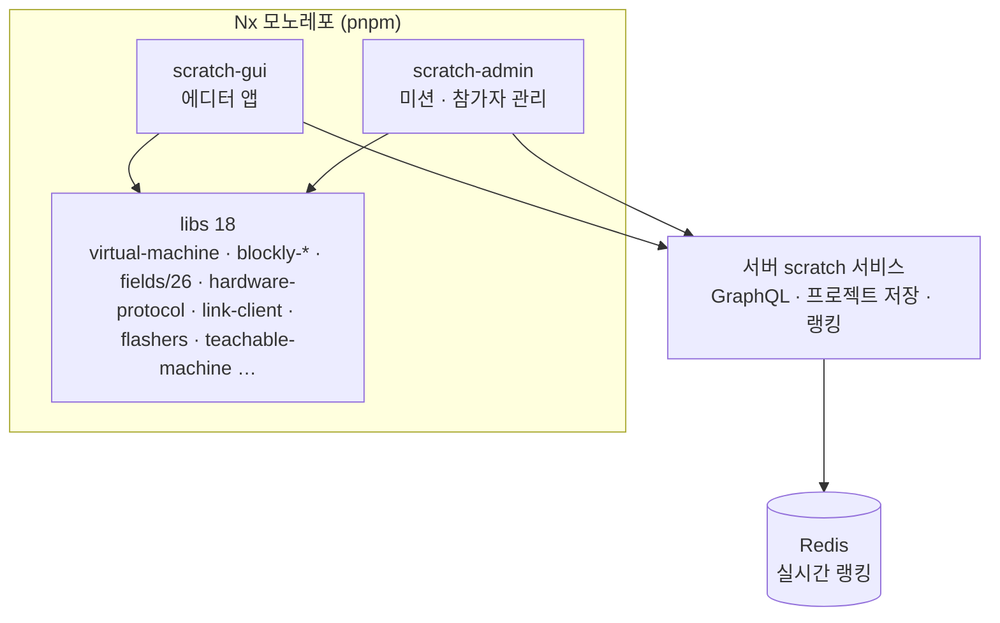

<!-- 캡처 자리: 에디터 전체 화면 (블록 팔레트 + 무대) — 프론트매터 cover 로 -->

## 내 역할

2025년 3월 Scratch 3를 포크한 상태에서 시작해, 마이그레이션 방향과 엔진 구조를 정하고 라이브러리 분리·모노레포 전환·Vision AI·하드웨어 통신 계층을 주도했습니다. 블록 콘텐츠와 UI는 팀원 둘이 함께 만들었습니다.

| 영역 | 내 커밋 | 전체 | 비율 | 역할 |
|---|---:|---:|---:|---|
| 플랫폼 저장소 (앱 3 · 라이브러리 18) | 1,018 | 5,990 | 17% | 구조 변경 커밋 대부분, 엔진·워커·하드웨어·AI |
| 서버 scratch 서비스 (Go) | 58 | 125 | 46% | 미션·저장 API, 실시간 랭킹 |

비율이 낮아 보이는 이유는 팀원 커밋이 블록 정의와 화면에 집중돼 있어서입니다. 저장소 구조를 바꾼 커밋(모노레포 전환 3,830 파일, 라이브러리 분리, 에셋 이전)은 전부 제 것입니다.

## 왜 다시 세웠나

Scratch 3를 그대로 쓰면 세 가지가 막혔습니다. 블록 에디터가 scratch-blocks(오래된 Blockly 포크)에 묶여 있어 새 필드 타입을 넣기 어려웠고, scratch-vm의 실행 모델이 외부 비동기 작업(카메라 추론, 하드웨어 응답)을 끼워 넣기에 맞지 않았고, GraphQL 백엔드와 자사 하드웨어 제품군이 늘어날수록 포크와 원본의 차이를 유지하는 비용이 커졌습니다.

그래서 UI는 React로, 에디터는 Blockly 12로, 실행 엔진은 처음부터 다시 썼습니다. 2025년 4월 14일 scratch-vm 의존을 지웠습니다. 렌더러·오디오·스토리지처럼 교체 이유가 없는 것은 원본 패키지를 그대로 씁니다.

## 1. 실행 엔진

블록을 실행하는 런타임을 TypeScript로 새로 썼습니다. 시퀀서가 프레임마다 스레드를 돌리고, 블록 실행 결과는 캐시에 남기고, 변수·모니터·펜은 전담 모듈이 맡습니다.

**확장 스케줄러**가 이 엔진의 특징입니다. 카메라 추론이나 하드웨어 폴링처럼 주기적으로 도는 작업을 확장이 등록하면, 런타임이 프레임 끝에서 한 번에 돌립니다. 같은 확장이 다시 등록하면 이전 작업을 덮어쓰고(핫 리로드 대응), 작업이 Promise를 돌려주면 끝나기 전까지 같은 작업을 다시 띄우지 않고, 하나가 예외를 던져도 다른 작업은 계속 돕니다. 원본 scratch-vm에는 이 계층이 없어서 확장마다 `setInterval`을 따로 돌렸고, 그게 프레임과 어긋나는 원인이었습니다.

## 2. 무거운 일은 워커로

프로젝트 파일(SB3) 로드와 Vision AI 추론은 메인 스레드에서 돌리면 화면이 멈춥니다. 둘 다 Web Worker로 뺐습니다.

Vision 워커는 **싱글톤**입니다. 얼굴·손·자세·사물 블록이 각각 워커를 띄우면 Windows 태블릿에서 모델 네 개가 동시에 GPU를 잡아 느려졌습니다. 워커 하나가 모델을 공유하고 결과를 캐시해서, 같은 프레임에 대한 얼굴 요청 둘은 추론 한 번으로 끝납니다.

## 3. 하드웨어: 세 갈래 길

자사 보드와 통신하는 경로가 셋입니다. 브라우저가 지원하면 Web Serial이나 Web Bluetooth로 직접 붙고, 지원하지 않는 환경(일부 OS·브라우저)에서는 로컬에 설치한 작은 프로그램이 WebSocket 다리가 됩니다.

프로토콜 라이브러리는 제품마다 모듈이 따로 있고(패킷 구조·CRC가 다릅니다) 전송 계층과 분리돼 있어서, 같은 블록이 어느 경로로든 같은 바이트를 보냅니다.

**펌웨어 업로드**도 브라우저에서 합니다. AVR 보드는 STK500 v1·v2 프로토콜을, nRF 보드는 Nordic DFU(SLIP 프레이밍, CRC)를 TypeScript로 구현해 Intel HEX를 직접 씁니다. 설치 프로그램 없이 "업데이트" 버튼 하나로 끝나는 것이 교육 현장에서 가장 큰 차이였습니다.

<!-- 캡처 자리: 하드웨어 연결 또는 펌웨어 업데이트 다이얼로그 -->

## 4. 에디터: Blockly 12 위에 Scratch 모양

scratch-blocks 대신 Blockly 12를 쓰되, 아이들이 익숙한 Scratch 모양은 유지해야 했습니다. 렌더러·테마·연속 스크롤 툴박스를 각각 라이브러리로 만들고, 커스텀 필드 26종(각도·슬라이더·조이스틱·색상·비트맵 편집기·카메라 선택 등)을 독립 패키지로 두었습니다. 필드가 패키지라서 Blockly 버전을 올릴 때 깨지는 범위가 패키지 단위로 좁혀집니다.

## 5. 합치면

의존 방향은 앱 → 라이브러리 단방향이고 라이브러리끼리 순환은 lint가 막습니다. 2025년 9월 단일 저장소에서 모노레포로 전환했고([Nx 시리즈](/series/nx-vite-pnpm-monorepo)에 그 과정을 썼습니다), 빌드는 webpack에서 Vite로 옮겼습니다([Vite 시리즈](/series/webpack-to-vite-library)).

## 남은 것

- 하드웨어 통신 UX(연결 실패 안내, 재시도)를 세 경로에 걸쳐 다시 정리하는 작업이 핸드오프 문서로 남아 있습니다.
- E2E 테스트는 틀만 있고 시나리오가 적습니다. 단위 테스트 75개가 엔진과 플래셔에 몰려 있습니다.
