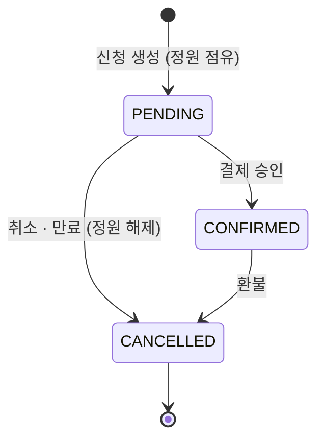
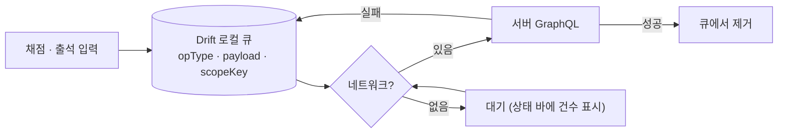
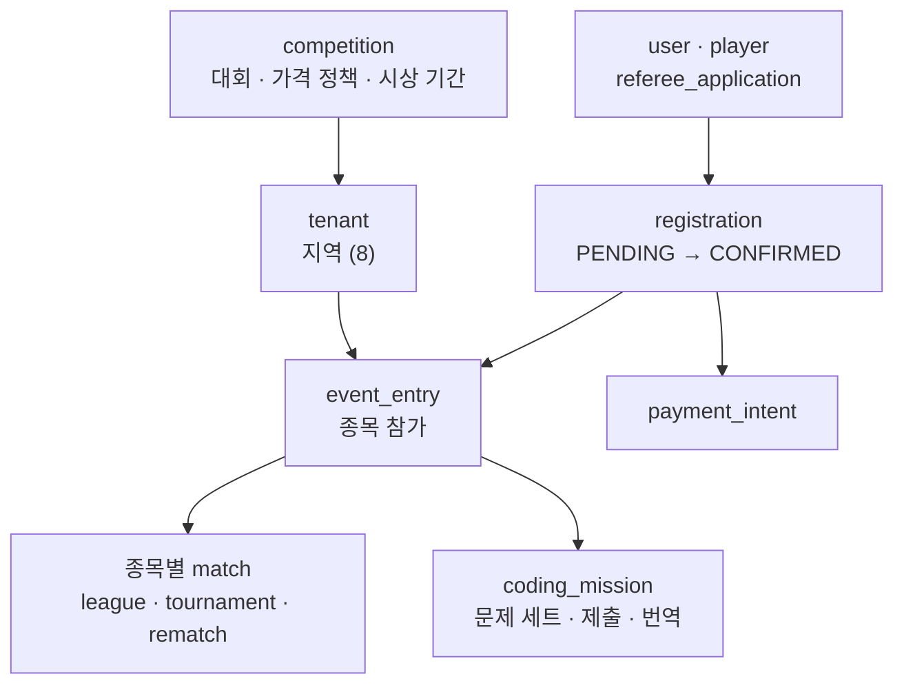
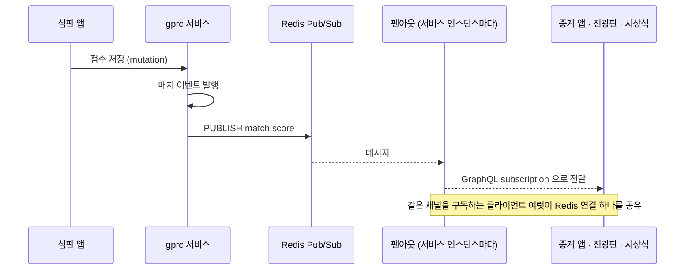
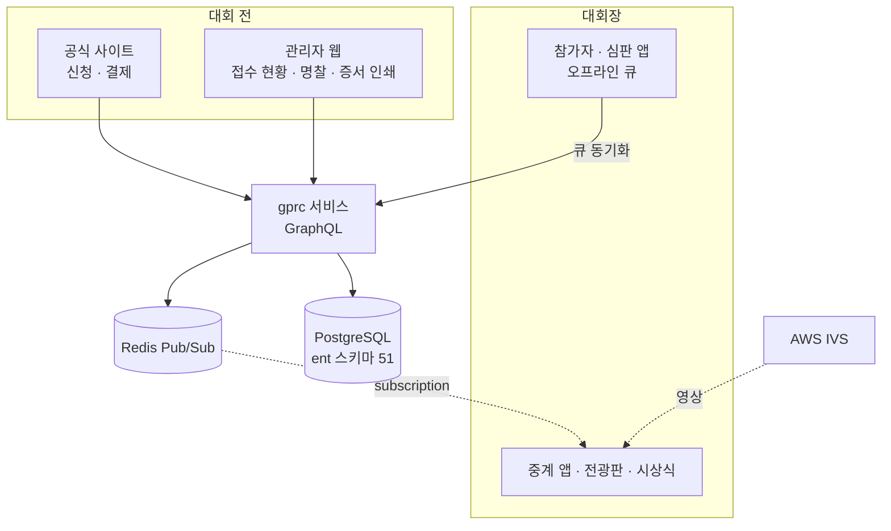

<!-- 캡처 자리: g-prc.com 메인 또는 참가 신청 화면 (프론트매터 cover 로 넣습니다) -->

## 내 역할

팀장으로 전체 구조를 잡고, 현장에서 쓰는 두 앱(참가자·심판 앱, 중계 앱)과 관리자 웹을 주도했습니다. 공식 사이트와 서버는 팀원이 주도하고 저는 설계와 리뷰를 맡았습니다. 저장소 기준 기여 비율입니다.

| 영역 | 내 커밋 | 전체 | 비율 | 역할 |
|---|---:|---:|---:|---|
| 참가자·심판 앱 (Flutter) | 1,021 | 2,269 | 45% | 구조 설계·오프라인 동기화·v2 리뉴얼 주도 |
| 현장 중계 앱 (Flutter) | 196 | 431 | 45% | 구조 설계·실시간 구독 |
| 관리자 웹 (React) | 243 | 525 | 46% | 구조 설계·접수·인쇄물 |
| 공식 사이트 (SvelteKit) | 68 | 608 | 11% | 재구축 계획·리뷰 |
| 서버 gprc 서비스 (Go) | 85 | 864 | 10% | 실시간 구독·pubsub 설계, 리뷰 |

## 1. 접수: 웹과 결제

공식 사이트는 일정·규정·역대 기록·참가 신청·심판 신청을 담당합니다. 6개 언어(ko·en·ja·ms·zh-CN·zh-HK)를 경로 세그먼트로 라우팅하고, 참가 신청은 유료라 결제가 붙습니다.

<!-- 캡처 자리: 참가 신청 흐름 또는 다국어 화면 -->

결제에서 가장 신경 쓴 것은 **정원**입니다. 결제 창을 열어 둔 채로 다른 사람이 마지막 자리를 가져가면 돈을 내고도 접수가 안 됩니다. 그래서 신청을 만드는 순간 `PENDING` 상태로 정원을 먼저 점유하고, 결제가 승인되면 `CONFIRMED`로 바꾸고, 취소하거나 시간이 지나면 점유를 풉니다.

같은 사용자가 같은 대회에 `PENDING`을 또 만들려 하면 서버가 `CONFLICT`를 돌려주고, 사이트는 기존 신청을 이어서 결제하게 안내합니다. 결제 실패로 돌아온 경우(쿼리에 `code`가 있음)와 성공으로 돌아온 경우를 사이트가 구분해 서버에 최종 승인을 요청합니다.

## 2. 현장 앱: 인터넷이 끊겨도 심사는 계속된다

접수부터 심판 채점까지 현장에서 쓰는 앱입니다. 역할별로 화면이 나뉩니다. 접수(출석 확인·정보 수정·동의서 서명·라벨 출력), 심판(종목별 채점·토너먼트 진행), 참가자(내 일정·결과).

<!-- 캡처 자리: 심판 채점 화면 또는 접수 화면 (참가자 이름·사진은 가립니다) -->

전시장 와이파이는 믿을 수 없습니다. 수천 명이 한 홀에 모이면 끊기는 건 시간문제입니다. 그래서 앱은 **모든 쓰기를 로컬 큐에 먼저 넣고** 네트워크가 있을 때 서버로 보냅니다.

큐 항목은 `opType`(채점·출석·정보 수정·토너먼트 진행 등)과 payload로 이루어지고, 보내는 쪽은 `opType`별로 어느 저장소 함수를 부를지만 압니다. 이 디스패처가 동기화 엔진과 각 기능의 유일한 결합점입니다.

**중복 정리가 어려웠습니다.** 오프라인 상태에서 같은 참가자의 출석을 두 번 찍으면 마지막 것만 보내면 됩니다. 그런데 정보 수정은 다릅니다. 첫 번째 수정이 전화번호, 두 번째가 소속이면 뒤의 것으로 덮어쓸 때 앞의 수정이 사라집니다. 그래서 `opType`마다 중복 정리 규칙을 따로 둡니다. 출석은 "최신 것만", 정보 수정은 "필드를 합친 뒤 하나로". 이 규칙을 큐에 넣기 전에 적용해서 서버에는 정리된 요청만 갑니다.

서명도 여기서 받습니다. 본선 참가자의 개인정보·초상권 동의서를 태블릿에 서명받아 저장하고, 접수가 끝나면 라벨 프린터로 명찰을 출력합니다. QR은 참가자 식별에 쓰여서 심판 앱이 QR을 찍으면 그 참가자의 채점 화면이 열립니다.

## 3. 서버: 종목마다 매치 테이블

Go 서비스 하나가 대회 도메인을 담당합니다. ent 스키마 51개 중 절반이 매치 테이블입니다. 종목이 6개이고 각각 리그전과 토너먼트전, 재경기가 있어서 종목 × (리그·토너먼트·재경기) 만큼 테이블이 생깁니다.

종목별 테이블을 하나로 합치지 않은 이유는 채점 규칙이 전부 다르기 때문입니다. 스피드 드론은 기록 시간, 코딩 미션은 문제 세트와 제출, 터치 종목은 라운드별 점수. 공통 컬럼을 억지로 뽑는 것보다 종목마다 명확한 스키마를 두는 쪽이 심판 앱의 입력 화면과 일대일로 맞았습니다.

심판 신청서에는 신분증 같은 개인정보가 들어옵니다. 심사가 끝나면 문서를 지우는 정리 작업을 따로 두어 보관 기간이 지나지 않게 했습니다.

## 4. 중계: 점수가 바뀌면 전광판이 바뀐다

현장에는 화면이 여럿 있습니다. 종목별 중계 화면, 진행 상황 전광판, 시상식 연출, 경품 추첨. 전부 서버의 같은 사실을 보고 있어야 합니다. 심판이 점수를 넣으면 전광판이 바로 바뀌어야 하고, 그 사이에 누가 새로고침을 하면 안 됩니다.

서비스가 Kubernetes에서 여러 파드로 돌기 때문에, 점수를 저장한 파드와 중계 앱이 붙어 있는 파드가 다를 수 있습니다. 그래서 파드 사이는 Redis Pub/Sub으로 잇고, 파드 안에서는 팬아웃이 Redis 구독 하나를 여러 GraphQL 구독자에게 나눠 줍니다. 클라이언트마다 Redis 연결을 열면 연결 수가 클라이언트 수만큼 늘어나서, 채널당 하나만 열고 마지막 구독자가 떠날 때 닫습니다.

**어려웠던 것.** 구독자가 떠나는 순간과 메시지가 도착하는 순간이 겹치면 닫힌 채널에 쓰려다 패닉이 납니다. 구독 맵과 핸들러 맵을 다루는 잠금 순서를 고정하고, 핸들러 호출이 끝날 때까지 읽기 잠금을 유지해서 제거와 전달이 경쟁하지 않게 했습니다. 이 부분은 통합 테스트와 부하 테스트를 따로 두었습니다.

중계 앱은 영상도 다룹니다. 경기 영상은 AWS IVS로 스트리밍하고, 점수와 진행 상태는 위의 구독으로 받아 영상 위에 얹습니다. 영상과 데이터가 다른 경로로 오니 각자 끊겨도 서로를 막지 않습니다.

<!-- 캡처 자리: 중계 화면 또는 전광판 (현장 사진도 좋습니다) -->

## 5. 합치면

대회 전에는 웹이, 대회장에서는 앱이 입구입니다. 둘 다 같은 서버를 보고, 현장 앱만 네트워크가 없을 때를 대비해 큐를 둡니다. 중계 쪽은 읽기만 하므로 구독으로 받습니다.

2025년 제11회 대회(코엑스, 참가자 13만 명 이상, 8개국)에서 앱 기반 접수와 실시간 심사 중계를 처음 도입했습니다. 그 뒤 참가자·심판 앱을 기능 단위 구조로 다시 짰습니다(v2). 처음 버전이 레이어별 폴더였는데 종목이 늘수록 한 기능을 고치려면 폴더 넷을 오가야 했기 때문입니다.

## 남은 것

- 공식 사이트의 결제 대기 정리(만료된 `PENDING` 회수)는 서버 정책이 먼저 바뀌어서 사이트 쪽이 따라가는 중입니다.
- 서버 gprc 서비스가 25만 줄로 가장 큽니다. 종목별 매치 테이블을 유지하는 대신 채점 로직을 종목 플러그인으로 분리하는 것이 다음 과제입니다.
