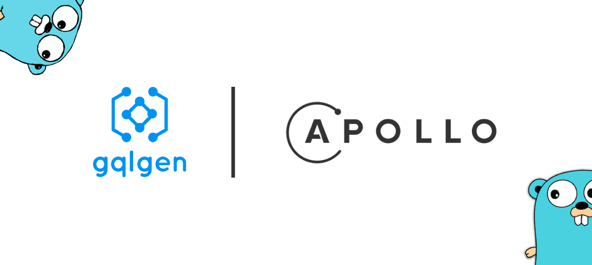

GraphQL Subscription으로 서버에서 클라이언트로 이벤트를 실시간 스트리밍하는 예제입니다. 서버는 Go와 gqlgen, 클라이언트는 React와 Apollo Client로 구성했고, 댓글이 추가되면 구독 중인 클라이언트에 즉시 전달되는 흐름을 5편에 걸쳐 만듭니다.

- 서버: `server.go`, `graph/` (스키마, 리졸버, 생성 코드)
- 클라이언트: `client/` (Create React App + Apollo Client)
- 실행: `docker-compose.yml`, `Makefile`
