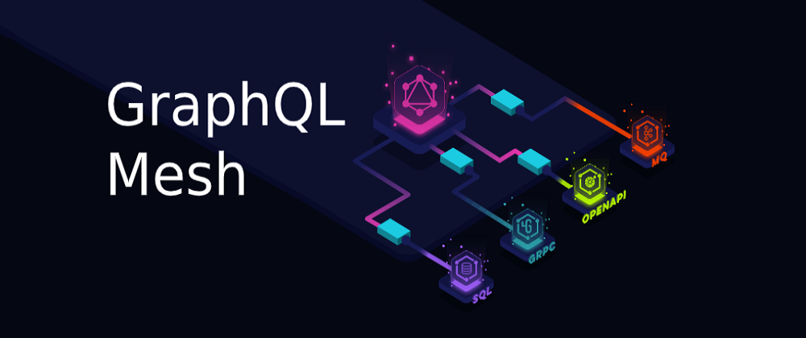

GraphQL Mesh 튜토리얼을 목표로 Books(REST), Authors(gRPC), Stores(GraphQL) 세 서비스를 Go로 만들고, 하나의 Mesh Gateway 뒤에 묶는 예제입니다. 저장소는 `rest_api`, `grpc`, `graphql`, `mesh_gateway` 네 폴더로 나뉘며 글 3편이 각 단계에 대응합니다.

글을 다시 정리하면서 세 서비스에 서로 id가 맞는 예제 데이터를 넣고, proto와 어긋나 있던 gRPC 생성 코드를 재생성하고, 게이트웨이의 gRPC 엔드포인트 형식을 고쳐 세 소스 통합 쿼리가 실제로 동작하는 것을 확인했습니다. 남은 과제는 소스 간 관계 필드(`Book.author`)를 `additionalResolvers`로 잇는 것입니다.
